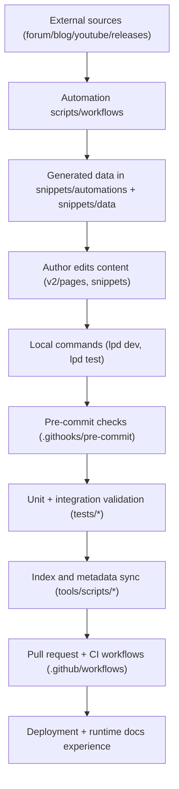

This is an internal systems map for how content, tooling, validation, and automation interact.

## Top-Level Components

- Content source: `v2/pages/**`, `snippets/**`, `docs.json`
- Runtime UX: Mintlify dev/build + hosted docs deployment
- Local operator tooling: `lpd`, `.githooks/*`, `tools/scripts/*`, `tests/*`
- CI/automation: `.github/workflows/*`, `.github/scripts/*`, `snippets/automations/*`
- Governance docs: `README.md`, `docs-guide/*`, `contribute/CONTRIBUTING/*`

## Data + Control Flow

## Execution Layers

### Layer 1: Authoring + Content System

- Markdown/MDX pages and snippets are the editable content primitives.
- `docs.json` defines navigation and routing context.

### Layer 2: Local Enforcement

- `lpd` orchestrates setup/dev/tests/hooks/scripts.
- Pre-commit hook runs fast safety gates and staged audits.
- Test runners validate style, MDX, links/imports, quality, docs navigation, and script docs.

### Layer 3: CI + Automation

- Workflows run changed-file quality checks and browser checks for PRs.
- Scheduled/manual workflows refresh external data and supporting assets.
- Template and intake workflows enforce issue/PR quality and labeling.

### Layer 4: Documentation Governance

- `docs-guide/` defines internal navigation source of truth.
- `README.md` provides high-level orientation and points to canonical docs-guide pages.

## Key Contract Edges

1. Script metadata contract:
   - Script headers -> script index generation -> docs-guide scripts catalog.
2. Workflow/template contract:
   - `.github/workflows/*` + `.github/ISSUE_TEMPLATE/*` -> docs-guide generated indexes.
3. Content validity contract:
   - Content changes -> hooks/tests -> CI -> deployable docs.
