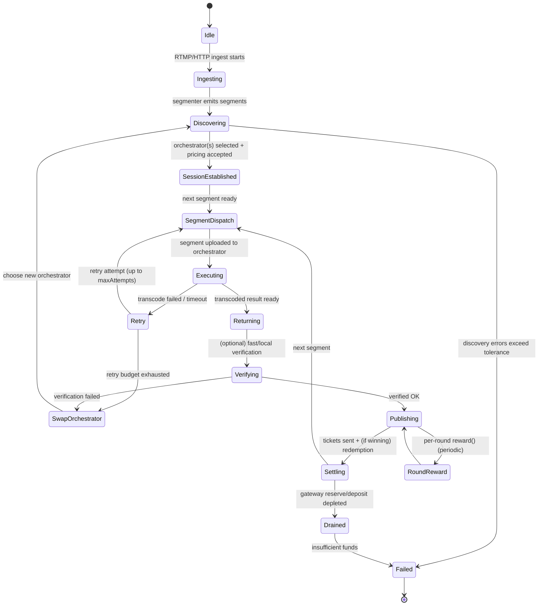

import { DynamicTable } from "/snippets/components/layout/table.jsx"

{/*
This page describes:
6. **Job Lifecycle**

   * Job submission
   * Assignment
   * Execution
   * Verification
   * Payment (ETH fees)
 */}

{/* ## Job Lifecycle
This view describes the end-to-end “compute job” as a state machine. Because Livepeer’s compute is segment-oriented, the lifecycle is modelled at the level of a stream session and per-segment processing, with payment settlement occurring continuously via tickets and periodically via reward calls. */}

### Lifecycle Narrative
A minimal, source-grounded job lifecycle is:
<Steps>
<Step title="Ingest and segmentation">
Ingest and segmentation: A Gateway receives an RTMP stream (docs provide explicit RTMP ingest examples) and produces segments to be processed.
</Step>
<Step title="Discovery and selection">
Discovery and selection: The Gateway selects an Orchestrator set according to the node software’s discovery logic; operational failures here appear as discovery errors and orchestrator swaps.
</Step>
<Step title="Price and session parameters">
Price and session parameters: Orchestrators advertise a price per pixel (Wei denominated) to gateways off-chain; orchestrators may auto-adjust price to compensate for ticket redemption overhead when gas is high.
</Step>
<Step title="Segment dispatch and compute">
Segment dispatch and compute: The Gateway uploads segments; the Orchestrator executes transcoding/AI compute locally or delegates to attached transcoder processes.
</Step>
<Step title="Result return and verification">
Result return and verification: Results are returned to the Gateway; verification may be performed (fast verification metrics exist and are explicitly named). Failures can trigger orchestrator swaps and retries.
</Step>
<Step title="Continuous settlement">
Continuous settlement: The Gateway sends probabilistic payment tickets; the Orchestrator redeems winning tickets and the system tracks redemption errors and redeemed value.
</Step>
<Step title="Periodic reward accounting">
Periodic reward accounting: Each round, orchestrators may call reward() as an Arbitrum transaction distributing minted rewards to itself and its delegators.
</Step>
</Steps>

### State machine diagram

### Events and transitions
The table below maps concrete triggers to transitions using explicit config knobs/metrics where possible:

<DynamicTable
  headerList={["Event / Trigger", "Observable Evidence", "Transition", "Notes"]}
  itemsList={[
    { "Event / Trigger": "Stream starts", "Observable Evidence": "livepeer_stream_started_total increments", "Transition": "Idle → Ingesting", "Notes": "Metrics are defined in node docs." },
    { "Event / Trigger": "Discovery fails", "Observable Evidence": "livepeer_discovery_errors_total increments", "Transition": "Discovering → Failed", "Notes": "Exact selection algorithm is not fully specified in docs; treat as implementation detail." },
    { "Event / Trigger": "Segment transcode fails", "Observable Evidence": "livepeer_segment_transcode_failed_total / livepeer_transcode_retried", "Transition": "Executing → Retry", "Notes": "Retry budget controlled by maxAttempts (default 3)." },
    { "Event / Trigger": "Orchestrator swap mid-stream", "Observable Evidence": "livepeer_orchestrator_swaps", "Transition": "Retry/Verifying → SwapOrchestrator", "Notes": "Swap behaviour is observable though exact policy is not fully specified." },
    { "Event / Trigger": "Payment sent", "Observable Evidence": "livepeer_tickets_sent, livepeer_ticket_value_sent", "Transition": "Publishing → Settling", "Notes": "Deposit/reserve are explicitly surfaced per gateway." },
    { "Event / Trigger": "Reserve/deposit depleted", "Observable Evidence": "livepeer_gateway_reserve / livepeer_gateway_deposit low/zero", "Transition": "Settling → Drained", "Notes": "Some community guides discuss splitting ETH into deposit + reserve for testing; treat exact sizing as operator-specific." },
    { "Event / Trigger": "Ticket redemption error", "Observable Evidence": "livepeer_ticket_redemption_errors", "Transition": "Settling → (degraded)", "Notes": "Redemption reliability impacts realised revenue for Orchestrator." },
    { "Event / Trigger": "On-chain tx confirmation timeout", "Observable Evidence": "txTimeout (default 5 mins)", "Transition": "Settling/RoundReward → (retry/replace tx)", "Notes": "Transaction replacement knobs are defined in CLI options." },
    { "Event / Trigger": "Per-round reward minted/distributed", "Observable Evidence": "orchestrator reward service enabled", "Transition": "Publishing ↔ RoundReward", "Notes": "Docs describe default auto reward calls per round on Arbitrum." }
  ]}
  monospaceColumns={[1]}
/>

### Job Lifecycle (video vs AI)

Livepeer supports two main job types: transcoding (video format conversion) and AI inference (e.g. Style transfer, generation). Each follows a similar multi-party flow but with different pipeline details. Transcoding Workflow: When a Gateway (broadcaster) has a live stream (or video) to process, it:
Register Funds: Pre-funds an on-chain TicketBroker contract with ETH equal to the expected job fees.
Select Orchestrator: Off-chain, the Gateway queries the network (using the Explorer or libp2p signaling) to find an active Orchestrator whose price and location meet its needs.
Submit Segments: For each video segment (usually a few seconds of video), the Gateway sends the raw segment to the chosen Orchestrator along with a probabilistic payment ticket. This “ticket” is a signed payment promise for a random lottery draw (see below).
Transcode: The Orchestrator passes the segment to its connected Transcoder (the GPU hardware) which generates requested renditions (e.g. Different bitrates, formats).
Return Results: The Transcoder returns encoded segment(s) to the Orchestrator, which sends them back to the Gateway (or to an output stream).
Redeem Payments: Periodically (or at job end), the Orchestrator submits any winning tickets to the TicketBroker on-chain, redeeming them for ETH. A winning ticket is one that cryptographically meets a random threshold; most tickets “lose”, but statistically over time the Orchestrator receives the full earned fee.
The essential flow is:
flowchart LR
 Gateway([Gateway (Broadcaster)]) -->|“video + ticket”| Orchestrator([Orchestrator Node])
 Orchestrator -->|“assign chunk”| Transcoder([Transcoder GPU])
 Transcoder -->|“renditions”| Orchestrator
 Orchestrator -->|“encoded output”| Gateway
 Gateway -->|“next segment / finalize”| Orchestrator
Example: A Gateway has a 30-second live video. It deposits ETH in TicketBroker, then streams segments to Orchestrator A with tickets. Orchestrator A’s Transcoder outputs multiple bitrates. Orchestrator A later sends any winning tickets to the TicketBroker contract on Arbitrum to claim payment. Fees (in ETH) are automatically split according to the Orchestrator’s fee-share settings, crediting Delegators’ balances
.
Probabilistic Payments: Instead of paying per-segment, Gateways use a lottery-ticket scheme. Each ticket has a chance to “win” a fixed ETH prize. Over many segments, the expected payout equals the true cost of work
. This shields Orchestrators from tiny on-chain transactions and gas-variability. (Broadcasters pre-fund enough ETH so that expected payouts cover all tickets.) AI Inference Workflow: AI jobs (e.g. Real-time style transfer, video generation) use the same stake/fee model but may involve pipelines of multiple models (e.g. Stage-1 text encoder → Stage-2 image decoder). Livepeer’s Cascade framework coordinates multi-step AI workflows: a Gateway sends initial data and a prompt, and orchestrators sequentially apply models until a final video is produced
. For example, Daydream (an AI app) captures webcam video, sends it through a StableDiffusion pipeline on the network, and returns the stylized video output.
Example (AI): A user feeds a webcam stream into Daydream (powered by Livepeer AI). The Gateway sends frames plus a “style” prompt to Orchestrator B. B runs a sequence of GPUs (e.g. Enhance → stylize) and returns an AI-edited video in real time. Livepeer’s GPUs and networking are optimized for this low-latency pipeline
.
The common pattern: Gateway 🡒 Orchestrator(s) 🡒 Transcoder/AI Model 🡒 Gateway. Smart contracts (TicketBroker for fees, JobsManager, etc.) mediate off-chain jobs and on-chain accounting.
