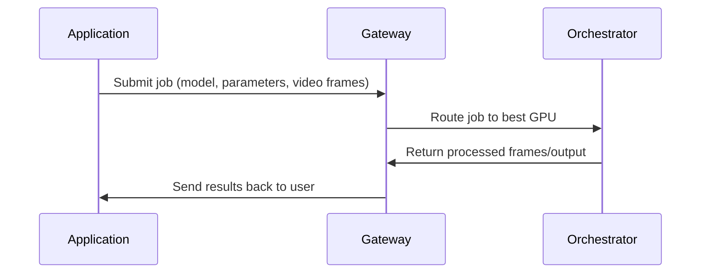

---

## Overview

In brief:

<Callout >

<Icon icon="torii-gate" /> **Gateways coordinate.**

<Icon icon="microchip"/> **Orchestrators compute.**

</Callout>

Together, they form the backbone of the Livepeer AI video pipeline.

| Role             | Function                                       | Performs GPU Work? | External-Facing? |
| ---------------- | ---------------------------------------------- | ------------------ | ---------------- |
| **Gateway**      | Job intake, pricing, routing, capability match | ❌ No              | ✅ Yes           |
| **Orchestrator** | GPU compute, inference, transcoding, BYOC      | ✅ Yes             | ❌ No            |

## Gateway Responsibilities

Gateways act as the front door to the network:

- Receive jobs from applications
- Determine required model, pipeline, or GPU
- Select the best orchestrator based on performance and pricing
- Route the workload with low latency
- Return results to the client
- Publish marketplace offerings (models, pipelines, cost per frame, etc.)

Gateways provide _service intelligence_, not compute.

---

## Orchestrator Responsibilities

Orchestrators are GPU operators who run:

- Real-time AI inference
- Daydream / ComfyStream pipelines
- BYOC containers
- Traditional transcoding

They provide:

- GPU horsepower
- Model execution
- Deterministic and verifiable output
- Performance guarantees

They do not expose external APIs directly-Gateways handle that.
