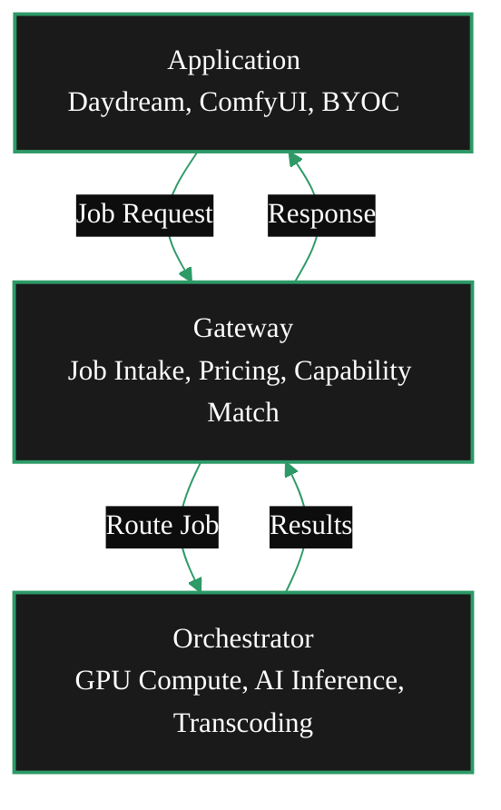
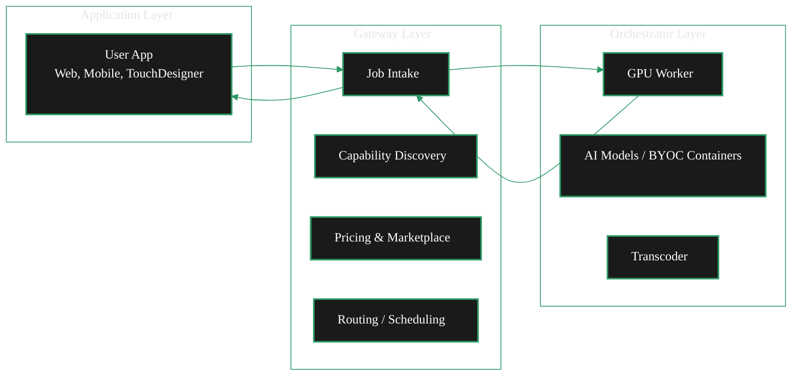

import { ScrollableDiagram } from '/snippets/components/content/zoomableDiagram.jsx'
import { DoubleIconLink } from '/snippets/components/primitives/links.jsx'

Livepeer Gateway Architecture is defined in the `livepeer-go` core codebase.

<Card
  title="/go-livepeer/core/livepeernode.go"
  href="https://github.com/livepeer/go-livepeer/blob/5691cb48/core/livepeernode.go"
  icon="github"
  arrow
  horizontal
/>

## Gateway Technical Architecture

```mermaid
%%{init: {'theme': 'base', 'themeVariables': { 'primaryColor': '#1a1a1a', 'primaryTextColor': '#fff', 'primaryBorderColor': '#2d9a67', 'lineColor': '#2d9a67', 'secondaryColor': '#0d0d0d', 'tertiaryColor': '#1a1a1a', 'background': '#0d0d0d', 'fontFamily': 'system-ui' }}}%%
flowchart TB
    subgraph INPUT["Input Sources"]
        direction LR
        RTMP["RTMP Stream"]
        HTTP["HTTP Upload"]
        AI_REQ["AI Request"]
    end

    GATEWAY["Gateway Node<br/>LivepeerNode"]

    INPUT --> GATEWAY

    subgraph MANAGERS["Session Managers"]
        direction LR
        BSM["BroadcastSessionsManager<br/>Video Transcoding"]
        ASM["AISessionManager<br/>AI Processing"]
    end

    GATEWAY --> BSM
    GATEWAY --> ASM

    subgraph VIDEO["Video Pipeline"]
        SEG["Segment Processing"]
        ORCH_V["Orchestrators<br/>Transcoding"]
        HLS["HLS/DASH Output"]
    end

    subgraph AI["AI Pipeline"]
        PROC["AI Processing"]
        ORCH_AI["Orchestrators<br/>AI Models"]
        OUT_AI["AI Output<br/>Images/Video"]
    end

    BSM --> SEG --> ORCH_V --> HLS
    ASM --> PROC --> ORCH_AI --> OUT_AI

    subgraph PAYMENT["Payment"]
        direction LR
        PAY_SEG["Per Segment"]
        PAY_PIX["Per Pixel"]
    end

    ORCH_V --> PAY_SEG
    ORCH_AI --> PAY_PIX

    classDef default fill:#1a1a1a,color:#fff,stroke:#2d9a67,stroke-width:2px
    classDef video fill:#1a1a1a,color:#fff,stroke:#3b82f6,stroke-width:2px
    classDef ai fill:#1a1a1a,color:#fff,stroke:#a855f7,stroke-width:2px
    class RTMP,HTTP,BSM,SEG,ORCH_V,HLS,PAY_SEG video
    class AI_REQ,ASM,PROC,ORCH_AI,OUT_AI,PAY_PIX ai
    style INPUT fill:#0d0d0d,stroke:#2d9a67,stroke-width:1px
    style MANAGERS fill:#0d0d0d,stroke:#2d9a67,stroke-width:1px
    style VIDEO fill:#0d0d0d,stroke:#3b82f6,stroke-width:1px
    style AI fill:#0d0d0d,stroke:#a855f7,stroke-width:1px
    style PAYMENT fill:#0d0d0d,stroke:#2d9a67,stroke-width:1px
```

<ScrollableDiagram title="Dual Gateway Architecture: Video & AI Pipelines" maxHeight="800px">

</ScrollableDiagram>

### Flow Diagram

<ScrollableDiagram title="Gateway Flow" maxHeight="600px">

</ScrollableDiagram>

 

### Layered Architecture

<ScrollableDiagram title="Layered Architecture" maxHeight="600px">

</ScrollableDiagram>
