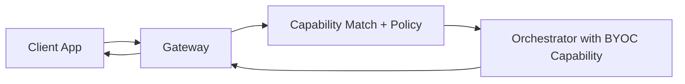

BYOC (Bring Your Own Container) from a gateway perspective is about **routing** and **service policy**, not model execution. Gateways route AI requests to orchestrators advertising compatible BYOC capabilities.

## What gateway operators need to do

- Route requests by capability and policy (price, latency, reliability)
- Prefer orchestrators with stable warm-start behavior
- Monitor p95 latency and error rates by capability
- Configure retries and failover so requests remain serviceable during node churn

## What gateway operators do not do

- Run model containers directly
- Host model weights as the primary inference service
- Expose orchestrator-internal model identifiers as public API contracts

## Routing best practices

- Treat capabilities as the API contract (`image-to-image`, `depth`, `segmentation`, etc.)
- Avoid coupling routing to specific model names
- Maintain per-capability health and route around degraded nodes
- Keep clear max-price settings to avoid uneconomic job assignment

<Warning>
BYOC enables custom workloads, but poor-fit batch workloads can degrade routing quality and increase latency. Prioritize real-time, streaming, GPU-bound capabilities.
</Warning>

## Operational flow

## Developer handoff

For BYOC implementation and container design details, use the developer guide:

<Card title="Developer BYOC" icon="display-code" href="/v2/developers/ai-pipelines/byoc">
 Full architecture and setup for teams deploying BYOC containers.
</Card>

## Related pages

- [Gateway Job Pipelines Overview](./overview)
- [Gateway providers](/v2/gateways/using-gateways/gateway-providers)
- [Run a gateway](/v2/gateways/run-a-gateway/run-a-gateway)
