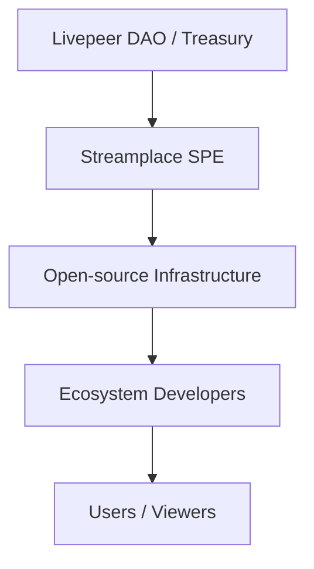

---

Streamplace operates as a **Special Purpose Entity (SPE)** within the Livepeer ecosystem. SPEs are publicly funded teams responsible for building **critical, open-source, public-goods infrastructure** that strengthens and expands the Livepeer Network.

This page explains:

- What an SPE is
- How funding flows from the Livepeer Treasury
- How Streamplace uses this funding
- Why the SPE model exists

---

# 🏛️ What Is an SPE?

A **Special Purpose Entity** is a mission-driven engineering or operational team funded by the Livepeer ecosystem to deliver:

- Long-term infrastructure
- Open-source software
- Network-level capabilities
- Public goods that benefit creators, developers, and node operators

Streamplace is an SPE specifically focused on **decentralized video infrastructure, provenance systems, and SDKs for social/Web3 applications**.

---

# 💸 Funding Flow Diagram

---

# 📦 What Streamplace Delivers as an SPE

Treasury funding enables Streamplace to maintain and improve:

### **1. Streamplace Node**

- ingest (WHIP/WHEP/RTMP)
- segmentation
- provenance embedding (C2PA + Ethereum)
- transcoding dispatch

### **2. SDK & APIs**

Developer-friendly tools for:

- livestreaming
- metadata configuration
- playback integrations
- social app embedding

### **3. Metadata & Provenance Standards**

A complete schema for:

- rights
- content warnings
- distribution policy
- replay and episode metadata

### **4. Public-Goods Infrastructure**

Everything Streamplace builds is:

- **open-source**
- **transparent**
- **ecosystem-owned**
- **permissionless** to adopt

---

# 🔥 Why the SPE Model Exists

SPEs ensure that Livepeer can sustainably fund complex, long-term projects without relying on:

- venture capital
- centralized operators
- closed-source business models

The SPE model creates:

- stable capacity for critical network work
- transparent accountability
- ecosystem resilience
- healthy decentralization

---

# 📚 Related Pages

- [Streamplace Overview](/solutions/streamplace/overview)
- [Architecture](/solutions/streamplace/introduction/streamplace-architecture)
- [Provenance & Metadata](/solutions/streamplace/introduction/streamplace-provenance)
- [Developer Integration Guide](/solutions/streamplace/introduction/streamplace-integration)
