import { LinkArrow } from '/snippets/components/primitives/links.jsx'

```mermaid
%%{init: {'theme': 'base', 'themeVariables': { 'primaryColor': '#1a1a1a', 'primaryTextColor': '#fff', 'primaryBorderColor': '#2d9a67', 'lineColor': '#2d9a67', 'secondaryColor': '#0d0d0d', 'tertiaryColor': '#1a1a1a', 'background': '#0d0d0d', 'fontFamily': 'system-ui' }}}%%
flowchart TB
  %% =========================
  %% Top-level entity
  %% =========================
  subgraph Single["Single Entity – Dual Role"]
    Entity["Orchestrator–Delegate<br/>Entity"]
  end

  %% =========================
  %% Interactions
  %% =========================
  subgraph Interactions
    Delegators["Investor–Delegators"]
    Gateways["Gateways<br/>Job Distributors"]
  end

  %% =========================
  %% Delegate Function
  %% =========================
  subgraph Delegate["Delegate Function"]
    StakeNode["Staking Node<br/>go-livepeer"]
    DelegatedLPT["Delegated LPT<br/>from Investor-Delegators"]
    Governance["DAO Voting Rights"]
    Treasury["Livepeer Treasury"]
    Protocol["Protocol Upgrades<br/>LIPs"]
    LPTIssuance["LPT Issuance Share"]
  end

  %% =========================
  %% Orchestrator Function
  %% =========================
  subgraph Orchestrator["Orchestrator Function"]
    GPUNode["GPU Node<br/>Hardware Infrastructure"]
    Compute["Compute Services<br/>Transcoding, AI, Custom"]
    ETHFees["ETH Fee Income"]
  end

  %% =========================
  %% Relationships
  %% =========================

  %% Entity splits into dual roles
  Entity --> StakeNode
  Entity --> GPUNode
  Entity -. "Share Rewards" .-> Delegators

  %% Delegation & staking
  Delegators -->|Stake LPT| DelegatedLPT
  DelegatedLPT --> LPTIssuance
  DelegatedLPT --> Governance

  %% Governance outcomes
  Governance -->|Vote on| Treasury
  Governance -->|Vote on| Protocol

  %% Job execution path
  Gateways -->|Distribute Jobs| Compute
  GPUNode --> Compute
  Compute --> ETHFees

  %% Stake node governance
  StakeNode --> Governance

  %% Styling
  classDef default fill:#1a1a1a,color:#fff,stroke:#2d9a67,stroke-width:1px
  style Single fill:#0d0d0d,stroke:#2d9a67,stroke-width:2px
  style Interactions fill:#0d0d0d,stroke:#2d9a67,stroke-width:1px
  style Delegate fill:#0d0d0d,stroke:#2d9a67,stroke-width:1px
  style Orchestrator fill:#0d0d0d,stroke:#2d9a67,stroke-width:1px
```

{/* <Frame caption="Orchestrator Dual Role as defined by Andrew Macpherson in his [research paper](https://github.com/shtukaresearch/livepeer-data-geography/tree/main/roles)"> */}

{/* </Frame> */}
 

 _Orchestrator Dual Role as defined by Andrew Macpherson in his {<LinkArrow href="https://github.com/shtukaresearch/livepeer-data-geography/tree/main/roles" label="research report" newline={false} />}_ 
 

 
