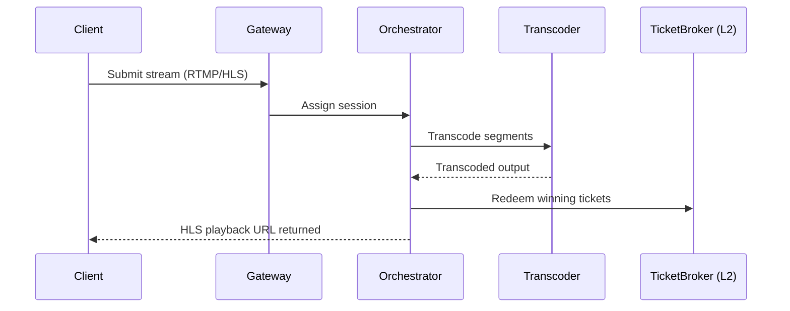
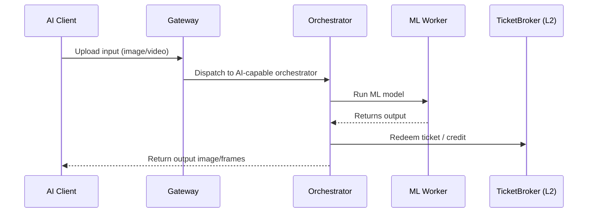

# Livepeer Job Lifecycle

This document explains the full lifecycle of a compute job on the Livepeer Network, including both **video transcoding** and **AI inference** jobs. It outlines how sessions are established, how jobs are routed and executed, how payments are made and validated, and how output is returned to clients.

Job lifecycle spans both off-chain and on-chain actions:

| Layer            | Function                                       |
|------------------|------------------------------------------------|
| Gateway (off-chain) | Accepts jobs, validates auth/payment           |
| Orchestrator (hybrid) | Coordinates job execution and reward tracking |
| Worker (off-chain) | Executes the compute                          |
| Smart Contracts (on-chain) | Verifies tickets, issues rewards         |

---

## Session Setup

A compute job begins when a client (e.g., Livepeer Studio, SDK, or AI pipeline) submits a session request.

**Gateway Node actions:**
- Validates API key or ETH/credit balance
- Assigns job metadata (type, resolution, latency, duration)
- Routes to a registered orchestrator

If credit-based: balance is deducted
If ETH-based: ticket session initialized

---

## Path 1: Video Transcoding

**Key Features:**
- Segmented stream (e.g., 2s chunks)
- FFmpeg-based transcoding
- Winning tickets returned every N segments
- Job status monitored by orchestrator

---

## Path 2: AI Inference

**Use Cases:**
- Frame enhancement
- Object detection
- Latent diffusion (e.g., Stable Diffusion, ComfyUI)

---

## Payment & Verification

Livepeer uses **probabilistic micropayments**:
- Broadcaster sends tickets to orchestrator
- Each ticket has a chance to be a winner
- On-chain contract `TicketBroker` validates the signature and redemption
- Winning tickets pay out larger ETH amounts

**Why it matters:**
- Reduces L2 gas cost
- Allows real-time streaming with no per-segment tx

**On success:**
- ETH credited to orchestrator
- Orchestrator later claims LPT inflation rewards (see `BondingManager`)

---

## Fault Tolerance

Orchestrators:
- Monitor worker availability
- Reassign jobs on failure
- Log tickets claimed vs failed

Gateways:
- Retry on orchestrator timeout
- Rotate to new orchestrator pool

---

## Merkle Snapshot & Rewards

On each round (~5760 blocks):
- Orchestrators submit Merkle proof of work completed
- Includes ETH fees earned and delegator % share
- Protocol calculates and mints LPT rewards
- Rewards can be claimed by orchestrators and delegators

Contract Involved:
- `RoundsManager`
- `MerkleSnapshot`
- `L2ClaimBridge`

---

## Metrics

| Job Type          | Metric                           | Placeholder          |
|-------------------|-----------------------------------|----------------------|
| Transcoding       | Streams per day                   | `INSERT_VIDEO_JOBS` |
| AI Inference      | Frames per day                    | `INSERT_AI_FRAMES`  |
| Avg Latency       | Worker response time              | `INSERT_LAT_MS`     |
| Ticket Win Rate   | % of tickets redeemed             | `INSERT_TICKET_WIN` |

Source: [Livepeer Explorer](https://explorer.livepeer.org)

---

## References

- [TicketBroker.sol](https://github.com/livepeer/protocol/blob/master/contracts/job/)
- [Livepeer SDK (job API)](https://github.com/livepeer/js-sdk)
- [Gateway routing docs](https://livepeer.studio/docs)
- [Stable Diffusion x Livepeer](https://blog.livepeer.org/ai-on-livepeer)
- [Orchestrator examples](https://livepeer.org/docs/orchestrators)

---

Next: `marketplace.mdx`

