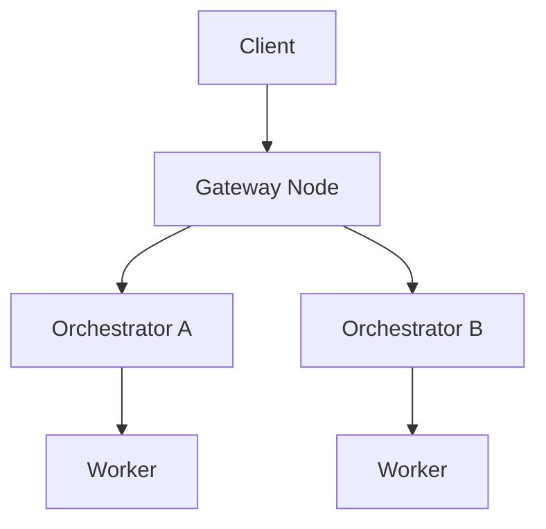

# Livepeer Marketplace

The Livepeer Network supports a dynamic decentralized marketplace for real-time media compute: transcoding and AI inference. Unlike static infrastructure platforms, Livepeer's open marketplace introduces real-time **bidding, routing, and pricing** of jobs across a global pool of orchestrators.

This document outlines the design of the marketplace layer, its actor behaviors, session economics, and design proposals for advanced matching.

---

## Marketplace Overview

| Element                  | Role                                                   |
|--------------------------|--------------------------------------------------------|
| **Broadcaster/Client**    | Submit job requests (stream, image, session intent)   |
| **Gateway**              | Matches requests to suitable orchestrators             |
| **Orchestrator**         | Advertises availability, pricing, and capabilities     |
| **Worker**               | Executes compute task                                  |
| **TicketBroker**         | Receives tickets for ETH reward upon verified work     |

This market is **continuous** — orchestrators are always bidding for sessions.

---

## Demand: Client Workloads

Clients submit various media compute jobs:

| Job Type         | Example Use Case                         | Payment Style     |
|------------------|-------------------------------------------|-------------------|
| Live Stream      | RTMP ingest for video platforms           | Per-minute ETH / credits |
| AI Inference     | Frame-by-frame image-to-image generation | Per-job (frame, token)   |
| File Transcode   | Static MP4 → web formats                  | Batch credits     |

**API Examples:**
- Livepeer Studio REST
- Gateway POST job
- ComfyStream interface (AI)

---

## Supply: Orchestrator Nodes

Orchestrators advertise:

- Hardware specs (GPU/CPU, memory)
- Region/latency
- Supported workloads (video, AI, both)
- Price per segment / frame / token

They update via gateway-side gRPC or REST heartbeat endpoints.

---

## Routing Logic

The gateway scores orchestrators by:
- Latency to input source
- Workload match
- Cost-per-job
- Availability + retry buffer

Session is **routed** to best match (no on-chain gas impact).

---

## Price Discovery

The current Livepeer implementation uses **posted pricing** (orchestrator-set), not auction-based. A few notes:

- Clients can be matched to the lowest available compatible provider.
- Bids may vary by:
  - Region (US-East vs EU-Central)
  - GPU load (AI-heavy orchestrators charge more)
  - Quality profile (1080p60 vs 720p30)

In development: LIP to introduce dynamic auction for AI sessions.

---

## Payments & Settlements

Clients pay via:
- ETH tickets (via protocol)
- Credit balance (tracked off-chain)

Orchestrators:
- Claim tickets to `TicketBroker`
- Accumulate earnings
- Claim inflation (LPT) rewards from `BondingManager`

---

## Credit System Extensions

Some gateways provide user-friendly pricing:

| Currency | Top-up Methods         | Denomination       |
|----------|------------------------|--------------------|
| USD      | Credit card, USDC      | $0.01 per minute   |
| ETH      | Metamask, smart wallet | 0.001 ETH per job  |

Orchestrators can price in USD-equivalent via oracle-based quoting.

---

## Observability

Each session logs:
- Latency to first response
- Retry count
- Orchestrator ID and region
- Price paid (ETH or credit)

Future: Marketplace indexers to surface real-time job flow stats.

---

## Protocol-Market Boundaries

| Layer            | Description                                  | Example                             |
|------------------|----------------------------------------------|-------------------------------------|
| Protocol         | Verifies work and pays ETH & LPT rewards     | `TicketBroker`, `BondingManager`   |
| Marketplace      | Matches jobs to compute providers            | Gateway load balancer              |
| Interface Layer  | Abstracts API, SDK, session negotiation      | Livepeer Studio SDK, Daydream API  |

---

## Metrics (Insert Live)

| Metric                     | Placeholder         |
|----------------------------|---------------------|
| Avg price per segment      | `INSERT_SEG_PRICE`  |
| Orchestrator fill rate     | `INSERT_FILL_RATE`  |
| AI job queue depth         | `INSERT_QUEUE_LEN`  |

---

## Future Upgrades (LIPs Proposed)

- **LIP-78: Spot job auctions**
- **LIP-81: Credit-to-protocol sync bridge**
- **LIP-85: Orchestrator staking influence on job routing**

---

## References

- [Livepeer Gateway Routing](https://livepeer.studio/docs)
- [TicketBroker.sol](https://github.com/livepeer/protocol/tree/master/contracts/job)
- [Orchestrator Node Setup](https://livepeer.org/docs/guides/orchestrator)
- [Forum: LIP Proposals](https://forum.livepeer.org/c/lips/)
- [ComfyStream AI](https://blog.livepeer.org/real-time-ai-comfyui)

---

Next: `technical-stack.mdx`

