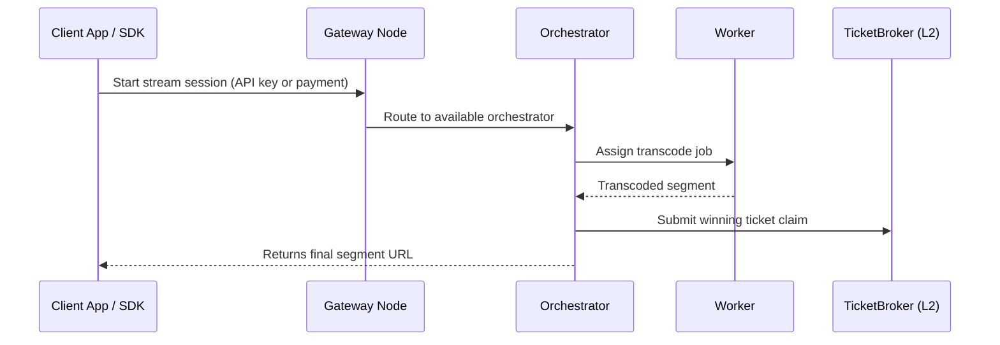

# Livepeer Network Overview

While the Livepeer protocol defines cryptoeconomic and smart contract infrastructure on Ethereum and Arbitrum, the Livepeer **network** consists of off-chain actors, compute resources, job routing layers, and gateways that coordinate decentralized video and AI workloads in real time.

This page introduces the architectural structure of the Livepeer Network, how it relates to the protocol, and who operates key components.

---

## What Is the Livepeer Network?

The **Livepeer Network** is the off-chain infrastructure and set of actors that execute real work—stream transcoding, AI inference, and other media computation—via open interfaces and permissionless coordination. It includes:

- Compute node operators (Orchestrators, Workers)
- Job routers and session gateways
- End-user applications and media clients
- Credit systems and off-chain accounting layers

The protocol provides incentives and correctness guarantees. The **network performs the jobs.**

---

## Key Network Participants

| Actor          | Role in the Network                                                    |
|----------------|------------------------------------------------------------------------|
| **Gateway Nodes** | Accept session requests, handle API keys, route to orchestrators       |
| **Orchestrators** | Bid for jobs, validate tickets, distribute to local workers           |
| **Workers**       | Execute compute tasks: transcoding (FFmpeg) or inference (AI model)   |
| **Clients**       | Submit streams via Livepeer Studio, CLI, SDKs, or integrated platforms |
| **Gatekeeper Services** | (Optional) perform workload verification, credit balance resolution |

---

## Session Lifecycle: Video Example

Session metadata, monitoring, and reporting are managed off-chain but linked to protocol rewards.

---

## Compute Separation: Video vs AI

| Workload Type | Description                         | Example Session Path                            |
|---------------|-------------------------------------|--------------------------------------------------|
| Transcoding   | Convert bitrate, resolution, format | HLS stream → FFmpeg Worker → .m3u8 + .ts output |
| Inference     | Run ML model on image/video input   | MP4 → Stable Diffusion Worker → output frame    |

The same orchestrator may support both job types or specialize. Selection depends on job metadata.

---

## Gateway Design

Gateways are **entry points**, not smart contracts.

| Gateway Type       | Description                                  | Examples                       |
|--------------------|----------------------------------------------|---------------------------------|
| Livepeer Gateway   | Public, runs at api.livepeer.org             | Used by Livepeer Studio, SDKs  |
| Daydream Gateway   | ML-optimized, handles image/video inference  | Used by MetaDJ, dotSimulate    |
| Custom Gateways    | Partner-hosted with custom auth/routing      | E.g., ComfyStream, cascade labs|

Gateways manage:
- API keys or credit balances
- Compute routing logic
- Input/output delivery

They **do not require protocol governance** to operate.

---

## Compute Credit System (Optional)

Many workloads are paid via internal credit systems that:
- Top up via ETH or USDC
- Deduct credits per minute or per image
- Are tracked off-chain by gateway providers

Payment reconciliation via protocol occurs at orchestrator layer.

---

## Observability and Monitoring

Livepeer Studio and gateway hosts run real-time monitoring tools:

- Stream quality (fps, bitrate, segment latency)
- Orchestrator logs (retries, drops, error codes)
- Credit consumption logs

These metrics are reported to operators but not persisted on-chain.

---

## Decentralization Guarantees

The network maintains:
- **Redundant routing** across multiple gateways
- **Permissionless compute** registration for orchestrators
- **Decentralized payment** via probabilistic ETH tickets

Slashing and quality verification remain protocol-level enforcement paths.

---

## Network Health Metrics (Insert Live)

| Metric                     | Placeholder               |
|----------------------------|---------------------------|
| Active Gateways            | `INSERT_COUNT`            |
| Orchestrator Uptime (avg)  | `INSERT_PCT`              |
| Job Throughput             | `INSERT_TOTAL_JOBS`       |
| AI Sessions per Day        | `INSERT_AI_VOLUME`        |

Source: [explorer.livepeer.org](https://explorer.livepeer.org)

---

## References

- [Livepeer SDK](https://github.com/livepeer/js-sdk)
- [Daydream AI Gateway](https://docs.daydream.livepeer.org)
- [MetaDJ on Livepeer](https://blog.livepeer.org/metadj)
- [Builder story: dotSimulate](https://blog.livepeer.org/builders-dotsimulate)
- [Gateway modes (cascade)](https://forum.livepeer.org/t/lip-77-arbitrum-native)

---

Next: `actors.mdx`

