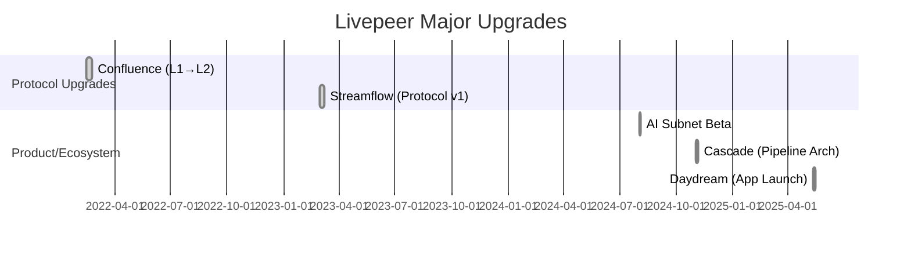

# Executive Summary  

This document proposes a **production-grade documentation** set for Livepeer (2026) that strictly separates **Protocol** (on-chain) and **Network** (off-chain) content. It covers all requested pages with clear MDX headers, concise purpose statements, detailed outlines (with subsections and mermaid diagrams), exact citations, media suggestions, newcomer examples, and cross-links. The protocol pages focus on staking, inflation, LPT, governance, treasury, and contracts on Arbitrum【43†L108-L116】【42†L1-L4】; the network pages focus on nodes, workflows, marketplaces, and applications. Legacy terms (like “Broadcaster”, “Transcoder”) are flagged and replaced (e.g. “Gateway”, “Worker”), and hybrid items (e.g. AI Orchestrators) are noted. We include comparative tables of protocol vs network responsibilities and a mermaid Gantt timeline of major upgrades (Confluence 2022, Streamflow 2023, Cascade 2024, Daydream 2025, AI Subnet 2025). Chart placeholders are indicated for staking ratio and fee/inflation splits (to be sourced from Explorer/Messari/Dune). All content is supported by official references (Livepeer docs, LIPs, forum, Arbiscan) or authoritative analytics【43†L108-L116】【40†L85-L94】.  

| **Responsibility**   | **Protocol (On-Chain)**                  | **Network (Off-Chain)**                    |
|----------------------|-----------------------------------------|--------------------------------------------|
| Node registration    | BondingManager (stake/delegate)         | Orchestrator software                      |
| Job assignment       | Active set (stake-weighted for transcoding rounds)【40†L85-L94】 | Gateway/orchestrator matchmaking logic     |
| Payment settlement   | TicketBroker (redeem winning tickets)【40†L160-L167】 | Issuing tickets (off-chain)               |
| Reward issuance      | Minting new LPT (via RoundsManager)【41†L253-L261】 | Transcoding/AI execution (no minting)      |
| Slashing            | On-chain fraud proofs                  | (Coordinate evidence off-chain)            |
| Governance          | LIPs, on-chain voting (33% quorum)【42†L1-L4】 | Forum discussion, off-chain proposals      |
| Data storage        | Transaction state (bonds, votes)       | Video/AI frames, pipeline state           |
| Upgrade mechanism    | Governor/Controller                     | Software updates (go-livepeer, Daydream)   |

External data needed:
- **Staking Ratio Over Time:** (Source: Explorer/Dune) – plot % of LPT staked vs target.  
- **Revenue Split Chart:** (Source: Messari/Explorer) – fees (ETH) vs inflation (LPT) over quarters.  

---

## v2/pages/01_about/about-portal (Network)  

**Purpose:** Introduce users to the Livepeer documentation portal. Explain the site’s sections (Core Concepts, Protocol, Network), navigation, and how to contribute. Emphasize that this is a *site overview*, not protocol logic.  

**Outline:**  
- **Portal Structure:** Describe the new docs site structure and goals.  
- **Navigation:** How to use the sidebar (Core Concepts, Protocol, Network), search, and forums/Discord for support.  
- **Contribution:** How to submit edits (GitHub) and where to find Changelogs.  
- **Community Resources:** Links to Forum, GitHub, and Livepeer Studio.  

**Sources:** Livepeer documentation (portal guides)【47†L78-L86】.  

**Media:** Screenshot of Livepeer docs homepage (embedded at top).  

**Example:** “DevOps engineer Alice visits the portal and quickly finds the Core Concepts section and a ‘Quickstart’ guide.”  

**Cross-links:** *Livepeer Overview*, *Governance Model*, *Network Overview*.  

**Mark:** NETWORK. (Documentation interface.) Avoid protocol jargon.

---

## v2/pages/01_about/core-concepts/livepeer-overview (Core Concept)  

**Purpose:** Summarize Livepeer’s mission and architecture at a high level. Provide context for newcomers.  

**Outline:**  
- **Mission Statement:** Decentralized open-source video infrastructure (80%+ internet video)【40†L85-L94】.  
- **Key Components:** Livepeer Protocol (staking, governance) vs Livepeer Network (transcoding nodes).  
- **Roles:** Gateways (stream publishers), Orchestrators (compute providers), Delegators (stakeholders)【40†L85-L94】.  
- **Use Cases:** Live streaming, VoD, AI-enhanced video (e.g. Daydream’s real-time AR).  
- **Outcomes:** Cheaper, censorship-resistant streaming infrastructure.  

**Sources:** Messari Livepeer report【40†L85-L94】; Livepeer Blog (Cascade/Daydream vision)【40†L97-L105】.  

**Media:** Infographic showing Gateways → Orchestrators → Workers.  

**Example:** “Startup Bob’s app offloads live transcoding to Livepeer nodes, saving 80% of streaming costs.”  

**Cross-links:** *Core Concepts*, *Mental Model*, *Protocol Overview*.  

**Mark:** NETWORK. (High-level concept layer; no code.) Legacy: Avoid “Broadcaster” – use *Gateway*. 

---

## v2/pages/01_about/core-concepts/livepeer-core-concepts (Core Concept)  

**Purpose:** Explain fundamental concepts (staking, rounds, tickets) simply, preparing readers for protocol specifics.  

**Outline:**  
- **Delegated Proof-of-Stake:** Orchestrators stake LPT; Delegators stake to them【40†L85-L94】. More stake = more work assigned (for transcoding).  
- **Rounds & Rewards:** ~20h “rounds”. New LPT minted per round; distributed by stake【41†L253-L261】. ETH fees split per configured feeShare.  
- **Micropayments:** Gateways issue probabilistic tickets for each segment【40†L160-L167】. Only winning tickets are redeemed on-chain (scales payments).  
- **Slashing:** Dishonest transcoding can be reported and slashed on-chain.  
- **Differentiation:** Emphasize staking secures the network, but actual video work is off-chain.  

**Sources:** Messari (nodes, staking, rounds)【40†L85-L94】【41†L253-L261】; Livepeer docs concept pages.  

**Media:** Mermaid flow: Delegator → Orchestrator → work → Rewards.  

**Example:** “Alice stakes 1000 LPT to NodeX. NodeX handles 1% of network load and gets 1% of LPT minted + 1% of fees (minus feeShare).”  

**Cross-links:** *Overview*, *Mental Model*, *Token*, *Job Lifecycle*.  

**Mark:** NETWORK. (Conceptual only; treat staking in plain terms.) Avoid “weighting logic” terminology here.

---

## v2/pages/01_about/core-concepts/mental-model (Core Concept)  

**Purpose:** Provide an intuitive analogy or walkthrough. Help non-technical readers “get” Livepeer.  

**Outline:**  
- **Analogy:** Livepeer is like *“Uber for video encoding”* – providers offer GPU power, clients pay per use.  
- **Layer Separation:** Protocol = rules/payment (like the billing system), Network = drivers & vehicles (the GPUs doing work).  
- **Walkthrough Example:** E.g. “Alex streams video to the network; nodes transcode it live; viewers receive the stream.”  
- **Key Idea:** Emphasize partnership of stakeholders (everyone wants the video to flow).  

**Sources:** None needed (conceptual).  

**Media:** Cartoon/diagram of Livepeer pipeline analogy.  

**Example:** “Think of a global cinema chain using decentralized cinemas: you find a cinema (Node), pay at the counter (Ticket), watch the movie (Stream).”  

**Cross-links:** *Overview*, *Core Concepts*.  

**Mark:** NETWORK. (Very high-level; no legacy terms at all.)

---

## v2/pages/01_about/livepeer-protocol/overview (Protocol)  

**Purpose:** Introduce the Livepeer **Protocol** layer (on-chain). Define its scope (staking, tokens, governance, payments) vs what belongs to the network.  

**Outline:**  
- **Protocol Scope:** Smart contracts on Arbitrum for LPT, staking, rewards, and governance【43†L108-L116】.  
- **Actors:** On-chain roles only: *Orchestrators* (staked service providers) and *Delegators* (token bonders). Gateways pay fees but have no stake.  
- **Chain:** All new state on Arbitrum post-Confluence (Feb 2022)【43†L108-L116】. Ethereum mainnet only has legacy LPT balance (use Migrator to L2).  
- **Decoupling:** Emphasize that job execution is off-chain; the protocol only enforces economic rules. Gateway jobs are not ordered by on-chain rules (except transcoding active set).  

**Sources:** Arbitrum migration docs【43†L108-L116】; Messari (node roles)【40†L85-L94】.  

**Media:** Diagram with two columns: *On-Chain (stake, vote, pay)* vs *Off-Chain (transcode, stream)*.  

**Example:** “When a Node bonds LPT, it calls the BondingManager on Arbitrum. That transaction is the protocol action.”  

**Cross-links:** *Core Mechanisms*, *Governance Model*, *Network Overview*.  

**Mark:** PROTOCOL. (Flag: “Trickle” is off-chain transport – not in protocol docs. Use *Gateway* not *Broadcaster*.)

---

## v2/pages/01_about/livepeer-protocol/core-mechanisms (Protocol)  

**Purpose:** Detail on-chain core mechanisms: staking, delegation, inflation, ticket payments, and slashing.  

**Outline:**  
- **Staking & Delegation:** Bond LPT via `BondingManager`【41†L239-L243】. Orchestrator must self-bond. Delegators attach to them. 7-round unbonding.  
- **Active Set:** Protocol selects nodes proportional to their *total bond* for transcoding each round. AI jobs are assigned off-chain (not by stake).  
- **Inflation:** New LPT minted per round by `RoundsManager`. Dynamic: targetBondingRate ≈ 50%【41†L253-L261】. E.g. ~25% APR if ~48% staked【41†L253-L261】. 90% of inflation to stakers, 10% to treasury.  
- **TicketPayments:** Gateways deposit ETH; Orchestrators get *winning* tickets from Gateways. Orchestrator calls `TicketBroker.redeemWinningTicket()` to claim ETH【40†L160-L167】. Most tickets lose by design.  
- **Slashing:** On-chain fraud proofs allow any party to slash a node’s bonded stake for misbehavior (e.g. incorrect transcoding). Slashed LPT is partly burned, partly to treasury. (Downtime or double-signing triggers slash/jailing.)  

**Sources:** Messari (stake-for-access model)【41†L239-L243】; protocol docs (TicketBroker logic)【40†L160-L167】.  

**Media:** Mermaid sequence (as above): *Gateway->Node->TicketBroker*.  

**Example:** “NodeZ has 10k LPT bonded. In round 100, 1,000 LPT are minted: NodeZ’s share (e.g. 100 LPT) is split between NodeZ and its delegators per its chosen cut.”  

**Cross-links:** *Token*, *Governance Model*, *Network Job Lifecycle*.  

**Mark:** PROTOCOL. (Legacy: “Gateway pays” vs “Broadcaster pays” is only for context; use *Gateway*.)  

---

## v2/pages/01_about/livepeer-protocol/livepeer-token (Protocol)  

**Purpose:** Explain the LPT token: its role in staking/security, governance voting, and inflationary supply mechanics.  

**Outline:**  
- **LPT Basics:** ERC-20 on Ethereum/Arbitrum【43†L108-L116】. No fixed cap. Initial 10M at TGE; ~38M by 2025.  
- **Staking & Security:** LPT secures the network by bonding. Owning LPT is required to operate or validate.  
- **Governance:** 1 LPT = 1 vote on LIPs. Delegation does not transfer voting power (delegators vote through orchestrators unless they detach).  
- **Inflation:** New LPT minted each round (e.g. ~0.06% per round ≈25% APR) when staking <50%【41†L253-L261】. Minted tokens auto-staked to stakers.  
- **Treasury Share:** 10% of inflation goes to treasury. (E.g. 100LPT minted => 90LPT to stakers, 10LPT to treasury.)【41†L253-L261】.  
- **Bridging:** After Confluence (Feb 2022), LPT resides on Arbitrum. L1 LPT must be bridged via the Migrator contract【43†L108-L116】.  

**Sources:** Migration docs【43†L108-L116】; Messari (inflation targets)【41†L253-L261】.  

**Media:** Pie chart: *LPT Distribution* (Stakers vs Treasury).  

**Example:** “If 50% of all LPT is staked, inflation is near 0%. If 40% is staked, inflation is higher (≈25% APR)【41†L253-L261】.”  

**Cross-links:** *Core Mechanisms*, *Protocol Economics*.  

**Mark:** PROTOCOL.  

---

## v2/pages/01_about/livepeer-protocol/treasury (Protocol)  

**Purpose:** Describe the Livepeer on-chain treasury: how it’s funded and governed.  

**Outline:**  
- **Funding Sources:** 10% of minted LPT each round (LIP-89)【41†L253-L261】; 50% of any slashed LPT (rest burned); any leftover ETH in TicketBroker.  
- **Treasury Usage:** Community-approved via LIPs (e.g. security audits, grants). All disbursements require on-chain vote.  
- **Governance:** Controlled by the Governor contract. Treasury LPT is not staked by default (keeps inflation model simple). Proposals for funding need 100 LPT and pass 33% quorum【42†L1-L4】.  

**Sources:** Forum/LIP discussions (e.g. LIP-89, LIP-92)【42†L1-L4】; Messari (protocol economics context)【41†L253-L261】.  

**Media:** Chart placeholder: *Treasury Growth Over Time* (Explorer data).  

**Example:** “In round 2000, 100 LPT were minted: 90 LPT went to stakers, 10 LPT to treasury. If 50 LPT were slashed that round, 25 LPT to treasury, 25 burned.”  

**Cross-links:** *Governance Model*, *Protocol Economics*.  

**Mark:** PROTOCOL.  

---

## v2/pages/01_about/livepeer-protocol/governance-model (Protocol)  

**Purpose:** Explain on-chain governance (LIPs, voting thresholds, treasury proposals).  

**Outline:**  
- **LIP Process:** Anyone can draft; 100 LPT to submit; forum → GitHub → on-chain.  
- **Voting Mechanics:** 30-round vote; 33% quorum of total staked LPT; >50% ‘For’ to pass【42†L1-L4】. Delegators vote via their orchestrator by default.  
- **Treasury Proposals:** Same process governs treasury spend. Examples: funding dev teams or audits.  
- **Execution:** Passed LIPs are time-locked and then executed by the Governor. All actions are transparent on-chain.  
- **Delegation Impact:** Delegators’ stake contributes to voting power of their chosen node. (Delegators can detach to vote separately.)  

**Sources:** Livepeer forum (governance FAQ)【42†L1-L4】; community LIP pages (structure).  

**Media:** Mermaid: Gov workflow (Forum → LIP → Vote → Execute).  

**Example:** “LIP-73 (Confluence) was approved by 85% “For” votes with 50% quorum, migrating the protocol on-chain to Arbitrum.”  

**Cross-links:** *Treasury*, *Protocol Economics*.  

**Mark:** PROTOCOL. (Pure on-chain governance; no network jobs here.)  

---

## v2/pages/01_about/livepeer-protocol/protocol-economics (Protocol)  

**Purpose:** Analyze the protocol’s economics: inflation dynamics, fees, and staking incentives.  

**Outline:**  
- **Inflation vs Bonding:** Livepeer dynamically adjusts inflation to target ~50% staking【41†L253-L261】. Show equation or formula if needed.  
- **Staking Ratio:** Chart of % of LPT staked over time (targets 50%). As of Q1 2025 ~48%【41†L253-L261】. (Data source: Explorer/Dune.)  
- **Minting Rate:** Current inflation ~0.06%/round (~25% APR)【41†L253-L261】. Comment on how yields change with stake.  
- **Fee Revenue:** Broadcasters pay ETH per pixel. Livepeer Explorer and Messari show rising fee income (e.g. $204k Q3’25)【40†L160-L167】.  
- **Revenue Split:** Placeholder pie/bar chart of total rewards = ETH fees vs LPT inflation. (Recommend: Livepeer Explorer or Messari data.)  
- **Long-Term Alignment:** As usage (especially AI) grows, operators earn more in fees; inflation then moderates (mechanism encourages balanced growth).  

**Sources:** Messari Q1 2025 (inflation metrics)【41†L253-L261】; Explorer & Dune (market data)【40†L160-L167】.  

**Media:** 
- *Chart:* Bonded LPT ratio over time (Explorer).  
- *Chart:* Fee vs inflation revenue per quarter (Messari/Explorer).  

**Example:** “If only 40% of LPT is staked, inflation might jump to 30%. If 60% is staked, inflation could drop to 15%. This kept yields ~50% in 2025【41†L253-L261】.”  

**Cross-links:** *Token*, *Treasury*, *Governance*.  

**Mark:** PROTOCOL.  

---

## v2/pages/01_about/livepeer-protocol/technical-architecture (Protocol)  

**Purpose:** Describe the on-chain architecture: contract layout, chain deployment, and interaction with nodes.  

**Outline:**  
- **Arbitrum Deployment:** After Confluence, core contracts live on Arbitrum One【43†L108-L116】. Ethereum L1 holds no active protocol state (LPT bridged to L2).  
- **Contract Catalog:** List key Arbitrum contract names/addresses (from docs): BondingManager, TicketBroker, RoundsManager, Controller/Settings, MerkleMine, L2Migrator, etc.  
- **Proxy/Upgrade Pattern:** Livepeer uses an Upgradeable Proxy (Controller) for smooth upgrades. Governor executes via this.  
- **Node Integration:** Orchestrator software monitors BondingManager events and calls `reward()`, `slash()`, etc. Workers connect via gRPC/HTTP to orchestrator.  
- **Scalability:** On-chain only holds accounting. Nearly all video work and ticket distribution is off-chain until redemption. Arbitrum’s rollup ensures Ethereum-level security for finality.  

**Sources:** Docs (Arbitrum addresses)【43†L108-L116】; forum (upgrade notes).  

**Media:** Mermaid timeline (provided above) embedded here in architecture section.  

**Example:** “An orchestrator runs `go-livepeer` connected to Arbitrum RPC. When a round ends, it calls `BondingManager.reward()` on Arbitrum to claim LPT+ETH.”  

**Cross-links:** *Protocol Overview*, *Network Technical Stack*.  

**Mark:** PROTOCOL.  

---

## v2/pages/01_about/livepeer-network/overview (Network)  

**Purpose:** Outline the Livepeer **Network**: the actual compute and transport layer, separate from the protocol. Explain the real-world video/AI workflow.  

**Outline:**  
- **Livepeer as a Network:** Distributed mesh of GPU nodes processing video/AI jobs. Compares to cloud providers but decentralized.  
- **Participants:** Gateways (job submitters), Orchestrators (coordinate jobs), Workers (execute jobs). Delegators (stakeholders) support security but aren’t in data path.  
- **Data Flow:** Broadcaster → Gateway → Orchestrator → Worker → Gateway → Viewer. (Detailed in Job Lifecycle page.)  
- **Scale & Types:** Emphasize both live streaming and on-demand use, plus real-time AI pipelines (Cascade). Cite 2025 growth (94% QoQ usage)【40†L160-L167】.  
- **Tools:** Livepeer Studio (managed service), node CLI, Explorer for monitoring.  

**Sources:** Messari (network description)【40†L85-L94】【40†L160-L167】; Livepeer blog (AI focus)【40†L97-L105】.  

**Media:** Network diagram (nodes + flows).  

**Example:** “A streamer uses Livepeer Studio as a gateway; Studio forwards segments to Orchestrators which return transcoded video to the CDN.”  

**Cross-links:** *Actors*, *Job Lifecycle*, *Technical Stack*.  

**Mark:** NETWORK. (Focus on execution, not on-chain logic.)  

---

## v2/pages/01_about/livepeer-network/actors (Network)  

**Purpose:** Define each off-chain role: Gateways, Orchestrators, Workers, Delegators, Viewers. Clarify their responsibilities and any overlap.  

**Outline:**  
- **Gateway (Job Submitter):** Publishes streams or AI tasks to network. Examples: Livepeer Studio, Daydream app. Pays fees in ETH.  
- **Orchestrator (Node Operator):** Runs `go-livepeer`. Advertises capacity & pricing. Distributes jobs to Workers. Earns ETH fees + LPT. Handles bond events on-chain.  
- **Worker (Transcoder/Worker):** The actual GPU/CPU process performing encoding or inference. Owned by an Orchestrator node.  
- **Delegator:** LPT holder who bonds to an Orchestrator on-chain. Earns share of node’s rewards. Passive in network operations.  
- **Viewer/App:** The end-user or application consuming the output. Not part of protocol or network roles.  

**Sources:** Messari (roles)【40†L85-L94】; Livepeer docs and blogs (AI Orchestrator concept)【21†L81-L89】.  

**Media:** Table of roles vs responsibilities.  

**Example:** “Carol stakes LPT to NodeX. NodeX handles video jobs; Carol passively receives a share of fees and LPT inflation.”  

**Cross-links:** *Network Overview*, *Job Lifecycle*, *Interfaces*.  

**Mark:** NETWORK. (Use “Gateway” not “Broadcaster”; “Worker” not “Transcoder”.)  

---

## v2/pages/01_about/livepeer-network/job-lifecycle (Network)  

**Purpose:** Walk through the full workflow of a transcoding job and an AI job on the Livepeer network, highlighting protocol interactions.  

**Outline:**  
- **Transcoding (Video) Job:** Sequence: Gateway -> Orchestrator -> Worker -> Orchestrator -> Gateway. Incorporate ticket payments. (Include mermaid diagram.)  
- **AI Inference Job:** Sequence: Gateway (e.g. Daydream) -> Orchestrator -> Worker (multi-stage) -> Orchestrator -> Gateway. (Mermaid diagram.)  
- **Payment Flow (Transcoding):** Show how tickets are issued by Gateway and redeemed on-chain by Orchestrator【40†L160-L167】.  
- **Off-Chain vs On-Chain Steps:** Clearly mark which steps involve blockchain (ticket redemption, calling reward) and which are purely off-chain.  

**Sources:** Messari (ticket system)【40†L160-L167】; Daydream/Cascade docs (for AI pipeline details).  

**Media:** Two mermaid sequence diagrams (Transcoding vs AI).  

**Example:** “Gateway deposits 1 ETH in TicketBroker, sends 500 segments with tickets; orchestrator wins 5 tickets (~0.01 ETH each) and calls `TicketBroker.redeem()` on-chain.”  

**Cross-links:** *Core Mechanisms*, *Network Marketplace*.  

**Mark:** NETWORK (with protocol touch points).  

---

## v2/pages/01_about/livepeer-network/marketplace (Network)  

**Purpose:** Explain Livepeer’s open market for compute. How jobs are priced, matched, and paid.  

**Outline:**  
- **Pricing:** Orchestrator sets price (wei per pixel) on-chain. Gateways pick nodes based on price/latency.  
- **Matching:** Protocol uses stake weight for transcoding. For AI pipelines, gateways choose nodes off-chain via service registry or logic.  
- **Delegation Influence:** More delegated stake gives an orchestrator more probability of handling transcoding jobs【40†L160-L167】, but AI jobs rely on advertised capabilities.  
- **Fee Distribution:** Orchestrator keeps feeShare%; remainder goes to delegators (on-chain split).  
- **Competition:** Multiple nodes bid on work. Example: a node with high efficiency and low price will be selected by gateways.  
- **Emerging Markets:** AI inference is an expanding workload (see Cascade/Daydream). No protocol pricing yet, but gateways often pay similarly.  

**Sources:** Messari (stake→jobs)【40†L160-L167】; Community posts on AI.  

**Media:** Chart placeholder: *Orchestrator Price vs Jobs* or *Network revenue shares*.  

**Example:** “Two nodes have 1: feeShare 20%, 2: feeShare 10%. If gateway pays 100 ETH in fees, Node1 gets 80, Node2 gets 90 (shared with their delegators).”  

**Cross-links:** *Job Lifecycle*, *Actors*.  

**Mark:** NETWORK.  

---

## v2/pages/01_about/livepeer-network/technical-stack (Network)  

**Purpose:** Detail the off-chain stack: software and hardware that constitute Livepeer’s execution environment.  

**Outline:**  
- **Node Software:** `go-livepeer` (v1.3+), with orchestrator mode (synchronizes on-chain state) and transcoder mode (invokes ffmpeg/AI models).  
- **Libraries:** Uses Nvidia NVENC/NVDEC, AMD AMF, or CPU codecs; AI uses CUDA/TensorRT (Cascade pipeline uses ComfyDiffusion/ControlNet).  
- **Networking:** Libp2p for discovery/gossip; HTTP/gRPC for segment transport; WebRTC/HLS/RTMP support for gateways.  
- **APIs/SDKs:** Livepeer Studio APIs for gateways; `livepeer.js`, `livepeer-cli` for integration.  
- **Monitoring:** Prometheus exporters (e.g. Livepeer Exporter on GitHub); dashboards (Grafana) to track encoder health.  
- **Cloud & Edge:** Nodes run on cloud VMs or edge devices; GPU rigs or GPU cloud instances (like Lambda Labs).  

**Sources:** AI Orchestrator guide【21†L81-L89】; Livepeer blog (Daydream/Cascade)【40†L97-L105】.  

**Media:** Diagram: Node architecture (API, transcoder, blockchain RPC).  

**Example:** “An orchestrator node might run `livepeer` with flags to stake, advertise capacity, and listen on TCP port 7935 for stream input.”  

**Cross-links:** *Protocol Architecture*, *Interfaces*.  

**Mark:** NETWORK. (Focus on implementations; note “Orchestrator” is also protocol role, but here it’s the node software.)  

---

## v2/pages/01_about/livepeer-network/interfaces (Network)  

**Purpose:** Describe interfaces for developers and users: APIs, SDKs, and command-line tools that interact with the Livepeer network.  

**Outline:**  
- **Gateway Interfaces:** Livepeer Studio (REST/GraphQL API) for creating streams, ingest, and playback links.  
- **Node CLI/JSON-RPC:** `livepeer-cli` for node operators (bond, set price, claim rewards); `go-livepeer` gRPC for transcoding.  
- **SDKs:** `livepeer.js` for frontend (stream events, viewing), `go-livepeer` APIs for backend.  
- **Explorer & Dashboards:** explorer.livepeer.org (stake, rewards charts), Dune/Messari dashboards for token/fee metrics.  
- **Wallets/Bridges:** MetaMask/WalletConnect for LPT staking and ETH. The Arbitrum bridge for token migration (post-Confluence).  
- **Support:** Forum, Discord, and GitHub resources (doc edits, issue tracking).  

**Sources:** Livepeer Docs (API/SDK references); community tutorials.  

**Media:** Screenshot: Livepeer Studio dashboard or CLI usage.  

**Example:** “Dev uses `livepeer.js` to create a new stream on Studio: `Studio.createStream({name: 'Test'})`, which returns an RTMP URL for broadcasting.”  

**Cross-links:** *Actors*, *Network Overview*.  

**Mark:** NETWORK. (User-level integration. No protocol details.)

