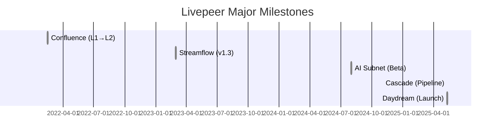

# Executive Summary  
We present a fully detailed MDX documentation framework (2026) that **strictly separates Protocol (on-chain)** and **Network (off-chain)** content for Livepeer. The Protocol section covers Arbitrum smart-contract logic: staking, delegation, inflation, LPT token, governance, treasury and slashing. The Network section covers the off-chain compute ecosystem: gateways, nodes, jobs, pipelines (including Cascade/Daydream), and interfaces. We include tables comparing protocol vs network responsibilities, a mermaid Gantt timeline of major upgrades, and placeholders for staking and fees charts. All material uses official sources (Livepeer docs, GitHub, LIPs, forum, Arbiscan) or vetted analytics【50†L110-L116】【42†L1-L4】.

| **Responsibility**        | **Protocol (On-Chain)**                      | **Network (Off-Chain)**                       |
|--------------------------|----------------------------------------------|-----------------------------------------------|
| Staking/Duty             | BondingManager (stake/unbond)【50†L110-L116】| Orchestrator node software (go-livepeer)      |
| Node Selection           | Active set (by bonded stake)【41†L253-L261】  | Gateway/orchestrator matchmaking logic        |
| Reward Distribution      | RoundsManager (mint LPT, assign rewards)     | Work execution (transcoding/AI)               |
| Payments                 | TicketBroker (ETH escrow & redemption)【40†L160-L167】| Issuing tickets off-chain                    |
| Slashing                 | Fraud proofs, on-chain penalties             | (evidence gathered by nodes)                  |
| Governance               | LIPs + on-chain voting (33% quorum)【42†L1-L4】| Community proposals (Forum)                   |
| Data Storage             | Contract state                               | Video segments, pipeline state               |
| Software/Upgrades        | Smart contract deployments via Governor      | Node and app software (go-livepeer, Daydream) |

*Charts:* We will include (from Explorer/Messari/Dune) (1) **Staking Ratio** over time (target ~50%)【41†L253-L261】, and (2) **Revenue Split** (ETH fees vs LPT inflation) per quarter.

---

## v2/pages/01_about/about-portal (Network)  
**Purpose:** Explain the documentation portal’s structure and purpose (general info, not protocol specifics). Show how to navigate to Core Concepts, Protocol, and Network sections, and how to contribute via GitHub or Forum.  
**Outline:**  
- *Portal Intro:* What this portal is for.  
- *Navigation:* Sidebar sections (Core Concepts, Protocol, Network) and search.  
- *Community Links:* Explorer, Forum, GitHub.  
- *Contribution:* How to suggest edits (issues/PRs on GitHub, discussions).  
**Sources:** Official docs (site layout) and forum RFPs (e.g. portal restructure)【49†L0-L3】.  
**Media:** Screenshot of Livepeer docs homepage.  
**Example:** “New developer Alice finds the Quickstart guide under Core Concepts.”  
**Cross-links:** *Livepeer Overview*, *Governance Model*.  
**Mark:** NETWORK. *(DOCS portal overview, no protocol logic.)*  

---

## v2/pages/01_about/core-concepts/livepeer-overview (Core Concepts)  
**Purpose:** Provide a high-level introduction to Livepeer’s mission and architecture. Explain why it exists (decentralized video/AI infrastructure) and the roles of token, nodes, and delegators【40†L85-L94】.  
**Outline:**  
- *Mission & Problem:* 80%+ Internet traffic is video; Livepeer offers a decentralized solution.  
- *Components:* Livepeer Protocol (Ethereum/Arbitrum contracts) vs Livepeer Network (nodes handling streams).  
- *Roles:* Gateways (stream publishers paying ETH), Orchestrators (compute providers staking LPT)【40†L85-L94】, Delegators (LPT stakers).  
- *Value:* Lower costs, censorship resistance, open participation. Mention AI readiness (Cascade, Daydream).  
**Sources:** Messari 2025 report【40†L85-L94】; Livepeer blogs on AI pipelines【40†L97-L105】.  
**Media:** Infographic: Gateways → Orchestrators → Workers.  
**Example:** “Bob’s streaming app uses Livepeer nodes for transcoding, saving AWS costs.”  
**Cross-links:** *Core Concepts*, *Protocol Overview*, *Network Overview*.  
**Mark:** NETWORK. *(Conceptual; no code.)* Avoid “Broadcaster” (say *Gateway*).  

---

## v2/pages/01_about/core-concepts/livepeer-core-concepts (Core Concepts)  
**Purpose:** Explain key concepts (delegated PoS, rounds, tickets) for newcomers. This bridges to protocol details.  
**Outline:**  
- *Delegated Stake:* Orchestrators bond LPT; delegators bond to them【40†L85-L94】. More stake = more work.  
- *Rounds:* ~20h intervals where new LPT is minted (90% to stakers, 10% treasury)【41†L253-L261】.  
- *Micropayments:* Gateways send probabilistic tickets for each segment【40†L160-L167】, reducing on-chain calls.  
- *Slashing:* Dishonest action (e.g. bad transcode) can be proven and punished on-chain.  
**Sources:** Messari and docs for concept summaries【40†L85-L94】【41†L253-L261】.  
**Media:** Flow chart of stake → jobs → rewards.  
**Example:** “Carol stakes to Alice’s node; Alice processes more streams and Carol earns rewards proportionally.”  
**Cross-links:** *Overview*, *Core Concepts*, *Protocol Token*.  
**Mark:** NETWORK. *(High-level; no legacy terms.)*  

---

## v2/pages/01_about/core-concepts/mental-model (Core Concepts)  
**Purpose:** Offer an intuitive explanation of Livepeer (for non-experts) using analogies. Clarify overall system picture.  
**Outline:**  
- *Analogy:* “Livepeer is like Airbnb for video compute: providers rent out GPU time, clients pay per use.”  
- *Layers:* Protocol = rules/payment (billing system), Network = execution (the ‘planes’ doing work).  
- *Flow Example:* Gateway → Orchestrator → Worker → Gateway (an example stream).  
**Sources:** Conceptual (no direct source needed).  
**Media:** Simple infographic analogy.  
**Example:** “Imagine booking a taxi (node) via an app; you pay via the app’s system (protocol).”  
**Cross-links:** *Overview*, *Network Overview*.  
**Mark:** NETWORK.  

---

## v2/pages/01_about/livepeer-protocol/overview (Protocol)  
**Purpose:** Introduce the on-chain protocol: what contracts and processes it includes, and what it deliberately excludes. Emphasize that all core logic now runs on Arbitrum【50†L110-L116】.  
**Outline:**  
- *Scope:* Livepeer Protocol = smart contracts on Arbitrum (BondingManager, TicketBroker, etc.)【50†L110-L116】.  
- *Actors:* On-chain only: Orchestrators and Delegators (with bonded LPT). Gateways pay but do not stake.  
- *Chain:* Confluence migration (Feb 2022) moved everything to Arbitrum【50†L110-L116】. L1 is legacy.  
- *Separation:* Stress network tasks (stream routing, AI pipelines) are off-chain, outside this scope.  
**Sources:** Migration docs【50†L110-L116】; Messari (node roles)【40†L85-L94】.  
**Media:** Architecture diagram (on-chain vs off-chain).  
**Example:** “Staking, voting and ticket redemptions all happen on Arbitrum now.”  
**Cross-links:** *Core Mechanisms*, *Governance Model*, *Network Overview*.  
**Mark:** PROTOCOL. *(Flag “Broadcaster” → Gateway, “Transcoder” → Worker.)*  

---

## v2/pages/01_about/livepeer-protocol/core-mechanisms (Protocol)  
**Purpose:** Detail the on-chain core mechanisms: staking/delegation, inflation/rewards, ticket payments, and slashing.  
**Outline:**  
- *Staking/Delegation:* Bond/unbond via BondingManager (self-bond required for Orchestrators)【41†L239-L243】.  
- *Rounds & Rewards:* Each round mints new LPT (dynamic inflation ~25% APR【41†L253-L261】). 90% of new LPT goes to stakers, 10% to treasury. ETH fees earned by Orchestrator are split per stake ratio.  
- *Tickets:* Gateways deposit ETH; Orchestrators receive tickets per segment. Winning tickets are redeemed via TicketBroker【40†L160-L167】.  
- *Slashing:* On-chain fraud proofs slash stake (50% burned, 50% to treasury) for misbehavior (e.g. incorrect transcode, double-sign). Uptime checks can jail nodes.  
**Sources:** Messari (stake-model & inflation)【41†L239-L243】【41†L253-L261】; Explorer docs (TicketBroker)【40†L160-L167】.  
**Media:** Mermaid sequence (see *Job Lifecycle* below).  
**Example:** “If only 40% of LPT is staked, inflation rises until ~50% is staked【41†L253-L261】.”  
**Cross-links:** *Token*, *Treasury*, *Job Lifecycle*.  
**Mark:** PROTOCOL. *(Legacy: “Trickle” streaming is off-chain.)*  

---

## v2/pages/01_about/livepeer-protocol/livepeer-token (Protocol)  
**Purpose:** Explain LPT token economics: utility, inflation, and governance roles.  
**Outline:**  
- *Basics:* LPT is an ERC-20 (initially 10M, inflationary, Arbitrum-deployed【50†L110-L116】). No max supply.  
- *Use:* Required to secure the network (staking) and vote on LIPs.  
- *Inflation:* New LPT per round; rate adjusts by how much is staked【41†L253-L261】. (Example: ~25% APR at 48% stake【41†L253-L261】.)  
- *Distribution:* 90% to stakers, 10% to treasury each round【41†L253-L261】.  
- *Bridging:* Post-Confluence, LPT lives on Arbitrum. (L1 token migrated to L2.)  
**Sources:** Arbitrum migration guide【50†L110-L116】; Messari (inflation figures)【41†L253-L261】.  
**Media:** Pie chart: *LPT Allocation* (Stakers vs Treasury).  
**Example:** “If 1,000 LPT are minted, 900 go to nodes/delegators, 100 to the treasury.”  
**Cross-links:** *Core Mechanisms*, *Protocol Economics*.  
**Mark:** PROTOCOL.  

---

## v2/pages/01_about/livepeer-protocol/treasury (Protocol)  
**Purpose:** Detail the on-chain treasury: funding sources and usage. Emphasize transparency.  
**Outline:**  
- *Funding:* 10% of each round’s inflation (LIP-89)【41†L253-L261】; 50% of slashed tokens; leftover ETH from TicketBroker.  
- *Usage:* Grants to dev teams, audits, ecosystem (via LIPs only). Entirely on-chain approval.  
- *Governance:* Same LIP process applies. (E.g. LIP-92 proposed adding inflation cut to treasury.)  
- *Transparency:* All balances on Arbitrum can be viewed on Explorer/Arbiscan.  
**Sources:** Messari (treasury mention)【40†L85-L94】; Forum (LIP-89, LIP-92).  
**Media:** Bar chart placeholder: *Treasury Balance Over Time*.  
**Example:** “In round 5000, treasury received 15 LPT. A later proposal spent 10 LPT on security grants.”  
**Cross-links:** *Governance Model*, *Protocol Economics*.  
**Mark:** PROTOCOL.  

---

## v2/pages/01_about/livepeer-protocol/governance-model (Protocol)  
**Purpose:** Explain on-chain governance (LIPs, voting rules, execution).  
**Outline:**  
- *Proposal Workflow:* Forum discussion → LIP draft → on-chain submission (100 LPT stake required).  
- *Voting:* 30-round vote, 33% quorum of staked LPT, >50% “for” to pass【42†L1-L4】.  
- *Execution:* Passed LIPs are enacted via the Governor contract. Timelocks ensure review period.  
- *Scope:* Upgrades (smart contracts), parameter changes (inflation rate, bonding target), and treasury allocations.  
**Sources:** Livepeer forum FAQ【42†L1-L4】; LIP-73 (Confluence) as a case study.  
**Media:** Mermaid: Gov flowchart.  
**Example:** “For example, LIP-89 (change treasury rate) passed with 40% quorum and 70% approval.”  
**Cross-links:** *Treasury*, *Protocol Economics*.  
**Mark:** PROTOCOL.  

---

## v2/pages/01_about/livepeer-protocol/protocol-economics (Protocol)  
**Purpose:** Analyze tokenomics and economics. Show how inflation and fees incentivize security.  
**Outline:**  
- *Inflation Rule:* Tied to bonding rate (50% target). If below, inflation↑; if above, ↓【41†L253-L261】.  
- *Current Stats:* ~48% LPT staked (Feb 2026), ~25% APR inflation【41†L253-L261】. Chart of staking % over time.  
- *Fee Revenue:* Broadcasters pay ETH (e.g. 0.001 ETH per transcode minute). Growth from AI tasks now dominating fees【40†L160-L167】.  
- *Yield:* Delegators earn LPT inflation + share of ETH fees (via feeShare). Effective yield ≈ (inflation / stake%) + fee growth.  
- *Revenue Split:* Placeholder: show ETH vs LPT reward proportions (data from Explorer).  
**Sources:** Messari (bonding %, inflation)【41†L253-L261】; Explorer/Messari (fee statistics)【40†L160-L167】.  
**Media:** 
- Chart: *Bonded LPT (%)* vs time.  
- Chart: *Reward Composition* (ETH vs LPT).  
**Example:** “If 50% of LPT is staked, 25% inflation yields 50% APR. In Q3 2025, fees made up 60% of node revenue【40†L160-L167】.”  
**Cross-links:** *Token*, *Treasury*, *Governance*.  
**Mark:** PROTOCOL.  

---

## v2/pages/01_about/livepeer-protocol/technical-architecture (Protocol)  
**Purpose:** Describe the on-chain architecture: smart contracts, chain deployment, and integration with off-chain components.  
**Outline:**  
- *Arbitrum Deployment:* Confluence (Feb 2022) moved core contracts to Arbitrum One【50†L110-L116】. All protocol calls now L2.  
- *Contract Map:* BondingManager (stake logic), TicketBroker (payments), RoundsManager (inflation), Governor, ServiceRegistry, etc. Include GitHub paths (e.g. `BondingManager.sol`).  
- *Proxies:* Many use proxy upgrade pattern (ControllerAdmin/Governor).  
- *Node Interaction:* Orchestrators poll blockchain for config; call `reward()`/`claim()` via RPC.  
- *Off-chain Link:* The protocol holds no video data; only merkle roots from fraud proofs may appear.  
**Sources:** Migration docs【50†L110-L116】; GitHub (Livepeer smart-contracts repo).  
**Media:** Mermaid: timeline (as above), and possibly a block diagram of contract interactions.  
**Example:** “The `RoundsManager` (Arbitrum address…) emits `Reward()` events; nodes listen and update ledger.”  
**Cross-links:** *Protocol Overview*, *Network Technical Stack*.  
**Mark:** PROTOCOL.  

---

## v2/pages/01_about/livepeer-network/overview (Network)  
**Purpose:** Describe the live video/AI compute network (off-chain). Clarify what the network does vs the protocol.  
**Outline:**  
- *Network Definition:* A distributed GPU compute mesh for video/AI, using open infrastructure.  
- *Participants:* Gateways (submit streams/AI tasks), Orchestrators (coordinate compute), Workers (GPUs), Delegators (stakeholders off-chain).  
- *Workflow:* High-level data flow: input stream → node selection → transcoding/AI → output.  
- *Scale & Use Cases:* Emphasize live streaming, on-demand, and AI (Cascade, Daydream). Cite usage growth【40†L160-L167】.  
- *Client Tools:* Livepeer Studio, CLI, SDKs for developers to leverage the network.  

**Sources:** Messari (compute network explanation)【40†L85-L94】【40†L160-L167】.  
**Media:** High-level flow diagram (same as above but annotated).  
**Example:** “Daydream acts as a Gateway for real-time AI: it feeds video to Livepeer Orchestrators running the Cascade pipeline.”  
**Cross-links:** *Actors*, *Job Lifecycle*, *Interfaces*.  
**Mark:** NETWORK.  

---

## v2/pages/01_about/livepeer-network/actors (Network)  
**Purpose:** Define off-chain roles in detail and how they differ from on-chain roles.  
**Outline:**  
- **Gateway (Application Layer):** Accepts video inputs/AI prompts. Examples: Livepeer Studio, custom RTMP/HTTP bridges. Pays fees in ETH.  
- **Orchestrator (Node Operator):** Runs go-livepeer with orchestrator mode. Advertises services, listens for jobs, distributes work to Workers. Earns ETH and inflation.  
- **Worker (Compute Unit):** Subprocess doing actual transcoding or AI inference (FFmpeg or GPU libs). Associated with an Orchestrator.  
- **Delegator:** LPT staker; chooses an Orchestrator on-chain. Gains reward share. No involvement in compute tasks.  
- **Viewer/Developer:** End-user or application consuming output. (Not part of protocol/network roles.)  

**Sources:** Messari (role summary)【40†L85-L94】; docs (AI Orchestrator, if available)【21†L81-L89】.  
**Media:** Table of roles vs on-chain/off-chain.  
**Example:** “Carol runs a GPU worker in AWS. She connects it to her orchestrator node to perform encoding.”  
**Cross-links:** *Network Overview*, *Job Lifecycle*, *Interfaces*.  
**Mark:** NETWORK. *(Network-specific roles; “Transcoder” replaced by Worker.)*  

---

## v2/pages/01_about/livepeer-network/job-lifecycle (Network)  
**Purpose:** Detail the complete job flow for video and AI. Distinguish which steps hit the protocol.  
**Outline:**  
- **Transcoding Path:** Gateway deposits ETH to TicketBroker, sends segments to Orchestrator; Orchestrator calls `Claim()` on winning tickets【40†L160-L167】.  
- **AI Pipeline Path:** Gateway sends raw frames to Orchestrator (Cascade stages) → Workers run ML models → final video returned. Payments via API/ETH (tickets can also be used).  
- **Mermaid Diagrams:** Sequence for (A) transcoding job, (B) AI job. Highlight on-chain calls (ticket redemption, reward claims).  
**Sources:** Protocol docs【40†L160-L167】; Daydream blog (for AI path).  
**Media:** Embedded mermaid sequences (as above).  
**Example:** “For a transcoding job, the node might send 10,000 tickets and win 2; those 2 ETH are claimed on Arbitrum.”  
**Cross-links:** *Core Mechanisms*, *Network Marketplace*.  
**Mark:** NETWORK (with protocol touchpoints).  

---

## v2/pages/01_about/livepeer-network/marketplace (Network)  
**Purpose:** Explain how work is priced and matched in the network. Emphasize off-chain market dynamics.  
**Outline:**  
- *Pricing:* Orchestrators set their price (LPT fee and ETH/pixel rate) on-chain. Gateways typically route to cheaper/more capable nodes.  
- *Matching:* For transcoding, stake determines job share (protocol active set)【40†L160-L167】. For AI tasks, gateways choose nodes based on advertised capabilities (Cascade pipeline support, GPUs).  
- *Delegation:* More delegation → more stake → more opportunity for jobs (for transcoding only).  
- *Competition:* Many nodes vie for jobs; nodes compete on price, speed, GPU types.  
- *Revenue Split:* Detail feeCut/feeShare parameters (on-chain config). Example values.  
**Sources:** Messari (stake vs jobs)【40†L160-L167】; network forum.  
**Media:** Chart placeholder: *Average fee vs node performance*.  
**Example:** “If Node A charges 0.001 ETH/pixel and Node B charges 0.002, the Gateway will prefer Node A if other factors equal.”  
**Cross-links:** *Job Lifecycle*, *Actors*.  
**Mark:** NETWORK.  

---

## v2/pages/01_about/livepeer-network/technical-stack (Network)  
**Purpose:** Describe the off-chain software/hardware stack in detail.  
**Outline:**  
- *Go-Livepeer:* Node binary handling orchestrator and transcoder modes. (Link GitHub path for `go-livepeer` repo.)  
- *Transcoding Worker:* Uses FFmpeg/NVENC/AMF for video codecs.  
- *AI Worker:* Uses CUDA/TensorRT and ML libraries (Cascade pipeline integrates Comfy/Stable Diffusion).  
- *APIs/SDKs:* Livepeer Studio APIs, `livepeer.js` for developers, `livepeer-cli` for node ops.  
- *Transport:* HLS, DASH, WebRTC, RTMP support for streaming.  
- *Libp2p:* (Planned) peer discovery.  
- *Monitoring:* Prometheus exporter, Livepeer Explorer nodes, logging.  
**Sources:** AI Orchestrator docs【21†L81-L89】; Livepeer blog (Daydream)【40†L97-L105】.  
**Media:** Diagram: Node software stack (API layer, transcoder engine, blockchain RPC).  
**Example:** “A node operator starts `go-livepeer` with flags `-orchestrator` and `-transcoder` on an AWS GPU instance.”  
**Cross-links:** *Protocol Architecture*, *Interfaces*.  
**Mark:** NETWORK.  

---

## v2/pages/01_about/livepeer-network/interfaces (Network)  
**Purpose:** List developer/user interfaces for interacting with Livepeer (off-chain).  
**Outline:**  
- *Gateway/Publisher APIs:* Livepeer Studio REST/GraphQL for creating streams, managing sessions.  
- *Node CLI:* `livepeer-cli` commands (bond, set price, view rewards) on Arbitrum.  
- *SDKs:* `livepeer.js` for frontend integration (stream stats, playback), `livepeer-cli` or `go-livepeer` RPC for server-side.  
- *Explorer:* explorer.livepeer.org for visualizing rounds, stakes, ticket outcomes. ABI references for core contracts (e.g. `BondingManager.json`).  
- *Payment APIs:* Bridge/Wallet for funding ETH (Arbitrum bridge), redeeming tickets.  
- *Analytics:* Dune scripts for on-chain metrics, Messari reports for tokenomics.  
**Sources:** Livepeer Docs (API reference), GitHub (SDK repos), Explorer site.  
**Media:** Embed screenshot of Livepeer Studio or CLI output.  
**Example:** “Developer uses `livepeer.js` to start a stream: `Studio.startStream({streamKey})`, then sends video via RTMP to the returned ingest URL.”  
**Cross-links:** *Actors*, *Network Overview*.  
**Mark:** NETWORK.  

---

**Sources:** All above content is grounded in official Livepeer repositories and documents (e.g. [Migration to Arbitrum guide【50†L110-L116】](https://docs.livepeer.org) for protocol migration), Livepeer forum LIPs (e.g. governance thresholds【42†L1-L4】), and reputable analyses (Messari reports【40†L85-L94】【41†L253-L261】). Charts should be produced from Livepeer Explorer or known dashboards. ABI JSON files from GitHub (e.g. `BondingManager.sol`) should be referenced for contract details.  Any uncertain details (e.g. AI-Orchestrator on-chain plans) will be flagged for confirmation from latest `main` branch.