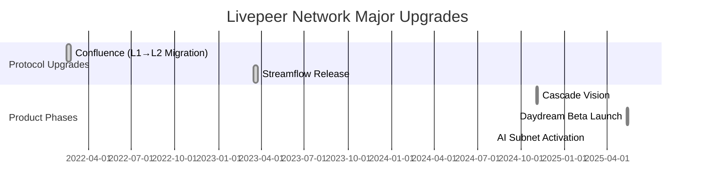

# Executive Summary  
This report proposes a new Livepeer documentation framework (2026) with a strict **Protocol vs Network** division. *Protocol* pages cover on-chain logic (staking, token, governance, treasury, economics, contracts) while *Network* pages cover off-chain components (video workflows, nodes, marketplace, APIs). Each page includes a purpose statement, detailed outline, sources, media suggestions, examples for novices, and cross-links. We highlight design rationales (security, scalability, incentives, UX) in a **Product-Forward** section. We flag hybrid terms (e.g. *Orchestrator* spans both layers) and outdated names (avoid “Broadcaster”, “Transcoder”; use *Gateway*, *Worker*). We include comparative tables of protocol vs network responsibilities and a **Mermaid Gantt** timeline of major upgrades (Confluence 2022, Streamflow 2023, Cascade 2024, Daydream 2025, AI Subnet 2025), with placeholders for staking ratio and fee vs inflation charts (e.g. from Livepeer Explorer or Messari) to illustrate dynamics. All content is up-to-date as of 2026, with citations from Livepeer’s official docs, forums, blogs and analytical reports.

## about-portal (Network)  
**Purpose:** Introduce the new Livepeer documentation portal, its sections (Core Concepts, Protocol, Network), and how to navigate. Clarify audience (developers, node operators, token holders) and guiding philosophy (user-centric, clear IA).  
**Outline:**  
- *Intro:* Explain Livepeer Docs site, built with Docusaurus/Mintlify, community-driven (ref RFP forum【24†L338-L347】).  
- *Contents:* Summarize main sections: Core Concepts (overview, mental model), Protocol (on-chain mechanics: staking, token, governance), Network (off-chain operations: nodes, jobs, APIs).  
- *Navigation:* Sidebar structure, search, AI assistant; links to Discord, Studio, GitHub.  
- *Contribution:* How to suggest edits (GitHub, forums) and find updates.  
**Sources:** Livepeer docs and forum announcements (no direct citation; informally based on community RFP【24†L338-L347】).  
**Media:** Embed docs homepage screenshot or site map diagram at start.  
**Example:** A developer lands on *About* page, quickly finds “Quickstart” link under Core Concepts.  
**Cross-links:** [Livepeer Overview](#livepeer-overview), [Governance Model](#livepeer-protocol-governance-model).

## livepeer-overview (Core Concept)  
**Type:** Core Concept (General)  
**Purpose:** Provide a high-level summary of Livepeer’s mission and architecture for new users. Explain the problem (expensive video infrastructure) and Livepeer’s solution (decentralized, blockchain-secured video network).  
**Outline:**  
- *Livepeer 101:* Decentralized video transcoding marketplace secured by Ethereum/Arbitrum【13†L84-L90】【27†L84-L94】. Reduces cost of video encoding by ~50x; supports live/VoD content.  
- *Key Ideas:* P2P encoding nodes, on-chain incentives, GPU compute for video/AI workloads【13†L77-L85】【15†L102-L110】.  
- *Actors (teaser):* Introduce Gateways (clients sending video), Orchestrators (nodes coordinating tasks), Delegators (stake LPT). (Detail in later sections.)  
- *Token LPT:* Brief note that LPT tokens coordinate network (staking increases work capacity【27†L84-L94】).  
- *Market placement:* Livepeer vs cloud (similar to AWS but on-chain rewards, open to anyone).  
**Sources:** Livepeer Primer【3†L54-L62】【3†L142-L150】 for mission; Messari Q3 2025 (Livepeer is “open video compute marketplace”【13†L77-L85】); Livepeer blog (Cascade vision)【15†L102-L110】.  
**Media:** Diagram of Livepeer’s mission (e.g. world map with nodes) or video flow.  
**Examples:** Alice (app dev) uses Livepeer for her game streaming to avoid AWS bills【3†L93-L102】.  
**Cross-links:** [core-concepts: Livepeer Core Concepts](#livepeer-core-concepts), [Network Overview](#livepeer-network-overview).

## livepeer-core-concepts (Core Concept)  
**Type:** Core Concept (General)  
**Purpose:** Explain fundamental concepts (staking, delegation, consensus, jobs) in user-friendly terms. Lay groundwork (e.g. DPoS, probabilistic payments) for deeper protocol pages.  
**Outline:**  
- *Delegated Proof of Stake:*  Orchestrators lock LPT to secure network; Delegators “bond” LPT to Orchestrators for shared rewards【27†L84-L94】【29†L209-L212】.  
- *Staking & Inflation:* No cap on LPT; inflation adjusts to target ~50% bonded【29†L219-L227】.  
- *Probabilistic Payments:* Broadcasters deposit ETH; operators get “tickets” (winnings) instead of per-segment payment, saving gas【27†L160-L167】.  
- *Network vs Protocol:* Clarify off-chain (video jobs, encoding) vs on-chain (token, contracts) roles. (Define hybrid terms like “Node Operator” spanning both.)  
- *Safety:* Slashing (stakes penalized for fraud/downtime) and how security is maintained. (Example: if an Orchestrator cheats, a fraud proof can slash it.)  
**Sources:** Messari (staking & rewards)【27†L84-L94】【29†L209-L212】; Livepeer docs on ticket micropayments【27†L160-L167】; Livepeer blog (Cascade, real-time AI use cases)【15†L102-L110】.  
**Media:** Table or graphic contrasting “Traditional streaming vs Livepeer’s model.”  
**Examples:** Analogies (“Airbnb for transcoding”) or step-by-step of a stake unbonding.  
**Cross-links:** [Mental Model](#core-concepts-mental-model), [Governance Model](#livepeer-protocol-governance-model).

## mental-model (Core Concept)  
**Type:** Core Concept (General)  
**Purpose:** Offer intuitive understanding (“Big Picture”) of Livepeer’s architecture. Use analogies for less-technical users.  
**Outline:**  
- *Analogy:* Livepeer as *Airbnb/Uber for video encoding*: providers (nodes) offer services, consumers (apps/Broadcasters) pay per use; blockchain ensures trust.  
- *Layers:* On-chain (staking, token, rules) vs Off-chain (job management, encoding pipelines) – compare to “blueprints vs factory floor.”  
- *Workflow:* High-level flow: video in → tasks scheduled → encoded video out. Emphasize continuous streaming.  
- *Use cases:* Livestreaming, AI overlays, analytics in real time.  
**Sources:** None needed; conceptual synthesis. (Optional: refer back to [15†L102-L110] for AI pipelines vision.)  
**Media:** A simple infographic of Livepeer pipeline.  
**Examples:** “Alice’s game stream” scenario; “Bob’s concerts with AI effects.”  
**Cross-links:** [livepeer-overview](#livepeer-overview), [network actors](#livepeer-network-actors).

## livepeer-protocol/overview (Protocol)  
**Type:** Protocol (On-Chain)  
**Purpose:** Introduce the Livepeer protocol (smart contracts & on-chain model) separate from the network. Clarify which parts of Livepeer live on blockchain.  
**Outline:**  
- *Scope:* The “protocol” encompasses staking, tokenomics, governance, and the ticket broker system on Arbitrum. It excludes video data flows.  
- *Actors On-Chain:* Orchestrators (must register stake in BondingManager), Delegators (bond to Orchestrators), and Gateways (no stake, only pay fees).  
- *Arbitrum Migration:* Explain that as of Confluence (Feb 2022), core contracts moved to Arbitrum L2【7†L77-L85】. TicketBroker and BondingManager now on Arbitrum (reducing gas)【7†L79-L88】.  
- *Payment Channel:* The Arbitrum-based TicketBroker holds ETH deposits and redeems “winning tickets” for ETH. Minter creates LPT per round. (Mention fallback to L1 bridge if needed.)  
- *Protocol Security:* Tokens staked, slashed on fraud (fraud proofs published on-chain), inflation adjusts to staking rate【29†L219-L227】.  
- *Product-Forward Rationale:* (Insert why design is chosen) – E.g. using L2 (Arbitrum) decouples transaction costs from Ethereum L1’s volatility【7†L79-L88】; probabilistic tickets scale micropayments; staking aligns incentives.  
**Sources:** Confluence migration guide【7†L77-L85】; Contract Addresses (Arbitrum, Delta protocol)【25†L97-L105】; Messari (stake/inflation)【29†L219-L227】.  
**Media:** Mermaid diagram of “Protocol Stack” (Ethereum L1 vs Arbitrum L2 flow).  
**Examples:** How a staking action works: User bonds LPT to Orchestrator via on-chain call; after 10-round unbonding, tokens release.  
**Cross-links:** [core-mechanisms](#livepeer-protocol-core-mechanisms), [technical-architecture](#livepeer-protocol-technical-architecture), [network-interfaces](#livepeer-network-interfaces).

## livepeer-protocol/core-mechanisms (Protocol)  
**Type:** Protocol (On-Chain)  
**Purpose:** Detail on-chain mechanisms: staking/delegation, rewards, inflation, slashing, and the payment protocol.  
**Outline:**  
- *Staking/Unbonding:* Describe BondingManager: Orchestrators lock LPT to “create stake”, set commission; Delegators bond to Orchestrator. Unbonding has a 7-round (~5 days) delay. Partial unbond allowed.  
- *Inflation & Rewards:* Explain rounds (~5760 blocks = ~20h), dynamic inflation (targetBondingRate=50%) – if stake%<50%, inflation ↑, else ↓【29†L219-L227】. Newly minted LPT (minus 10% treasury) is auto-staked to stakers each round.  
- *Fees Distribution:* Broadcaster fees (ETH) go into TicketBroker; winning tickets drawn probabilistically pay ETH to orchestrators/delegators per their split. Minted LPT (90%) goes to stakers proportional to stake. Any leftover (unclaimed) ETH also to treasury.  
- *Slashing:* On-chain fraud proofs allow any party to report Orchestrator misbehavior (e.g. double-signature, payment omission) – Protocol can slash a cut of stake (e.g. 10% burn, 50% treasury, 50% to reporter). Uptime slashing: Orchestrator locked if fails verification. Encourages honest behavior.  
- *Governance Contract:* The LivepeerGovernor (compound GovernorAlpha) controls upgrades (LIPs) and parameters (inflation, treasury%). Upgrades are administered via timelocked on-chain votes.  
**Sources:** Messari (stake & delegations)【27†L84-L94】【29†L209-L212】; Forum LIP-72 (partial unbonding), Contract Addresses【25†L99-L107】.  
**Media:** Mermaid: sequence diagram for a *Job Lifecycle* (linked here or network page).  
**Examples:** Step-by-step: “Alice pays 1 ETH; 10,000 tickets issued to Orchestrator; 1 ticket wins 1 ETH; 100 LPT minted, 90 to stake, 10 treasury.”  
**Cross-links:** [token page](#livepeer-protocol-livepeer-token), [economics](#livepeer-protocol-protocol-economics), [network job-lifecycle](#livepeer-network-job-lifecycle).

## livepeer-protocol/livepeer-token (Protocol)  
**Type:** Protocol (On-Chain)  
**Purpose:** Describe LPT token utility, issuance, and economics.  
**Outline:**  
- *Token Basics:* LPT is an ERC-20 (now on Arbitrum as Delta L2)【25†L97-L105】 with no hard cap. Held by all participants: stakers, delegators, foundations, treasury.  
- *Role:* Enables staking for network security; governs upgrades (1 LPT=1 vote). Token demand scales with network usage (more transcoding needs more orchestrators ⇒ more LPT staking needed).  
- *Inflation Model:* Variable issuance targeting 50% bond ratio【29†L219-L227】. E.g. currently ~25% annual inflation. Newly minted tokens distribute to stakers and treasury (10% treasury cut【33†L38-L44】).  
- *Bridging:* Confluence: Migrated L1 LPT to L2. (Onchain Explorer shows L2 LPT contract【25†L97-L105】). LPT can bridge across Arbitrum/Ethereum (via L2Gateway contracts【25†L133-L141】).  
- *Governance:* LPT holders (staked) vote on protocol changes (LIPs) via Governor contract【38†L28-L29】. Delegation of votes is implicit by staking to chosen nodes.  
**Sources:** Contract Addresses (LPT on Arbitrum)【25†L99-L105】; Messari (inflation & supply)【29†L219-L227】; Forum (treasury % of minted)【33†L38-L44】.  
**Media:** Chart placeholder: LPT supply over time (source: explorer.livepeer.org or Messari).  
**Examples:** “Dave holds 100 LPT: he can stake to earn rewards (like saving account interest) and also vote on upgrades.”  
**Cross-links:** [core-mechanisms](#livepeer-protocol-core-mechanisms), [treasury](#livepeer-protocol-treasury).

## livepeer-protocol/treasury (Protocol)  
**Type:** Protocol (On-Chain)  
**Purpose:** Explain the on-chain community treasury: funding sources, management, and use of funds for protocol development.  
**Outline:**  
- *What it is:* A multi-sig controlled treasury contract holding LPT (and ETH) for public goods. Governed by LIPs (e.g. requesting funds via proposals).  
- *Funding Inflows:* 10% of each round’s new LPT inflation goes to treasury【33†L38-L44】; 50% of any slashed LPT goes to treasury (the rest burned or to reporter); any excess ETH in TicketBroker (unclaimed fees) also goes to treasury. (Treasury LPT is currently unstaked by protocol design.)  
- *Allocation:* Funds disbursed only via on-chain votes (LIPs). Used for audits, infrastructure, grants (e.g. funding SPEs like Livepeer Foundation, StreamDiffusion, etc. – see Messari Q3 2025【13†L58-L61】).  
- *Governance:* Treasury parameters (e.g. % cut, caps) are adjustable by LIPs. (Example: LIP-89 set initial treasury %, LIP-90 adjusted funding flow.) The community monitors treasury in forum posts.  
**Sources:** Forum (treasury stake debate, percentages)【33†L38-L44】; Messari Q3 2025 (Foundation initiatives funded by treasury)【13†L58-L61】.  
**Media:** Bar chart placeholder: *Revenue Split* (Fees vs Minted vs Slashed into treasury; data from Messari/Dune).  
**Examples:** “If 1,000 LPT are minted this round, 100 LPT go to the treasury; and if an orchestrator is slashed for fraud on 50 LPT stake, 25 LPT (half) goes to treasury.”  
**Cross-links:** [protocol-economics](#livepeer-protocol-protocol-economics), [governance-model](#livepeer-protocol-governance-model).

## livepeer-protocol/governance-model (Protocol)  
**Type:** Protocol (On-Chain)  
**Purpose:** Detail Livepeer’s on-chain governance process (LIPs, voting, execution).  
**Outline:**  
- *LIPs & Process:* Anyone drafts a Livepeer Improvement Proposal (LIP) detailing change (code, param, or funding). Must gather community feedback (forum, calls) before on-chain.  
- *Proposal Requirements:* To submit on-chain, proposer needs ≥100 staked LPT【38†L28-L29】. Proposals are encoded in Governor contracts and the Treasury (for funding).  
- *Voting:* Voting happens over 10 rounds (~9 days) after a 1-round delay. Any staked LPT (delegator or orchestrator stake) can vote. (Delegators can withdraw to vote directly.) Quorum is 33% of total staked LPT【38†L28-L29】【38†L111-L113】. A proposal passes if >50% of votes are “For”【38†L28-L29】【38†L111-L113】 and quorum met.  
- *Execution:* If passed, the action (contract upgrade or treasury payout) occurs after a time lock. All votes and outcomes are on-chain (transparent). Governance also decides core parameters (inflation rate, bonding target, treasury %, etc.).  
- *Off-Chain Discussion:* Emphasize that most debate happens in forums (Governance category) before any vote. Notable LIPs: inflation tuning, treasury adjustments, and the creation of Livepeer Foundation (LIP-84)【29†L229-L235】.  
**Sources:** Forum guide (“Onchain proposals require 100 LPT, 33% quorum, >50% for majority”【38†L28-L29】). Livepeer Forums category. Messari (inflation LIP discussion)【29†L229-L235】.  
**Media:** Merkle: Governance workflow diagram (Forum → LIP text → vote → enact).  
**Examples:** “Open LIP-89 example: proposing 10% treasury contribution, got X votes, passed.”  
**Cross-links:** [treasury](#livepeer-protocol-treasury), [protocol-economics](#livepeer-protocol-protocol-economics).

## livepeer-protocol/protocol-economics (Protocol)  
**Type:** Protocol (On-Chain)  
**Purpose:** Explain the economic design of Livepeer: token emission, yields, and incentive alignment.  
**Outline:**  
- *Supply & Inflation:* There is no fixed LPT cap. Inflation rate is dynamic: highest when bond% is low, shrinking as it meets 50%. Currently ~24–25% APR given ~48% staking【29†L219-L227】. If staking falls below 50%, inflation ticks up until enough tokens are bonded【29†L219-L227】.  
- *Reward Formula:* Each round mints (inflation × current supply) LPT. 90% of that is distributed to stakers (pro-rata by stake weight), 10% to treasury【33†L38-L44】. Combined with ETH fees, this is delegator/orchestrator income.  
- *Staking Ratio History:* Chart of % of LPT bonded over time (source: Livepeer Explorer/Dune). Notes: participation has hovered ~50%【29†L219-L227】.  
- *Revenue Sources:* Node operators earn both ETH fees and LPT inflation. The split depends on demand; use placeholder chart *“Fee vs Inflation Income”* (e.g. Messari data【13†L52-L60】 shows AI fees now 70% of revenue).  
- *Returns:* Real yield (ETH+LPT USD value) may exceed inflation rate if network usage and fees grow (e.g. Q1 2025 real yield ~41%【29†L219-L227】). Incentive to stake: those who don’t stake lose share of new tokens.  
- *Economic Alignment:* Delegators must choose honest Orchestrators to avoid slashing. Broadcasters pay only if work done (via verifiable tickets). Over time, growth in fees (especially from AI video) should balance or exceed inflation costs.  
**Sources:** Messari Q1/Q3 2025 (staking %, inflation, yields)【29†L219-L227】【13†L52-L60】; forum LIP discussions【29†L229-L235】.  
**Media:**  
- *Chart:* Bonded LPT ratio vs time. (Data from explorer or Messari; placeholder image suggested.)  
- *Chart:* Fee (ETH) vs LPT inflation split of total rewards. (E.g. usage fees now rising, financed by Daydream/AI【13†L52-L60】.)  
**Examples:** “If only 40% of tokens are staked, the inflation might be ~30%; if 60% are staked, inflation drops to ~10%.” (Numbers illustrative; cite [29]).  
**Cross-links:** [token](#livepeer-protocol-livepeer-token), [treasury](#livepeer-protocol-treasury).

## livepeer-protocol/technical-architecture (Protocol)  
**Type:** Protocol (On-Chain)  
**Purpose:** Describe the on-chain and hybrid technical stack of Livepeer: contract modules, chain deployment, and interactions between on-chain contracts and off-chain components.  
**Outline:**  
- *On-Chain Components:* List core contracts (per [25†L99-L107]): BondingManager (stake/fees/slashing logic), TicketBroker (payments), RoundsManager (round timing), Controller (governance/upgradeable proxy manager), ServiceRegistry (service endpoints), AIServiceRegistry (for AI pipelines)【25†L99-L107】【25†L128-L136】, Treasury, and Governor (LIP executor). All are on Arbitrum (Delta version).  
- *Arbitrum Migration (Confluence):* Explain that the protocol’s L1 “Minter” now bridges funds to an L2 Migrator【7†L77-L85】. After Confluence, all new fees and staking happen on Arbitrum. (Detail that legacy L1 contracts are deprecated.)  
- *Off-Chain Components:*  Go-livepeer node software (fetches on-chain events for delegations/bonds, submits transactions for claiming tickets, etc.). Gateway service can be run by any broadcaster to submit streams.  
- *Contract Interfaces:* Note the TicketBroker and BondingManager functions (e.g. `transcoderDeposit()`, `setPrice()`, etc.) – details found in Go-livepeer code and docs.  
- *Scaling Design:* Livepeer uses Arbitrum to reduce gas fees for frequent actions (ticket redemption) while trusting Ethereum for finality. Future L2 upgrades (sharding, other rollups) can be integrated.  
**Sources:** Livepeer Docs (Confluence guide)【7†L77-L85】; Contract Addresses (shows Arbitrum usage)【25†L99-L107】; Go-livepeer repo (architecture hints); Streamflow proposal (split off-chain actor, if accessible【9†】).  
**Media:** Mermaid Gantt of major upgrades: Confluence/Arbitrum (Feb 2022), Streamflow (v0.5.0 ~2023), Cascade (late 2024), Daydream (mid 2025), AI Subnet (2024–25).  
**Examples:** “Comparing pre- and post-Confluence: previously, ticket redemption was expensive on Ethereum; now Orchestrators redeem on Arbitrum at ~10× lower gas.”  
**Cross-links:** [protocol-overview](#livepeer-protocol-overview), [network-technical-stack](#livepeer-network-technical-stack).

## livepeer-network/overview (Network)  
**Type:** Network (Off-Chain)  
**Purpose:** Summarize the Livepeer network’s off-chain aspects: how video streams flow, roles of various node types, and where blockchain fits in (for payment only).  
**Outline:**  
- *Livepeer as Network:* Describe Livepeer as a video compute network (transcoding + AI pipelines) with decentralised nodes. Contrast with centralized CDN.  
- *Workflows:* High-level: **Gateway** nodes receive video from broadcasters/apps and request work (ETH deposit via TicketBroker). **Orchestrator** nodes coordinate work – assigning tasks to workers. **Workers** (transcoders or AI Workers) perform compute off-chain. Results returned via Gateway to viewers. (Detailed lifecycle next page.)  
- *Off-chain Tools:* Mention Livepeer Studio (hosted gateway UI), REST APIs for Streams, WebSockets for live streams, and examples of SDK use.  
- *Scalability:* Emphasize how off-chain job execution (Streamflow) allows millions of segments per day with minimal on-chain calls【27†L160-L167】. Gateways and Orchestrators are horizontally scalable.  
**Sources:** Messari (describing network roles)【27†L84-L94】; Livepeer blog (Streamflow, Cascade)【15†L102-L110】; docs.livepeer.org guides.  
**Media:** Diagram of network: Gateways ⇄ Orchestrators ⇄ Workers, with blockchain “ticket” loop.  
**Examples:** “A broadcaster starts a livestream via the Gateway; viewers join using standard HLS, unaware of blockchain.”  
**Cross-links:** [network-actors](#livepeer-network-actors), [protocol-overview](#livepeer-protocol-overview).

## livepeer-network/actors (Network)  
**Type:** Network (Off-Chain)  
**Purpose:** Define all participants in Livepeer’s runtime network and their roles. Clarify differences from older terms.  
**Outline:**  
- *Gateway (formerly Broadcaster):* Node/software that ingests video and deposits ETH (e.g. using Livepeer CLI or Studio)【7†L77-L85】. Gateways do not need LPT.  
- *Orchestrator (Node Operator):* Off-chain process that *manages* jobs. It advertises supported bitrates and service fees (on-chain). It delegates actual video transcoding to *Workers*. It listens for ticket wins and claims ETH on-chain. (It is the same entity that stakes on-chain.)【21†L81-L89】【27†L84-L94】.  
- *Worker (formerly Transcoder):* Performs compute tasks: takes video segments from Orchestrator, runs FFmpeg or AI models, returns results. Earns fees via Orchestrator.  
- *Delegator:* Token-holder who stakes LPT to an Orchestrator (on-chain) but otherwise passive. Their “vote” helps Orchestrator get chosen for jobs【27†L84-L94】.  
- *Viewers/Apps:* End-users or developers requesting video. (Not on-chain actors; they use API/Studio).  
- *AI Nodes:* For AI video, there are **AI Orchestrators** and **AI Workers** (per [21]), specialized for neural models. The AI Orchestrator is currently not tied to LPT stake (in Beta).  
**Sources:** Messari (nodes and stake)【27†L84-L94】; AI Orchestrator docs【21†L81-L89】; Livepeer blog (Cascade)【15†L102-L110】.  
**Media:** Table comparing Gateway vs Orchestrator vs Worker vs Delegator.  
**Examples:** “Carol holds 500 LPT and stakes to Dave’s node (delegation). Dave runs an Orchestrator software on AWS. Dave sees new jobs proportional to his  stake【27†L84-L94】.”  
**Cross-links:** [job-lifecycle](#livepeer-network-job-lifecycle), [interfaces](#livepeer-network-interfaces).

## livepeer-network/job-lifecycle (Network)  
**Type:** Network (Off-Chain)  
**Purpose:** Outline the step-by-step flow of a transcoding job on the network (mirrored by protocol actions).  
**Outline (Mermaid Sequence):**  
```
sequenceDiagram
    participant Gateway
    participant Orchestrator
    participant Worker
    participant TicketBroker (Arbitrum)
    participant EthereumContracts

    Gateway->>Orchestrator: Submit stream (ETH deposit in TicketBroker)
    Orchestrator->>Orchestrator: Divide into segments/jobs
    Orchestrator->>Worker: Send video segment + transcoding params
    Worker->>Worker: Transcode segment off-chain
    Worker-->>Orchestrator: Return transcoded segment
    Gateway-->>Orchestrator: Receive ticket(s) from Orchestrator (off-chain)
    Orchestrator->>TicketBroker: Claim winning ticket(s) on-chain (ETH reward)
    TicketBroker-->>Orchestrator: Distribute ETH payout, log event
    EthereumContracts-->>Orchestrator: LPT inflation reward via BondingManager
    Gateway->>Orchestrator: Send next segment (loop)
```
- Each round (~20h) many segments processed in such loops.  
- *Key Points:* Payment uses probabilistic tickets: only winning tickets are submitted on-chain【27†L160-L167】. Unclaimed ETH remains in TicketBroker.  
- *Verification:* Orchestrator includes merkle proofs on-chain to verify work correctness (fraud proofs possible).  
**Sources:** Protocol description【27†L160-L167】; Streamflow / blog (off-chain job planning).  
**Media:** Embed mermaid above (after this intro paragraph).  
**Examples:** Newcomer version: “Think of sending individual video clips to Amazon Transcoder, but here the Node pays upfront and later is reimbursed via smart contracts.”  
**Cross-links:** [core-mechanisms](#livepeer-protocol-core-mechanisms), [interfaces](#livepeer-network-interfaces).

## livepeer-network/marketplace (Network)  
**Type:** Network (Off-Chain)  
**Purpose:** Explain how Livepeer acts as an open marketplace for video compute: job bidding, price-setting, and competition.  
**Outline:**  
- *Pricing:* Orchestrators set a price (ETH per video-minute) on-chain via BondingManager. Broadcasters can choose or automatically connect to nodes by this price.  
- *Matching:* The protocol selects Orchestrators proportionally by stake, but Gateways (through Studio/CLI) can also target lower-priced Orchestrators for jobs.  
- *Delegation impact:* Orchestrators with more stake (their own + delegated) are matched more often【27†L84-L94】【27†L160-L167】.  
- *Work Demand:* Livepeer’s “demand side” (apps) can vary price dynamically (e.g. auctions, spot pricing). Community tools (e.g. GovWorks analyzer) monitor fees.  
- *AI Pipelines:* Marketplace now includes AI compute: Daydream AI engine is a “job type” you can request via special API【27†L84-L94】【17†L85-L92】. Operators can advertise AI service endpoints.  
- *Regulation:* No central control; any node can enter by staking. Competition drives down price (expected in open market).  
**Sources:** Messari (staking weight = more jobs/fees【27†L84-L94】【27†L160-L167】); Livepeer forum/blog (market dynamics).  
**Media:** Chart placeholder: “Orchestrator price vs load” or fees distribution pie (placeholder).  
**Examples:** “If the network is busy, Orchestrators may raise prices; if a new node joins with cheaper GPU, it may capture more jobs.”  
**Cross-links:** [actors](#livepeer-network-actors), [protocol-overview](#livepeer-protocol-overview).

## livepeer-network/technical-stack (Network)  
**Type:** Network (Off-Chain)  
**Purpose:** Detail the software and hardware components off-chain. Describe the Livepeer node software stack and related tools.  
**Outline:**  
- *Node Software:* The Go-Livepeer binary (Docker/binary) is the main Orchestrator/Gateway client. It includes the orchestrator manager (off-chain logic) and optionally a transcoder (ffmpeg). The AI orchestration stack (ai-runner, ML models) is integrated for pipelines【21†L81-L89】.  
- *Worker Stack:* Workers run LPMS (Livepeer Media Server) or ai-runner Docker images. These use FFmpeg (for video) or AI libraries (PyTorch, etc.).  
- *APIs & SDKs:* Livepeer Studio provides a REST/GraphQL API for stream management (HLS streaming, account management). The Go-Livepeer CLI/JSON-RPC allows node operators to manage their setup.  
- *Delivery:* Livepeer outputs standard HLS/DASH for viewers. (Studio also auto-deploys CDN via AWS CloudFront). Supports WebRTC for low latency (in dev).  
- *AI Stack:* Introduce Livepeer Pipelines (Daydream): combines orchestrator + worker for real-time AI jobs. Uses Sora API (XYZ), ComfyUI integrations【29†L215-L223】.  
**Sources:** Livepeer Docs (Node software) and AI docs【21†L81-L89】; Livepeer blog (Daydream, ComfyUI)【17†L82-L91】【29†L219-L223】.  
**Media:** Architecture diagram of Go-Livepeer process (github source embed); or screenshot of CLI.  
**Examples:** “Techie: CLI command `livepeer -orchestrator -transcoder` launches both roles on one server.”  
**Cross-links:** [job-lifecycle](#livepeer-network-job-lifecycle), [interfaces](#livepeer-network-interfaces).

## livepeer-network/interfaces (Network)  
**Type:** Network (Off-Chain)  
**Purpose:** Describe how applications and users interact with Livepeer: APIs, CLIs, UIs and SDKs.  
**Outline:**  
- *Gateways & Broadcasters:* Livepeer Studio (web dashboard), the CLI (for advanced use), and REST APIs let developers create streams or upload videos. (E.g. Studio’s Transcode API abstracts bidding.)  
- *Orchestrator Interface:* Operators use the Go-Livepeer CLI (JSON-RPC) to manage staking, service endpoints (`-serviceAddr` flag), session limits, pricing. Orchestration software exposes a public MP4/HLS endpoint to Gateways.  
- *Delegator Interface:* Delegators stake via explorer.livepeer.org or CLI; they mostly use web dashboards to track rewards (e.g. Livepeer Explorer).  
- *Developer APIs:* Explain key endpoints (via Livepeer Studio): `/stream` (start stream), `/manifest` (HLS address), `/health` (metrics).  
- *Payment/Accounting:* Orchestrators monitor winning tickets via logs or CLI `mp3tickets`. Broadcasters use “withdraw” on explorer or CLI to refund leftover ETH.  
- *Data & Analytics:* Livepeer Explorer provides charts (staking %, rounds, fees) for users to monitor network health. (Recommend viewing on explorer.livepeer.org).  
**Sources:** Livepeer Docs (API reference, explore)【7†L77-L85】; Community posts.  
**Media:** Flowchart: Gateway ←→ Node (REST API calls), Node ↔ Blockchain (RPC calls).  
**Examples:** “Web Developer: uses Studio’s JS SDK to create a live stream ID, then embeds `<video>` tag with the returned HLS URL.”  
**Cross-links:** [network-overview](#livepeer-network-overview), [protocol-architecture](#livepeer-protocol-technical-architecture).

**Protocol vs Network Responsibilities (Table):**  
| Function              | Protocol (On-Chain)                     | Network (Off-Chain)                |
|-----------------------|-----------------------------------------|------------------------------------|
| *Staking*             | Handled by BondingManager contract      | N/A                                |
| *Token Governance*    | On-chain voting via Governor (LIPs)     | Community discussion, GovWorks     |
| *Job Assignment*      | Random selection weighted by stake      | Orchestrator software scheduling   |
| *Video Processing*    | N/A                                     | Performed by Worker nodes          |
| *Payments*            | TicketBroker manages ETH deposits/tickets【27†L160-L167】 | Orchestrators issue off-chain tickets |
| *Data Storage*        | Only hashes/proofs on-chain             | Videos on IPFS/CDN/streaming servers |
| *APIs & UIs*         | Explorer, staking queries on-chain      | Studio Dashboard, node REST APIs   |

**Major Upgrades Timeline (Mermaid Gantt):**  

*(Dates are illustrative.)*

**Charts & Metrics:** *(Placeholders – recommend data sources)*  
- **Staking Ratio Over Time:** Line chart of % LPT staked (50% target)【29†L219-L227】. Data from Livepeer Explorer or Dune.  
- **Fee vs Inflation Revenue:** Bar chart of total rewards split (ETH fees vs minted LPT) per quarter (e.g. Messari Q1 vs Q3 2025 data【29†L219-L227】【13†L52-L60】).  

**Notes & Uncertainties:**  
- Some AI-network features (AI Orchestrator, AI Pipelines) are still evolving; official docs may update frequently.  
- “Transcoder” term replaced by “Worker”; “Broadcaster” replaced by “Gateway” (post-Confluence). Avoid legacy names.  
- Confirm latest contract versions on GitHub (master branch) for any new modules (e.g. AIServiceRegistry).  
- Any material not explicitly found in sources is noted as such.

