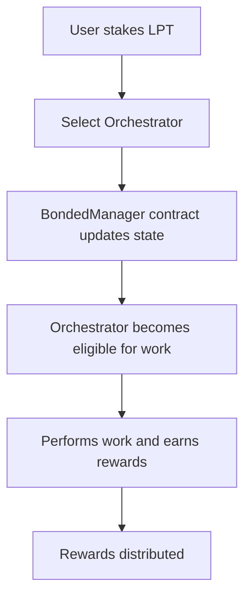
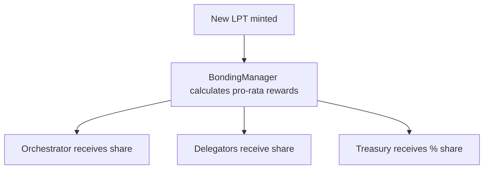
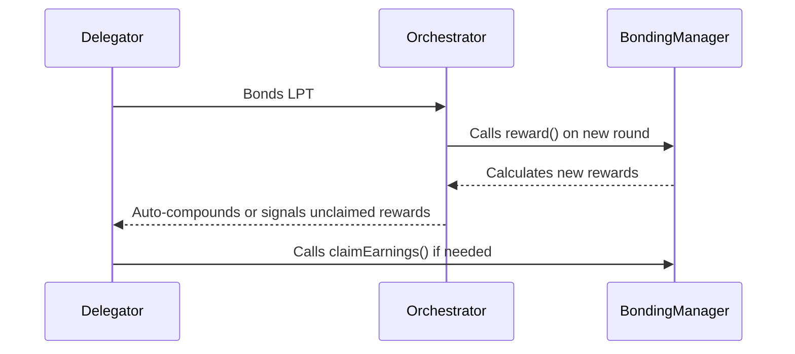

# Core Mechanisms of the Livepeer Protocol

The Livepeer protocol secures a decentralized marketplace for verifiable media compute through a tightly coupled set of economic and cryptographic systems. These mechanisms include LPT bonding, dynamic inflation, staking and delegation, slashing conditions, and rewards distribution—all executed through Ethereum-based smart contracts on Arbitrum.

This document details each core mechanism, how it interacts with others, and why these design decisions underpin Livepeer’s scalable, permissionless infrastructure.

---

## Protocol Objectives

Livepeer’s core mechanisms are designed to:

- **Incentivize honest behavior** among participants (Orchestrators, Delegators, Broadcasters)
- **Scale supply capacity** by rewarding infrastructure providers proportionally
- **Secure verification** of off-chain video and AI workloads through bonded stake
- **Disincentivize dishonest actors** via slashing

---

## Actors and Roles

| Role          | Stake Required | Responsibilities                         | Earns                         |
|---------------|----------------|-------------------------------------------|-------------------------------|
| Orchestrator  | Yes (LPT)      | Run transcoding/AI node, redeem tickets   | ETH fees, LPT rewards         |
| Delegator     | Yes (LPT)      | Bond to Orchestrator                      | Share of ETH + LPT rewards    |
| Broadcaster   | No             | Submits video jobs, sends ETH tickets     | Transcoded/processed output   |

---

## Bonding LPT

Delegators and Orchestrators must bond Livepeer Token (LPT) to participate in rewards and protocol security.

### Bonding Flow



### Parameters
- **Unbonding Period**: 7 days (configurable)
- **Minimum Stake**: Enforced to prevent spam registration

Bonding is permissionless. Any user can bond to any orchestrator.

---

## Delegation

Delegators bond LPT to orchestrators and receive:
- A portion of that orchestrator’s rewards (ETH + LPT)
- Auto-compounded LPT inflation
- Voting rights in protocol governance

Rewards are split according to orchestrator-configured `rewardCut` and `feeShare`:

```text
Delegator LPT reward = (1 - rewardCut) * total LPT reward
Delegator ETH share  = feeShare * total ETH fees earned
```

> Note: Orchestrators compete on service, uptime, and fee/reward share parameters.

---

## Dynamic Inflation Model

Livepeer uses a bonded-rate-targeting inflation system to secure economic participation.

Let:
- `S` = total LPT supply
- `B` = total bonded LPT
- `β*` = target bonding rate (e.g. 50%)
- `r(t)` = current inflation rate
- `Δ` = step adjustment (e.g. 0.05%)

### Adjustment Formula
```
If B/S < β*:
    r(t+1) = min(r_max, r(t) + Δ)
Else if B/S > β*:
    r(t+1) = max(r_min, r(t) - Δ)
```

Minted inflation `M(t) = r(t) * S`, distributed to active set.

### Target Bonding Rate
The bonding target aligns protocol security with desired staking participation. Too little stake? Inflation rises. Too much? It drops, preventing over-dilution.

> Placeholder: Insert current `r(t)`, `B`, and `S` from Explorer

---

## Rewards Distribution

Inflationary LPT is distributed each round (~21.5 hours) proportionally:
- Based on orchestrator stake weight
- Automatically compounded if not claimed



---

## Slashing

To prevent collusion, spam, and fraud, bonded stake is slashable.

### Conditions for Slashing:
- Double-spending or fraudulent ticket redemption
- Invalid work claim (e.g. incorrect transcoding result)
- Caught acting against consensus security (via challenge flow)

### Slash Effects:
- % of orchestrator stake is removed
- Slashed amount may be burned or allocated to treasury
- Delegators to that orchestrator lose proportionally

Slashing is enforced on-chain via challenge-and-response mechanisms, often linked to work verification or probabilistic ticket fraud.

---

## Rounds and Reward Claiming

Livepeer operates in fixed-length **rounds** (approx. 21.5 hours).

Each round:
1. Mints inflationary LPT
2. Enables orchestrators to call `reward()` and distribute shares
3. Snapshots delegation state for reward calculation

Delegators must periodically **claim** rewards or opt-in to auto-compounding.

---

## Claim Flow



---

## Token Velocity and Staking Impact

Unlike protocols with capped supply or fixed emissions, Livepeer ties LPT emissions to bonding participation. This model ensures:
- **Stake velocity** remains active
- **Dilution** impacts only unstaked participants
- **Governance participation** scales with protocol security

This mechanism introduces meaningful opportunity cost for passivity, encouraging active delegation and rebalancing.

---

## Reference Contracts

| Contract        | GitHub / Address Placeholder                 |
|------------------|-----------------------------------------------|
| BondingManager   | [GitHub](https://github.com/livepeer/protocol/blob/master/contracts/bonding/BondingManager.sol) / `[ARBITRUM_ADDRESS]` |
| Minter           | [GitHub](https://github.com/livepeer/protocol/blob/master/contracts/token/Minter.sol) / `[ARBITRUM_ADDRESS]` |
| RoundsManager    | [GitHub](https://github.com/livepeer/protocol/blob/master/contracts/rounds/RoundsManager.sol)` / `[ARBITRUM_ADDRESS]` |
| TicketBroker     | [GitHub](https://github.com/livepeer/protocol/blob/master/contracts/job/ETHTicketBroker.sol) / `[ARBITRUM_ADDRESS]` |

---

## Further Reading

- [Token Economics Deep Dive](https://blog.livepeer.org/token-inflation-design)
- [Livepeer GitHub – Protocol](https://github.com/livepeer/protocol)
- [Livepeer Explorer](https://explorer.livepeer.org)
- [Forum: LIP 73 - RewardCut Update](https://forum.livepeer.org/t/lip-73-adjusting-orchestrator-parameters)
- [Forum: LIP 77 - Arbitrum Migration](https://forum.livepeer.org/t/lip-77-arbitrum-native)

---

This concludes the `core-mechanisms.mdx` documentation. Ready to proceed with `livepeer-token.mdx`?

