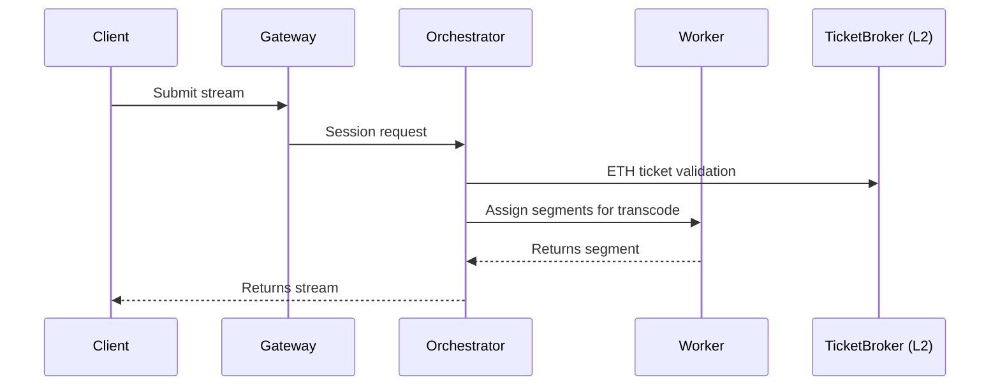

# Livepeer Technical Architecture

Livepeer's technical architecture spans Ethereum-based smart contracts, Layer 2 scaling infrastructure, and off-chain software components that coordinate decentralized video and AI job execution. The design emphasizes modularity, scalability, and permissionless participation.

This document provides a deep dive into the components, execution paths, and on-chain/off-chain coordination that power the Livepeer Protocol.

---

## System Overview

Livepeer can be modeled as a layered architecture:

```mermaid
graph TD
    A[Clients / Apps] --> B[Gateways]
    B --> C[Orchestrator Nodes]
    C --> D[Transcode / AI Workers]
    D --> E[Off-chain Managers]
    E --> F[Smart Contracts (L2 Arbitrum)]
    F --> G[Core Contracts on Ethereum L1]
```

| Layer             | Role                                                         |
|------------------|--------------------------------------------------------------|
| Client Layer      | Streams or submits jobs via CLI, SDK, or Gateway API        |
| Gateway Layer     | Receives jobs, initiates session routing                    |
| Orchestrator Layer| Bids on sessions, runs compute nodes                        |
| Worker Layer      | Performs transcoding / inference                            |
| Off-chain Manager | Handles bonding sync, ticket validation, etc.               |
| L2 Contracts      | TicketBroker, Delegator claims, reward withdrawal           |
| L1 Contracts      | Bonding logic, inflation config, slashing, governance       |

---

## On-Chain Architecture

### L1: Ethereum (Finality + Governance)

| Contract            | Function                                                      |
|---------------------|---------------------------------------------------------------|
| `BondingManager`    | Bond/unbond LPT, slash, reward calc                           |
| `Minter`            | Inflation setting, minting logic                              |
| `RoundsManager`     | Round timing, epoch progression                              |
| `Governor`          | Executes passed proposals from token holders                 |

📍 L1 Deployment: `Ethereum Mainnet`

📎 Source: [github.com/livepeer/protocol](https://github.com/livepeer/protocol)

---

### L2: Arbitrum (Job Execution + Payment)

| Contract            | Role                                                    |
|---------------------|----------------------------------------------------------|
| `TicketBroker`      | ETH deposits and winning ticket redemptions             |
| `MerkleSnapshot`    | Proofs of orchestrator fees / rewards for claim          |
| `L2ClaimBridge`     | Relays rewards back to L1                                 |
| `DisputeResolution` | Slashing in case of invalid jobs (coming)                |

📍 Arbitrum Deployment: `[INSERT_ARBITRUM_CONTRACTS_HERE]`

📎 ABI: [protocol/contracts/job](https://github.com/livepeer/protocol/tree/master/contracts/job)

---

## Off-Chain Components

### Orchestrator Node
- Runs manager daemon (`livepeer`) and connects to ETH + Arbitrum
- Handles job bidding, ticket receiving, work distribution to workers
- Tracks bonded stake, reward claim timing, delegator fee cut settings

### Worker (Transcoder / AI Inference)
- Executes FFmpeg or ML model job
- Benchmarked before allowed on the network
- Supports real-time GPU workloads for video or inference

### Gateway Node
- Entry point for external clients
- Authenticates session and routes to appropriate orchestrators
- Validates payment or API keys (credit model / ETH payments)

---

## Session Flow: Transcoding Path



---

## Gateway Modes

### Cascade (2023 L2 Upgrade)
- Refers to job selection & payment validation separation
- Paved way for Arbitrum deployment

### Gateway Types

| Gateway           | Description                                                |
|------------------|------------------------------------------------------------|
| `api.livepeer.org` | Default entry point for Livepeer network                  |
| Daydream Gateway  | ML-specific interface for AI workloads                     |
| Partner Gateways  | Custom-run gateways (e.g., MetaDJ, ComfyStream)           |

Gateways are **not** part of the core protocol—they’re pluggable interfaces with API-layer access.

---

## Livepeer Explorer Metrics (Insert Live)

| Metric                     | Placeholder               |
|----------------------------|---------------------------|
| Active Orchestrators       | `INSERT_COUNT`            |
| Round Length               | `INSERT_BLOCK_COUNT`      |
| Jobs Per Day               | `INSERT_DAILY_TOTAL`      |
| ETH Payout Throughput      | `INSERT_ETH_VOLUME`       |

Source: [https://explorer.livepeer.org](https://explorer.livepeer.org)

---

## Reliability & Fault Domains

- L2 slashing coming (via `DisputeResolution`)
- Multiple gateways reduce session routing failure
- Worker benchmarking ensures stream quality
- TicketBroker collateral ensures payment coverage

---

## Future Work

| Initiative            | Description                                                |
|----------------------|------------------------------------------------------------|
| Modular workloads     | Support for AI, 3D, inference, generative tasks            |
| Compute credits       | Native off-chain reputation + credit system                |
| zkProof validations   | Add proof-of-work quality without centralized logging      |

---

## References

- [Livepeer Protocol GitHub](https://github.com/livepeer/protocol)
- [Livepeer Orchestrator Docs](https://livepeer.org/docs/orchestrators)
- [Arbitrum Contracts](https://arbiscan.io/address/INSERT_CONTRACT)
- [Livepeer Gateway](https://livepeer.studio/docs/api/overview)
- [LIP-77: Arbitrum Migration](https://forum.livepeer.org/t/lip-77-arbitrum-native)

---

Next section: `network/overview.mdx`

