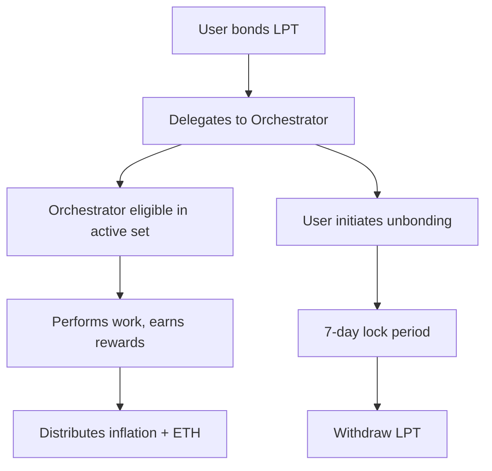

# Livepeer Protocol Overview

Livepeer is a decentralized video infrastructure protocol built to support cost-efficient, verifiable, and open media computation on-chain. Launched on Ethereum and now natively deployed on Arbitrum, Livepeer provides the cryptoeconomic foundations to secure off-chain video workloads—including transcoding, real-time AI inference, and advanced video pipeline orchestration.

This document outlines the Livepeer Protocol from a strictly on-chain perspective: its contract architecture, staking mechanisms, token economics, governance, and incentive alignment. The protocol governs how work is secured, rewarded, penalized, and how upgrades are proposed and implemented.

Livepeer does not route jobs or perform compute itself. Instead, it creates and secures an open marketplace where anyone can stake, delegate, propose changes, or serve compute through external orchestrator software.

---

## Core Design Goals

Livepeer was designed to address three core challenges in decentralized infrastructure:

1. **Trustless Verification:** Guarantee off-chain video work was performed honestly and efficiently without a trusted middleman.
2. **Sustainable Incentives:** Create economic alignment for operators and token holders to maintain service quality, uptime, and security.
3. **Composable Governance:** Enable protocol upgrades and treasury spending via on-chain token governance—driven by LPT holders.

---

## Protocol Architecture

Livepeer’s protocol layer lives entirely on Arbitrum as of 2025, following the Confluence upgrade and full L2 migration. Its smart contract architecture includes the following primary modules:

| Contract             | Purpose                                                             |
|----------------------|----------------------------------------------------------------------|
| `BondingManager`     | Handles staking, delegation, inflation distribution, slashing       |
| `RoundsManager`      | Defines protocol rounds (approx. 21.5 hours) for reward calculations |
| `Minter`             | Mints LPT per round via dynamic inflation targeting bonding rate     |
| `TicketBroker`       | Escrows broadcaster ETH deposits and settles winning ticket claims   |
| `Governor`           | Executes approved proposals after voting delay & timelock            |
| `PollCreator`        | Creates snapshot-style on-chain polls (used for signaling, LIPs)     |
| `Treasury`           | Accumulates protocol LPT and authorizes grants via LIPs              |

Contracts are upgradeable via a governance-controlled proxy and follow EIP-1967 and OpenZeppelin upgrade patterns. All major protocol actors interact with these contracts to perform bonding, claim rewards, submit proposals, or redeem fees.

> 📎 Placeholder: [Insert current Arbitrum contract addresses here from Explorer]

---

## Token: LPT and Dynamic Inflation

LPT is the staking and governance token of Livepeer. It is not used for payments, but for bonding to participate in protocol security and governance.

Livepeer uses a **dynamic inflation model** to ensure protocol security and delegation incentives. The inflation rate `r` adjusts to maintain a target bonding rate `β`.

### Inflation Formula:

Let:
- `S` = total LPT supply
- `B` = total bonded LPT
- `β*` = target bonding rate (e.g. 50%)
- `r_max` = max inflation rate (e.g. 7%)
- `Δ` = inflation adjustment step (e.g. 0.05%)

Then:
```
r(t+1) = 
  r(t) + Δ if B/S < β*
  r(t) - Δ if B/S > β*
```

Minted LPT per round:
```
M(t) = r(t) * S
```

Distributed proportionally to:
- Bonded Orchestrators (based on stake weight)
- Delegators (based on their delegation split)
- Protocol Treasury (fixed % of mint, configurable via LIP)

> Placeholder: Insert current `r(t)`, `B/S`, and `S` values from Explorer.

---

## Bonding & Slashing

Users participate in protocol security by bonding their LPT to an orchestrator. Bonding involves a 7-day unbonding period. Orchestrators must register with a stake to be eligible for work selection.

**Slashing** occurs when:
- An orchestrator submits invalid work proofs
- Fails double-spend checks on ticket redemption
- Is caught colluding with broadcasters

Slashed stake is burned or redirected to the treasury.

Mermaid Diagram — Bonding Lifecycle:


---

## Governance

Livepeer governance operates via token-weighted voting. Any bonded LPT holder can vote on protocol upgrades (LIPs), parameter changes, or treasury allocations.

Governance components:
- **LIP Repository:** Hosted on [forum.livepeer.org](https://forum.livepeer.org)
- **Governor Contract:** Executes approved LIPs
- **Snapshot Voting:** Community uses Snapshot for off-chain signaling, mirrored on-chain
- **Timelock:** Enforces a delay before approved LIPs are executed on-chain

Voting thresholds (example values):
- Quorum: 10% bonded LPT
- Support: >50% yes votes

> Placeholder: [Insert Governor contract ABI snippet here]

---

## Treasury Mechanics

The protocol treasury accumulates LPT through:
- % of LPT minted each round
- Slashed orchestrator stake
- Unclaimed ticket fees or expired deposits

Funds are disbursed via approved LIPs. Recent treasury uses include:
- Builder grants
- Security audits
- Public goods infrastructure (e.g. GPU routing tools)

---

## Incentive Alignment

| Actor        | Required Action           | Earns                        | Risks                 |
|--------------|----------------------------|-------------------------------|------------------------|
| Orchestrator | Run node, bond LPT         | ETH fees + LPT inflation      | Slashing, lost stake   |
| Delegator    | Bond to honest operator    | Share of ETH + LPT            | Misdelegation risk     |
| Broadcaster  | Fund with ETH              | Transcoded output             | Micropayment loss      |
| Community    | Propose LIPs, govern       | Ecosystem alignment           | None                   |

---

## Summary

Livepeer’s protocol layer is a secure, flexible foundation for decentralized video and AI compute markets. With dynamic inflation, robust bonding mechanics, transparent governance, and treasury flows, it aligns economic incentives with network health—without embedding any assumptions about the off-chain workloads.

This separation of security (on-chain) from execution (off-chain) is what enables Livepeer to evolve toward modular, verifiable compute infrastructure at internet scale.

---

## References & Further Reading

- [Livepeer Docs – Protocol](https://docs.livepeer.org/protocol/overview)
- [Livepeer Forum – LIP Archive](https://forum.livepeer.org/c/lips)
- [Livepeer GitHub – Contracts Repo](https://github.com/livepeer/protocol)
- [Livepeer Explorer](https://explorer.livepeer.org)
- [Inflation Math Post](https://blog.livepeer.org/token-inflation-design)
- [Arbitrum Migration Notes](https://forum.livepeer.org/t/lip-77-arbitrum-native)

