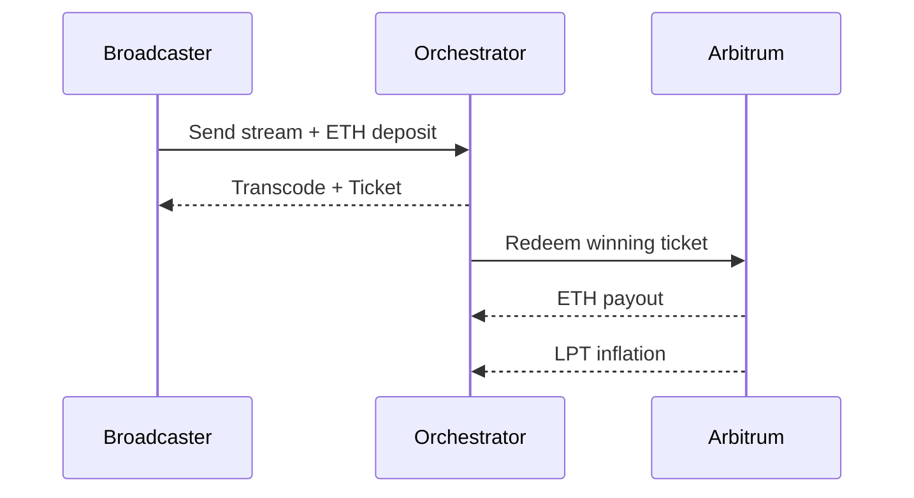

# Livepeer System Design (2026)

This document serves as the canonical technical reference for understanding Livepeer as a **multi-layered decentralized compute network**. It clearly separates the **protocol layer** (on-chain logic and incentives) from the **network layer** (off-chain execution and gateways), while highlighting the design rationales and product goals behind each system component.

It is structured around three pillars:

- **Protocol Layer**: smart contract-based staking, slashing, governance, and payment security mechanisms.
- **Network Layer**: real-world compute infrastructure including orchestrators, gateways, segment routing, and AI/video job processing.
- **Product-Forward Context**: rationale for design choices and how they serve different user personas (builders, node operators, creators, developers).

---

## ⚙️ Protocol Layer

The **Livepeer protocol** runs on Ethereum (currently Arbitrum One), providing a decentralized coordination layer for compute work.

### Purpose

- Incentivize compute supply through LPT staking and rewards
- Secure job routing via economic bonding
- Distribute LPT inflation and usage fees
- Enable community governance via LIPs

### Core Protocol Contracts

| Contract         | Role                                                           |
|------------------|----------------------------------------------------------------|
| `BondingManager` | Stake/bond logic, reward rounds, slashing                     |
| `TicketBroker`   | Probabilistic micropayment escrow for ETH fees               |
| `RoundsManager`  | Advances protocol rounds (~6 hrs); calculates inflation       |
| `Governor`       | Executes on-chain governance proposals                        |
| `LivepeerToken`  | ERC-20 interface for LPT                                      |

### Roles

- **Orchestrators**: stake LPT to be eligible for protocol jobs (transcoding). Earn LPT inflation + ETH. Slashed for cheating.
- **Delegators**: bond LPT to orchestrators. Share in earnings. Influence governance votes.
- **LPT Holders**: govern treasury and protocol via Livepeer Improvement Proposals (LIPs).

### Job Routing (Protocol Scope)

Only **transcoding jobs** are routed based on stake. The orchestrator pool is ranked by bonded LPT, and top performers are selected probabilistically per round.

AI jobs are currently **non-protocol-routed**.

---

## 📦 Network Layer

The **Livepeer network** consists of real-time infrastructure built around the protocol:

- **Orchestrators**: operators running `go-livepeer`, hosting GPU/CPU compute.
- **Gateways**: apps like Daydream and Cascade that submit jobs and verify outputs.
- **Transport + Protocols**: like Trickle for segment routing.
- **Workers**: external services performing ML, AI, and transcoding work.

### Key Systems

| Component | Description |
|----------|-------------|
| `go-livepeer` | Orchestrator node implementation (open source, reference stack) |
| `Trickle` | Segment router / HTTP relay layer for ingest/delivery |
| `Daydream` | AI inference job submission gateway and API platform |
| `Cascade` | Video-specific orchestrator gateway and media job router |
| `StreamDiffusionTD` | TouchDesigner-based real-time generative operator using Daydream backend 【353†source】|

> 🔄 These systems are **off-chain** and can evolve independently of the protocol.

### Routing Logic

- **Video Transcoding**: stake-routed via protocol
- **AI Workloads**: routed via gateway logic (e.g. Cascade uses latency + capacity heuristics)

---

## 🧭 Product Design Rationale

Livepeer is optimized around three core principles:

### 1. **Trustless Incentives (Protocol)**

- Stake = skin in the game. Nodes secure the network by bonding LPT.
- Inflation aligns long-term compute availability.
- Slashing deters fraud in transcoding and governance.

### 2. **Scalable Gateway Logic (Network)**

- AI/ML workloads are routed by latency/capacity, not stake.
- Gateways like Daydream can provide tiered quality of service (QoS).
- Enables hybrid models (off-chain reputation, credits, usage tiers).

### 3. **Composable Developer Interfaces**

- REST APIs, WebRTC ingestion, Arbitrum L2 endpoints
- Open source gateways and orchestrators
- Supports real-time AI effects, live video, generative media

---

## 🧮 Economics Summary

| Type          | Source                            | Distributed To        |
|---------------|------------------------------------|------------------------|
| LPT Inflation | Dynamic bonding curve (~50% target) | Orchestrators + Delegators |
| ETH Fees      | Probabilistic tickets (transcoding only) | Orchestrators              |
| Treasury      | LIP-governed (grants, ops, infra) | Developers, Grants     |

> 📉 As protocol inflation decreases, usage-based fees are expected to dominate【350†source】.

---

## 🔐 Governance Overview

- All LPT holders can vote on-chain via Governor contract
- Proposal flow:
  - LIP authored → Forum → GitHub PR → On-chain vote
  - 100 LPT required to submit proposal
  - 33% quorum + 50% majority → auto-execution

Example proposals:
- LIP-89: Multi-year roadmap funding
- LIP-92: Treasury inflation split

🔗 [LIPs GitHub](https://github.com/livepeer/LIPs) · [Forum](https://forum.livepeer.org)

---

## 🛰️ Interface & UX Integration

- **API-first** gateways enable developers to tap into Livepeer compute
- **OBS integration**, **StreamDiffusionTD**, and **Daydream frontends** support real-time experimentation

Use cases:
- Streamers: real-time effects via OBS + Daydream
- DJs/Artists: generative AI visuals with MetaDJ【352†source】
- Developers: GPU jobs, inference, video pipelines

---

## 📚 Resources

- [Livepeer Docs](https://livepeer.org/docs)
- [Explorer](https://explorer.livepeer.org)
- [Daydream](https://daydream.live)
- [go-livepeer GitHub](https://github.com/livepeer/go-livepeer)
- [Protocol APIs](https://docs.livepeer.org)
- [Developer SDKs](https://github.com/livepeer)
- [StreamDiffusionTD Demo](https://www.youtube.com/watch?v=CANAMxabbRQ)【353†source】

