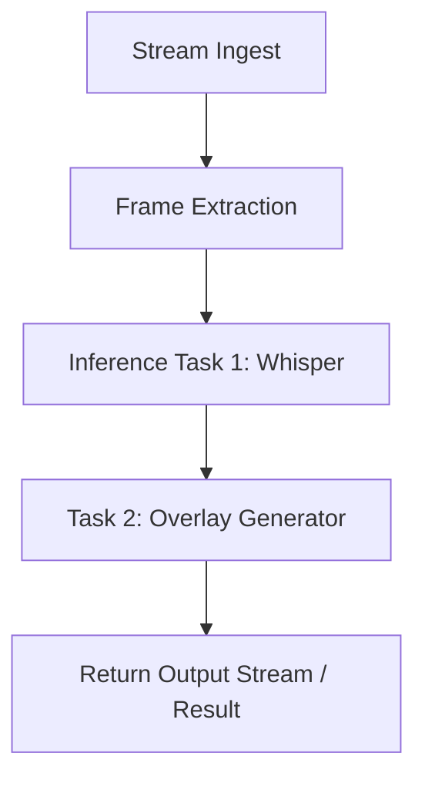

# AI Pipelines Overview

Livepeer AI Pipelines let developers run customizable, composable video inference jobs across distributed GPU infrastructure. Powered by the Livepeer Gateway Protocol and supported by off-chain workers like ComfyStream, the system makes it easy to deploy video AI at scale.

Use cases include:
- Speech-to-text (Whisper)
- Style transfer or filters (Stable Diffusion)
- Object tracking and detection (YOLO)
- Video segmentation (segment-anything)
- Face redaction or blurring
- BYOC (Bring Your Own Compute)

---

## 🧱 What Is a Pipeline?

An AI pipeline consists of one or more tasks executed in sequence on live video frames. Each task may:
- Modify the video (e.g. add overlays)
- Generate metadata (e.g. transcript, bounding boxes)
- Relay results to another node

Livepeer handles stream ingest + frame extraction + job dispatching. Nodes do the rest.



---

## 🛰 Architecture

### Gateway Protocol
A decentralized pub/sub coordination layer:
- Orchestrators queue inference jobs
- Workers subscribe to task types (e.g. whisper-transcribe)
- Gateway routes jobs to compatible nodes

### Worker Types
| Type               | Description                                     | Example Models      |
|--------------------|--------------------------------------------------|---------------------|
| Whisper Worker     | Speech-to-text inference                        | `whisper-large`     |
| Diffusion Worker   | Image-to-image or overlay generation            | `sdxl`, `controlnet`|
| Detection Worker   | Bounding box or class prediction                | `YOLOv8`            |
| Pipeline Worker    | Runs chained tasks via ComfyStream or custom    | `custom-pipeline`   |

---

## 🛠 Pipeline Definition Format

Jobs can be JSON-based task objects:
```json
{
  "streamId": "abc123",
  "task": "custom-pipeline",
  "pipeline": [
    { "task": "whisper-transcribe", "lang": "en" },
    { "task": "segment-blur", "target": "faces" }
  ]
}
```

Workers can accept:
- JSON-formatted tasks via Gateway
- Frame-by-frame gRPC (low latency)
- Result upload via webhook

---

## 💡 Bring Your Own Compute (BYOC)

Use your own GPU nodes to serve inference tasks:

1. Clone [ComfyStream](https://github.com/livepeer/comfystream)
2. Add plugins for Whisper / ControlNet / etc
3. Register gateway node with `livepeer-cli`

```bash
./run-gateway.sh --gpu --model whisper --adapter gRPC
```

---

## 📊 Pipeline Metrics (Live)

*Placeholder: Insert Livepeer Explorer data*

| Metric                  | Value (Example)    |
|-------------------------|--------------------|
| Active Gateway Workers  | `134`              |
| Avg Inference Latency   | `260ms`            |
| Daily Tasks Run         | `57,000+`          |
| Most Used Model         | `whisper-large`    |

---

## 📎 Resources

- [ComfyStream GitHub](https://github.com/livepeer/comfystream)
- [Livepeer AI Task Docs](https://livepeer.studio/docs/ai)
- [Gateway Protocol](../../livepeer-network/technical-stack)
- [AI Inference CLI](../guides-and-resources/resources)
- [BYOC Deployment Guide](./byoc)
- [Pipeline Examples](https://forum.livepeer.org/t/example-pipelines)

📎 End of `ai-pipelines/overview.mdx`

