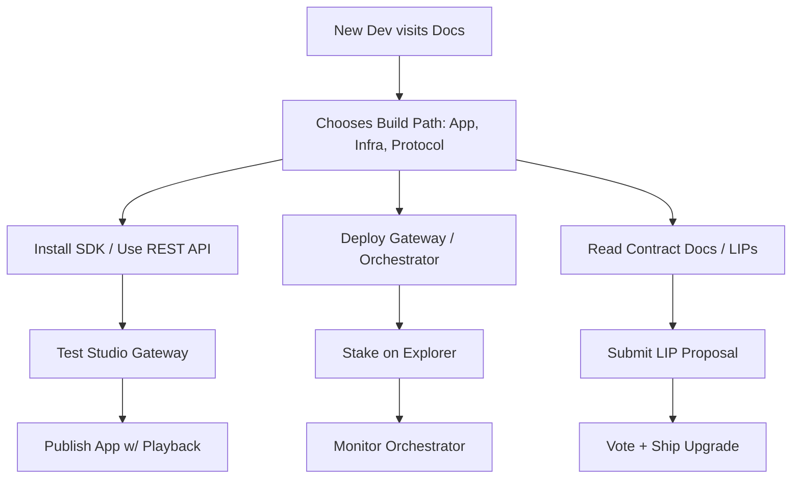

# Livepeer Developer Journey

This guide maps the journey of developers engaging with the Livepeer ecosystem—whether you're building an app, deploying infrastructure, or contributing to the protocol.

Use this as a compass to navigate the tooling, architecture, and growth pathways across the decentralized video and AI stack.

---

## 🚀 Entry Paths

| Entry Point             | Starting Role                      | Resources                                |
|-------------------------|-------------------------------------|-------------------------------------------|
| Build an app            | Frontend/Fullstack Developer       | [JS SDK](https://github.com/livepeer/js-sdk), [API Docs](https://livepeer.studio/docs) |
| Deploy a Gateway        | Infra Engineer / DevOps            | [Gateway Protocol](../technical-stack), [Orchestrator Recipes](../deployment-recipes) |
| Extend the Protocol     | Solidity / Smart Contract Developer| [Protocol GitHub](https://github.com/livepeer/protocol), [LIPs](https://forum.livepeer.org) |
| Run your own pipeline   | AI/ML Researcher or Builder        | [ComfyStream](../ai-pipelines/comfystream), [BYOC Guide](../ai-pipelines/byoc) |

---

## 🧭 Journey Map

---

## 🧠 Key Learning Phases

### Phase 1 – Bootstrapping
- Clone the SDK or call the Studio Gateway
- Try deploying a basic app
- Understand what a `session`, `stream`, and `task` is

### Phase 2 – Composing
- Combine AI inference (e.g. Whisper, SDXL) with stream ingest
- Use Livepeer Credits to enable compute jobs
- Configure your own `ffmpeg` + webhook stack

### Phase 3 – Scaling or Contributing
- Deploy a full orchestrator
- Join testnets or participate in protocol votes
- Build advanced apps (e.g. AI-enhanced playback, multi-modal tools)

---

## 🛠 Toolkit Selection

| Use Case                      | Tools/Path                                                  |
|-------------------------------|-------------------------------------------------------------|
| Stream-based App              | JS SDK, REST API, Studio Gateway                            |
| Real-time AI App              | gRPC Gateway, Daydream Protocol, ffmpeg → AI inference     |
| Deep Protocol Integration     | Smart contracts, `livepeer-cli`, Subgraph, BondingManager  |
| BYOC Pipeline Deployment      | ComfyStream, Python inference server, Gateway adapter       |

---

## 🌐 Community Milestones

| Stage              | Example Developer Outcome                            |
|--------------------|------------------------------------------------------|
| First App          | Publish to Vercel, stream to Livepeer, playback UI  |
| AI Layering        | Build a voice-to-caption or AI filters demo         |
| Tool Contribution  | Create CLI wrapper, dashboard, or open-source gateway |
| Ecosystem Grant    | Apply to expand an idea via RFP or grant track      |

---

## 📍 Recommended Paths by Role

### 🎨 App Developers
- Start with `@livepeer/sdk`
- Use [OBS](https://obsproject.com/) + Studio Gateway for testing
- Add AI jobs with `POST /ai/infer`

### 🛰 Gateway Engineers
- Start with Trickle Gateway or clone Daydream
- Use Prometheus and custom metrics exporters

### 🧠 AI Devs
- Use [ComfyStream](https://github.com/livepeer/comfystream)
- Train models locally, deploy as inference workers

### 🔒 Protocol Contributors
- Audit governance contracts
- Use `Governor` ABI to submit/vote LIPs
- Watch subgraph staking events

---

## 🧪 Evolving Roles

As the protocol modularizes, developers may shift:
- From App Developer → Gateway Operator
- From Gateway → Protocol Upgrader
- From CLI User → Subgraph Indexer

The journey is non-linear.

---

## 📚 Continue Exploring

- [Developer Guide](../developer-guide)
- [AI Pipelines](../ai-pipelines/overview)
- [Protocol Economics](../../livepeer-protocol/protocol-economics)
- [Livepeer Explorer](https://explorer.livepeer.org)
- [Forum](https://forum.livepeer.org)
- [Discord](https://discord.gg/livepeer)

📎 End of `developer-journey.mdx`

