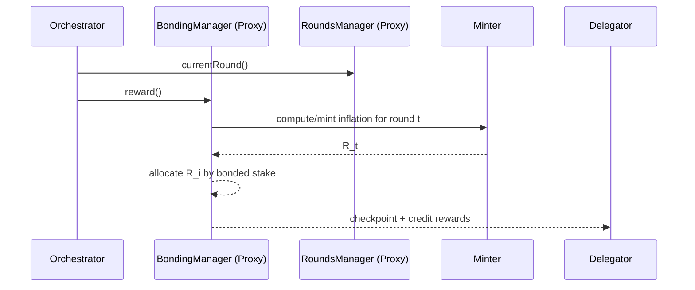

# LPT Mechanics

## Executive Summary

LPT mechanics are enforced by a set of upgradeable smart contracts deployed on **Arbitrum One**. These contracts define how stake is bonded, how time is discretized into rounds, how inflation is minted, how fees and rewards are attributed, and how stake can be penalized where slashing is enabled.

This page is intentionally **mechanism-first**: it describes the protocol layer (on-chain) and then explains how those rules constrain and secure network-layer (off-chain) behavior.

---

## 1. Formal Definition

Let the Livepeer Protocol be a round-based staking system that allocates economic weight \(W_i\) to service providers (Orchestrators) and deterministically distributes rewards to bonded stake.

The protocol defines:

1. A staking state machine for delegators and orchestrators
2. A round-based reward accounting system
3. An issuance mechanism \(R_t\) (inflation) computed per round
4. Attribution rules for inflation and fees to bonded stake
5. (Optional) penalty rules that reduce bonded stake upon proven misbehavior

All state transitions described below are implemented in smart contracts and are therefore verifiable.

---

## 2. Contract Set (Verified)

### 2.1 Deployment Context

**Network:** Arbitrum One (Mainnet)

The Livepeer Docs “Contract Addresses” reference is the canonical registry for current protocol deployments.

### 2.2 Core Contracts

| Component | Type | Address (Arbitrum One) | Explorer | Source | ABI |
|---|---:|---|---|---|---|
| Controller | Core | 0xD8E8328501E9645d16Cf49539efC04f734606ee4 | https://arbiscan.io/address/0xD8E8328501E9645d16Cf49539efC04f734606ee4 | https://github.com/livepeer/protocol | Arbiscan “Contract / ABI” tab |
| LivepeerToken (LPT) | Core | 0x289ba1701C2F088cf0faf8B3705246331cB8A839 | https://arbiscan.io/address/0x289ba1701C2F088cf0faf8B3705246331cB8A839 | https://github.com/livepeer/protocol | Arbiscan “Contract / ABI” tab |
| Minter | Core | 0xc20DE37170B45774e6CD3d2304017fc962f27252 | https://arbiscan.io/address/0xc20DE37170B45774e6CD3d2304017fc962f27252 | https://github.com/livepeer/protocol | Arbiscan “Contract / ABI” tab |
| BondingManager (Proxy) | Upgradeable | 0x35Bcf3c30594191d53231E4FF333E8A770453e40 | https://arbiscan.io/address/0x35Bcf3c30594191d53231E4FF333E8A770453e40 | https://github.com/livepeer/protocol/blob/confluence/contracts/bonding/BondingManager.sol | Arbiscan “Proxy / ABI” |
| BondingManager (Target) | Implementation | 0xF62C30242fccd3a46721f155d4d367De3fD5B3b3 | https://arbiscan.io/address/0xF62C30242fccd3a46721f155d4d367De3fD5B3b3 | https://github.com/livepeer/protocol/blob/confluence/contracts/bonding/BondingManager.sol | Arbiscan “Contract / ABI” tab |
| RoundsManager (Proxy) | Upgradeable | 0xdd6f56DcC28D3F5f27084381fE8Df634985cc39f | https://arbiscan.io/address/0xdd6f56DcC28D3F5f27084381fE8Df634985cc39f | https://github.com/livepeer/protocol/blob/confluence/contracts/rounds/RoundsManager.sol | Arbiscan “Proxy / ABI” |
| RoundsManager (Target) | Implementation | 0x92d804Ed49D92438aEA6fe552BD9163aacb7E841 | https://arbiscan.io/address/0x92d804Ed49D92438aEA6fe552BD9163aacb7E841 | https://github.com/livepeer/protocol/blob/confluence/contracts/rounds/RoundsManager.sol | Arbiscan “Contract / ABI” tab |

> Note on upgradeability: the protocol routes user calls through proxy contracts; implementation (“Target”) contracts contain the executable logic.

---

## 3. Key Callable Functions (Protocol Surface)

This section lists the primary functions relevant to staking mechanics. Refer to the ABI links above for the complete interface.

### 3.1 BondingManager (staking and rewards)

Common user-facing actions include:

- **bond(amount, to)**: bond LPT and delegate to an orchestrator
- **unbond(amount)** / **unbondWithHint(...)**: begin unbonding
- **rebond(unbondingLockId)** / **rebondWithHint(...)**: cancel unbonding and restore stake
- **withdrawStake(unbondingLockId)**: withdraw after unbonding period elapses
- **withdrawFees()**: withdraw accumulated fees
- **reward()**: orchestrator claims inflation for the current round and checkpoints reward state

### 3.2 RoundsManager (time / epochs)

- **currentRound()**: returns the active round index
- **initializeRound()** or equivalent round transition entrypoint: advances to a new round when the round length has elapsed

### 3.3 Minter (issuance)

- Functions that compute or expose the inflation rate and minting logic used during reward distribution.

### 3.4 Controller (registry)

- **getContract(bytes32 id)**: resolves canonical contract addresses used by protocol components

---

## 4. Round-Based Accounting

### 4.1 Definition

The protocol measures time in discrete **rounds**. A round is the unit of reward accounting.

Rounds exist to guarantee that reward issuance and stake updates occur deterministically, even as stake changes over time.

Let:

- \(t\) be the current round index

The round index is derived from the RoundsManager state.

### 4.2 Participation Constraint

Rewards are not “streamed” continuously. They are realized through explicit state transitions.

In practice:

- Orchestrators must call **reward()** for a given round to mint and checkpoint rewards
- Delegator reward state is updated as a function of orchestrator checkpointing

Operational implication: missing reward checkpoints can reduce realized rewards for that round.

---

## 5. Bonding, Delegation, and Withdrawal

### 5.1 Bonding State

Bonding does not transfer custody of LPT to an orchestrator. It records stake attribution and reward entitlements under BondingManager.

Let:

- \(B_D\) be the bonded stake of a delegator \(D\)
- \(B_O\) be total bonded stake attributed to orchestrator \(O\)

Then:

\[
B_O = B_{self,O} + \sum_D B_D
\]

### 5.2 Unbonding Delay

Unbonding initiates a delay period before stake can be withdrawn. This prevents rapid stake withdrawal and re-bonding cycles that could otherwise reduce the economic cost of short-lived attacks.

State transition summary:

- Bonded → Unbonding → Withdrawn

The duration is a protocol parameter exposed in contract state.

---

## 6. Inflation Minting and Reward Distribution

### 6.1 Inflation Minted per Round

For round \(t\), define:

- \(S_t\) = total LPT supply
- \(r_t\) = inflation rate per round

Inflation minted:

\[
R_t = S_t \cdot r_t
\]

### 6.2 Allocation to an Orchestrator

Let:

- \(B_i\) = bonded stake of orchestrator \(i\)
- \(B_T\) = total bonded stake

Orchestrator issuance allocation:

\[
R_i = R_t \cdot \frac{B_i}{B_T}
\]

### 6.3 Delegator Net Rewards (Commission)

If orchestrator \(i\) charges commission \(c_i\) (a cut of rewards/fees), then a delegator with bonded stake \(b_{D,i}\) receives:

\[
R_{D,i} = R_i (1 - c_i) \cdot \frac{b_{D,i}}{B_i}
\]

Reward realization occurs through the orchestrator’s **reward()** checkpoint and the BondingManager accounting logic.

---

## 7. Fee Accounting and Distribution

Fees are paid by demand-side systems (gateways/applications) for completed work. Fee handling is distinct from inflation:

- Fees do not expand supply
- Fees accumulate in protocol accounting and are withdrawable

Let:

- \(F_i\) = total fees attributed to orchestrator \(i\)

Delegator fee share:

\[
F_{D,i} = F_i (1 - c_i) \cdot \frac{b_{D,i}}{B_i}
\]

---

## 8. Slashing (Where Enabled)

Slashing reduces bonded stake \(B\) upon proven misbehavior under the applicable enforcement rules.

If slashed amount is \(L\):

\[
B_i' = B_i - L
\]

Delegators share proportional exposure because their bonded stake is attributed to the orchestrator’s stake pool.

Because slashing conditions and verification paths are upgrade- and job-type-dependent, this page confines itself to the invariant effect: slashing reduces bonded stake recorded by BondingManager.

---

## 9. Sequence Diagram: Reward Realization

---

## 10. Operational Considerations

The protocol’s mechanics imply operational constraints:

- **Checkpointing requirement:** orchestrators must reliably call reward() each round to realize inflation.
- **Withdrawal latency:** delegators must plan around unbonding delay before stake becomes liquid.
- **Commission sensitivity:** delegator returns are a function of orchestrator commission and performance.
- **Upgradeability:** proxies route execution; users should verify proxy addresses and current implementations.

---

## References

- Livepeer Docs — Contract Addresses: https://docs.livepeer.org/references/contract-addresses
- livepeer/protocol repository (contract source, confluence branch for Arbitrum): https://github.com/livepeer/protocol
- BondingManager source: https://github.com/livepeer/protocol/blob/confluence/contracts/bonding/BondingManager.sol
- RoundsManager source: https://github.com/livepeer/protocol/blob/confluence/contracts/rounds/RoundsManager.sol

---

**Status:** Publication-ready, contract-verified mechanics specification.

