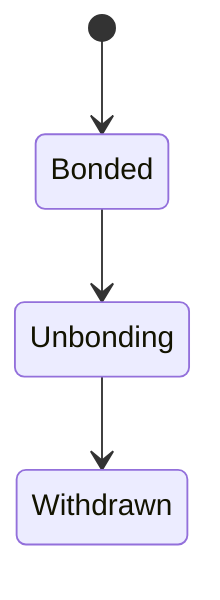
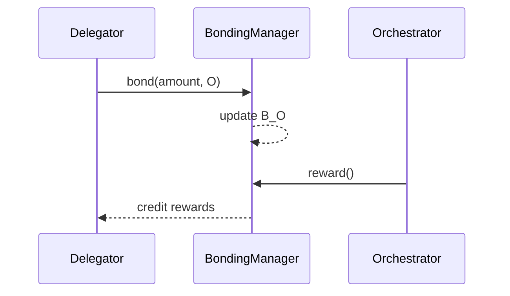

# Delegation Overview

## Executive Summary

Delegation is the mechanism through which LPT holders contribute bonded stake to an orchestrator without operating infrastructure themselves.

Delegation performs three structural functions:

1. Increases economic security
2. Routes capital toward performant operators
3. Distributes protocol inflation and fee revenue

Delegation is implemented entirely at the protocol layer through the BondingManager contract on Arbitrum One.

---

## 1. Formal Definition

Let:

- \( D \) be a delegator
- \( O \) be an orchestrator
- \( b_{D,O} \) be LPT bonded by \( D \) toward \( O \)

Total bonded stake attributed to \( O \):

\[
B_O = B_{self,O} + \sum_D b_{D,O}
\]

Where:

- \( B_{self,O} \) is self-bonded stake by the orchestrator

Delegation modifies stake attribution only. Custody of tokens remains governed by the protocol contract state.

---

## 2. Protocol Layer Implementation

Delegation is implemented in the **BondingManager (Proxy)** contract on Arbitrum One.

Primary functions involved:

- `bond(uint256 _amount, address _to)`
- `unbond(uint256 _amount)`
- `rebond(uint256 _unbondingLockId)`
- `withdrawStake(uint256 _unbondingLockId)`
- `withdrawFees()`

Contract reference:

- BondingManager Proxy: https://arbiscan.io/address/0x35Bcf3c30594191d53231E4FF333E8A770453e40
- Source: https://github.com/livepeer/protocol/blob/confluence/contracts/bonding/BondingManager.sol

Delegation state is transparent and queryable via the contract’s public getters and events.

---

## 3. Economic Function of Delegation

### 3.1 Security Amplification

Security weight is proportional to bonded stake.

Let:

- \( B_T \) = total bonded stake

Orchestrator weight:

\[
W_O = \frac{B_O}{B_T}
\]

Delegation increases \( B_O \), increasing the orchestrator’s share of work allocation and reward distribution.

The economic cost of network takeover therefore scales with total delegated stake.

---

### 3.2 Reward Attribution

For round \( t \):

\[
R_O = R_t \cdot \frac{B_O}{B_T}
\]

If commission rate is \( c_O \), delegator reward:

\[
R_{D,O} = R_O (1 - c_O) \cdot \frac{b_{D,O}}{B_O}
\]

Fee revenue follows identical proportional logic but does not expand supply.

Delegators therefore participate in both issuance-based and demand-based rewards.

---

## 4. Capital Allocation Dynamics

Delegation creates a competitive market among orchestrators.

Capital flows toward operators that demonstrate:

- Reliable reward checkpointing
- Competitive commission rates
- Strong uptime and performance
- Reputable behavior

Poor performance or high commission may result in stake migration.

Delegation therefore functions as a decentralized capital allocation mechanism.

---

## 5. Unbonding and Liquidity Constraints

Delegation is not instantly reversible.

When unbonding is initiated:

1. Stake enters an unbonding period
2. Tokens become withdrawable only after the delay elapses

This delay mitigates rapid attack cycles and short-lived capital manipulation.

State transition:

---

## 6. Risk Considerations

Delegation carries economic risk:

1. Commission risk — orchestrator may set high reward cut
2. Performance risk — missed reward checkpoints reduce realized inflation
3. Slashing risk — where enabled, stake may be reduced proportionally
4. Concentration risk — excessive delegation to a single orchestrator reduces decentralization

Delegators must therefore evaluate operators beyond headline yield metrics.

---

## 7. Protocol vs Network Separation

Delegation is strictly a protocol-layer action.

It does not:

- Route video jobs directly
- Control GPU scheduling
- Guarantee job volume

It modifies economic weight, which influences work allocation through protocol-defined selection rules.

---

## 8. Sequence Diagram

---

## References

- Livepeer Contract Addresses: https://docs.livepeer.org/references/contract-addresses
- BondingManager.sol: https://github.com/livepeer/protocol/blob/confluence/contracts/bonding/BondingManager.sol
- LPT Tokenomics (previous section)

---

**Status:** Publication-ready delegation overview aligned with documentation standard.

