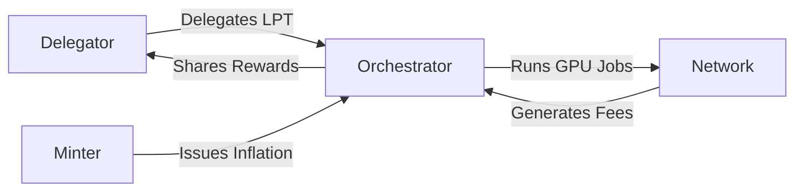

# LPT Token Portal

## Executive Summary

Livepeer Token (LPT) is the native staking and coordination asset of the Livepeer Protocol. It is not a payment token for video services, nor is it required for demand-side usage. LPT secures the protocol through delegated stake, governs protocol upgrades, and coordinates issuance-based and fee-based economic incentives.

This page serves as the canonical entry point to all LPT-related documentation: token purpose, tokenomics, delegation mechanics, governance authority, and treasury alignment.

---

## Formal Definition

**LPT (Livepeer Token)** is an ERC‑20 compatible protocol token deployed on Arbitrum and governed by the Livepeer Protocol smart contracts. It functions as:

1. A staking asset for orchestrator participation
2. A delegation signal for capital allocation
3. A governance weight unit
4. A coordination primitive for decentralized GPU infrastructure

LPT does **not** represent equity in any company, nor does it grant rights over Livepeer Inc. or the Livepeer Foundation.

---

## Architectural Context

### Protocol Layer (On‑Chain)

LPT interacts directly with the following contracts:

- BondingManager — stake delegation and reward distribution
- Minter — inflation issuance logic
- RoundsManager — round-based accounting
- Controller — contract registry

All staking balances, reward minting, and governance weight derive from these contracts.

### Network Layer (Off‑Chain)

Orchestrators run GPU infrastructure that:

- Transcodes video
- Executes AI inference
- Serves real-time workloads

LPT does not power execution directly; it secures the actors performing execution.

---

## System Overview Diagram

---

## Core Economic Roles

### 1. Security

Stake determines orchestrator eligibility and work allocation weight.

### 2. Incentive Alignment

Rewards consist of:

- Protocol inflation (issuance-based)
- Usage-based fees (demand-driven)

Delegators receive a proportional share of rewards distributed by the orchestrator.

### 3. Governance

Voting weight is proportional to bonded LPT.

### 4. Market Signaling

Delegation routes stake toward high-performing orchestrators, improving capital efficiency.

---

## Reward Framework (High-Level)

Let:

- B_i = bonded stake for orchestrator i
- B_T = total bonded stake
- R = total inflation minted in a round
- F_i = fees earned by orchestrator i
- s = orchestrator reward share (commission rate)

Then:

Inflation reward to orchestrator i:

R_i = R × (B_i / B_T)

Delegator reward share (post commission):

DelegatorShare = (R_i + F_i) × (1 − s)

Full derivations are provided in the Tokenomics and Mechanics sections.

---

## Why LPT Exists

Without LPT staking:

- Orchestrators would lack capital commitment
- No slashing-backed accountability could exist
- Governance weight would be undefined
- Supply-side bootstrapping would fail

LPT is the coordination layer that enables decentralized GPU infrastructure to compete with centralized clouds.

---

## Design Tradeoffs

| Design Choice | Implication |
|---------------|------------|
| Inflation bootstrapping | Enables early supply growth but dilutes non-stakers |
| Delegated stake | Improves accessibility but introduces delegation risk |
| Fee-sharing optionality | Encourages competitive commission markets |
| Round-based accounting | Simplifies deterministic reward calculation |

---

## What This Portal Covers Next

- LPT Overview
- Token Purpose
- Tokenomics (Inflation Model & Bonding Rate Adjustment)
- Mechanics (Rounds, Rewards, Slashing)
- Delegation Guide
- Governance Model
- Treasury Structure

Each section expands into contract-level detail and formal economic modeling.

---

## References

- Livepeer Protocol Contracts (Arbitrum)
- Livepeer GitHub Repository
- Livepeer Forum (Governance Proposals)
- "Why Delegation Still Matters in a Low‑Inflation Environment" (Livepeer Blog)

All subsequent pages must reference verified contract addresses and governance sources directly.

---

**Status:** Production-grade canonical entry point for LPT documentation.

