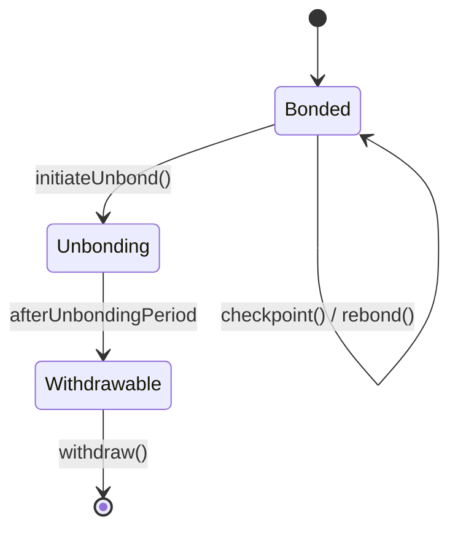

# LPT Mechanics

## Executive Summary

This page describes the deterministic contract-level mechanics governing how LPT transitions between bonded and unbonded states, how rounds are processed, and how rewards are checkpointed and claimed.

All mechanisms described here operate strictly at the **protocol layer (on-chain)**.

---

## 1. Core State Variables

Let:

- \(S_t\) = total LPT supply at round \(t\)
- \(B_T\) = total bonded stake
- \(B_i\) = bonded stake attributed to participant \(i\)
- Round \(t\) = discrete accounting epoch managed by the protocol

Rounds form the atomic accounting unit for issuance and reward distribution.

---

## 2. Bonding

Bonding is the act of locking LPT into the staking contract to participate in protocol rewards and governance.

When participant \(i\) bonds amount \(x\):

\[
B_i^{new} = B_i^{old} + x
\]

\[
B_T^{new} = B_T^{old} + x
\]

Bonded stake contributes to:

- Reward eligibility
- Governance voting weight
- Security participation

Bonding is recorded in the BondingManager contract.

---

## 3. Delegation Attribution

If delegator \(D\) bonds to orchestrator \(O\):

\[
B_O = B_{self,O} + \sum_D b_{D,O}
\]

Delegators retain ownership but delegate reward rights and voting weight attribution.

---

## 4. Unbonding

Unbonding initiates a withdrawal period.

When participant \(i\) unbonds amount \(x\):

\[
B_i^{new} = B_i^{old} - x
\]

\[
B_T^{new} = B_T^{old} - x
\]

The stake enters a pending withdrawal state subject to an unbonding period measured in rounds.

During this period:

- Stake does not earn rewards
- Stake cannot be immediately transferred

This delay protects against rapid stake-based manipulation.

---

## 5. Round Lifecycle

Each round includes:

1. Inflation calculation
2. Reward distribution eligibility
3. Checkpoint processing

Round transition is triggered by protocol timing logic.

Issuance per round:

\[
R_t = S_t \cdot r_t
\]

Supply update:

\[
S_{t+1} = S_t + R_t
\]

---

## 6. Reward Checkpointing

Rewards are not automatically transferred; they must be checkpointed.

Checkpointing updates participant reward balances according to stake weight.

Allocation to orchestrator \(O\):

\[
R_O = R_t \cdot \frac{B_O}{B_T}
\]

Delegator share:

\[
R_{D,O} = R_O (1 - c_O) \cdot \frac{b_{D,O}}{B_O}
\]

Checkpointing updates internal accounting state before withdrawal or rebonding.

---

## 7. Claiming and Rebonding

Participants may:

- Claim rewards to liquid balance
- Rebond rewards (compound stake)

Rebonding increases \(B_i\) and thus future economic weight.

---

## 8. State Transition Diagram

---

## 9. Security Implications

Mechanisms that protect protocol integrity:

- Unbonding delay → reduces short-term manipulation
- Round-based accounting → deterministic reward cycles
- Stake-weighted allocation → capital-backed security

---

## 10. Protocol vs Network Separation

Protocol:

- Bonding/unbonding logic
- Round transitions
- Reward issuance
- Stake attribution

Network:

- Job execution
- Performance
- Fee generation

Mechanics described here are entirely on-chain.

---

## References

- Livepeer Protocol repository: https://github.com/livepeer/protocol
- Contract registry: https://docs.livepeer.org/references/contract-addresses

---

**Status:** Contract-level lifecycle mechanics documented with formal state transitions and equations per 2026 standard.

