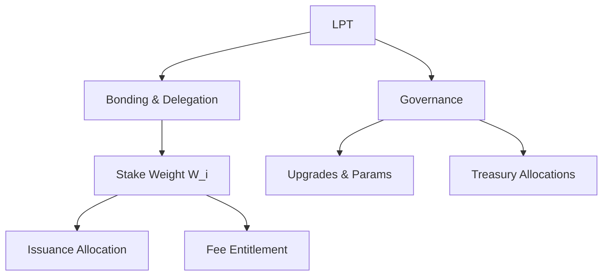

# LPT Overview

## Executive Summary

The Livepeer Token (LPT) is the protocol-layer asset used to (1) secure the Livepeer Protocol via bonded stake, (2) distribute protocol issuance and fees, (3) allocate capital toward performant orchestrators through delegation, and (4) govern upgrades and treasury flows.

LPT is not the mechanism by which jobs are routed, transcoded, or executed. Those are network-layer functions. LPT governs the **economic substrate** that constrains and incentivizes network behavior.

---

## 1. Formal Definition

Let the Livepeer Protocol be a round-based staking system with deterministic accounting over bonded stake.

Define:

- \(S\): total LPT supply
- \(B_T\): total bonded stake
- \(B_i\): bonded stake attributed to participant \(i\)

LPT is the asset whose bonded state \(B_i\) determines economic weight and governance authority.

---

## 2. Architectural Context

### 2.1 Protocol Layer (On-Chain)

At the protocol layer, LPT is referenced by core smart contracts that implement:

- Bonding and delegation accounting
- Round-based reward issuance and checkpointing
- Governance execution (parameter changes, upgrades)
- Treasury custody and allocations

Canonical contract addresses are published in the registry:

- https://docs.livepeer.org/references/contract-addresses

### 2.2 Network Layer (Off-Chain)

At the network layer, orchestrators and gateways execute and route work (video/AI jobs). These systems may earn fees that are ultimately distributed according to protocol accounting rules.

LPT does not perform work; it secures the market in which work is performed.

---

## 3. Economic Weight

Economic weight is stake-proportional.

Define:

\[
W_i = \frac{B_i}{B_T}
\]

Where \(W_i\) determines the stake-weighted share of protocol issuance and, depending on job/payment paths, stake-weighted entitlement to fee distributions.

Security implication:

- Increasing \(B_T\) increases the capital cost to capture stake-weighted outcomes.

---

## 4. Issuance and Rewards (High-Level)

Per round \(t\), protocol issuance is minted as a function of supply and an inflation parameter:

\[
R_t = S_t \cdot r_t
\]

Where:

- \(S_t\) is the supply at round \(t\)
- \(r_t\) is the inflation rate applied for that round

Allocation to an orchestrator \(O\) with total attributed stake \(B_O\):

\[
R_O = R_t \cdot \frac{B_O}{B_T}
\]

Delegator share (net of commission \(c_O\)) for delegator stake \(b_{D,O}\):

\[
R_{D,O} = R_O (1 - c_O) \cdot \frac{b_{D,O}}{B_O}
\]

This page is overview-only. Full derivations and parameter dynamics live in **About → Tokenomics**.

---

## 5. Delegation as Capital Allocation

Delegation allows non-operators to provide stake to orchestrators.

Total stake attributed to orchestrator \(O\):

\[
B_O = B_{self,O} + \sum_D b_{D,O}
\]

Delegation creates a competitive market over:

- Commission rates
- Reward checkpoint reliability
- Performance and reputation

---

## 6. Governance and Treasury Authority

Voting power is derived from bonded stake:

\[
V_i = \frac{B_i}{B_T}
\]

Governance can update protocol parameters, upgrade implementations (where upgradeable), and authorize treasury allocations.

This section is expanded in **Livepeer Governance** and **Livepeer Treasury**.

---

## 7. Protocol vs Network Separation

**Protocol (On-Chain):** contracts, bonding, issuance math, governance execution, treasury flows.

**Network (Off-Chain):** nodes, GPUs, routing, execution, gateways, performance.

Blurring these layers causes incorrect mental models and incorrect operational expectations.

---

## 8. System Diagram

---

## 9. Operational Considerations

- Bonding/unbonding introduce time-based constraints (liquidity delay).
- Returns are a mix of issuance and fees; they should not be conflated.
- Commission and performance differences are first-order variables.
- Governance participation is part of stewardship; passive holding is not equivalent to protocol participation.

---

## References

- Livepeer Protocol repository: https://github.com/livepeer/protocol
- Contract registry: https://docs.livepeer.org/references/contract-addresses

---

**Status:** Overview corrected (this canvas previously contained Purpose content).

