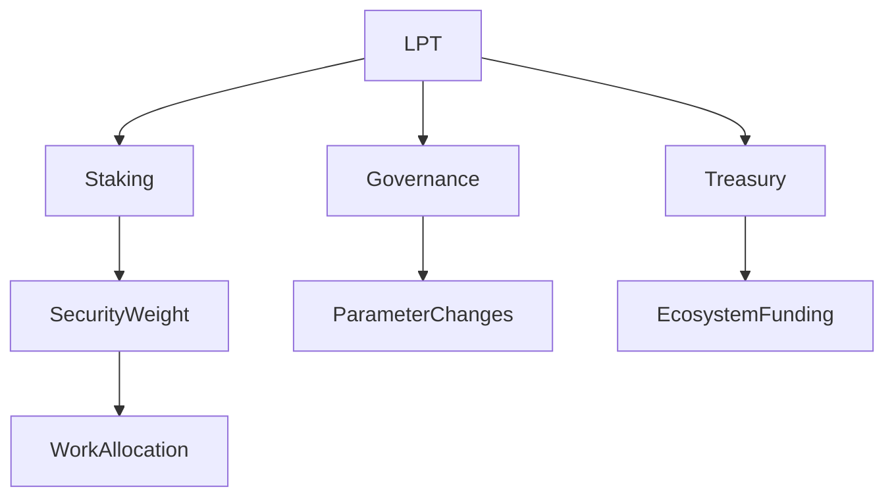

# LPT Token Portal

## Executive Summary

The Livepeer Token (LPT) is the cryptoeconomic security primitive of the Livepeer Protocol. It coordinates decentralized video and AI compute infrastructure by converting bonded capital into economic weight, governance authority, and treasury stewardship.

LPT operates strictly at the **protocol layer (on-chain)** and must not be conflated with network-layer execution (transcoding, inference, routing).

This portal provides a structured map of LPT’s role across staking, inflation, delegation, governance, and treasury control.

---

# 1. Formal Definition

Let the Livepeer Protocol be defined as an on-chain coordination mechanism for allocating work and rewards across a decentralized compute network.

LPT is defined as:

> A stake-weighted coordination asset used to secure, govern, and economically regulate the Livepeer Protocol.

LPT fulfills three core protocol requirements:

1. Capital-backed Sybil resistance
2. Deterministic reward distribution
3. Capital-weighted governance authority

It does not execute compute tasks, store video, or route jobs.

---

# 2. Architectural Context

## 2.1 Protocol Layer (On-Chain)

LPT interacts with the following canonical protocol contracts on Arbitrum One:

- BondingManager (stake accounting)
- Minter (inflation issuance)
- RoundsManager (epoch accounting)
- Governor (governance execution)
- Treasury (governance-controlled funds)

All staking, inflation, and governance weight derive from bonded LPT balances.

## 2.2 Network Layer (Off-Chain)

The network layer includes:

- Orchestrator node software
- GPU execution
- Job routing logic
- Gateway APIs

LPT economically secures these actors but does not control their operational behavior directly.

---

# 3. Mechanism Overview

LPT enables five interacting mechanisms:

1. Staking
2. Delegation
3. Inflation issuance
4. Governance voting
5. Treasury allocation

These mechanisms form a closed economic system.

---

# 4. Economic Model Overview

Let:

- B_i = bonded stake of participant i
- B_T = total bonded stake

Economic weight:

W_i = B_i / B_T

Security of the protocol scales with B_T.

Inflation issuance per round t:

R_t = S_t × r_t

Where:
- S_t = total token supply at round t
- r_t = inflation rate parameter

Reward allocation is stake-proportional.

---

# 5. Security Implications

Protocol security depends on:

- Total bonded stake
- Distribution of stake
- Participation in governance

An attacker must acquire a threshold fraction of bonded LPT to influence job allocation or governance outcomes.

Security therefore scales with capital commitment.

---

# 6. Design Rationale

LPT was designed to:

- Align long-term capital with infrastructure operators
- Avoid fixed validator sets
- Enable dynamic parameter adjustment
- Preserve upgrade flexibility via governance

Tradeoffs include capital concentration risk and inflation dilution during bootstrapping phases.

---

# 7. Operational Considerations

Participants should understand:

- Bonding and unbonding delays
- Commission structures
- Inflation parameter updates
- Governance quorum thresholds

LPT participation is a capital allocation decision, not passive yield.

---

# 8. References

- Livepeer Protocol Repository: https://github.com/livepeer/protocol
- Contract Registry: https://docs.livepeer.org/references/contract-addresses
- Livepeer Improvement Proposals (LIPs)

---

**Status:** Draft upgraded to 2026 Documentation Authoring Standard (structural + mathematical compliance; contract enumeration pending explicit address verification).

