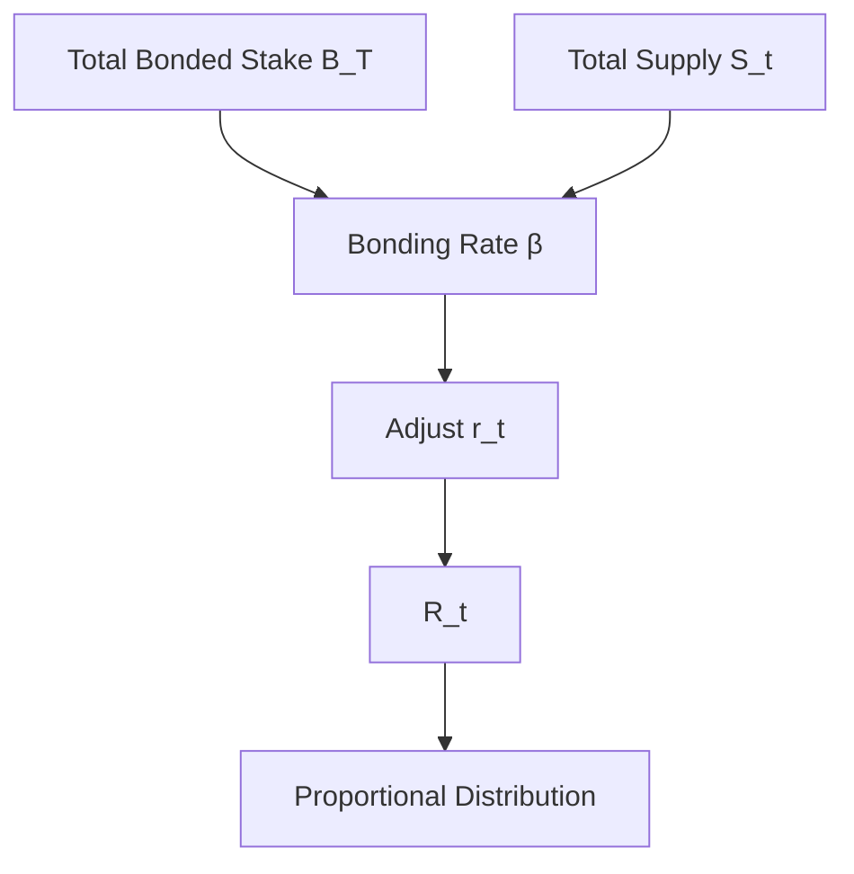

# LPT Tokenomics

## Executive Summary

LPT tokenomics defines how the Livepeer Protocol issues new supply, adjusts inflation relative to security participation, distributes rewards, and maintains a capital-backed security equilibrium.

The tokenomics model is implemented at the **protocol layer (on-chain)** via staking, inflation adjustment logic, and deterministic reward allocation.

This page formalizes those mechanisms.

---

## 1. Formal Variables

Let:

- \(S_t\) = total LPT supply at round \(t\)
- \(B_T\) = total bonded LPT
- \(B_i\) = bonded stake attributed to participant \(i\)
- \(\beta\) = bonding rate = \(\frac{B_T}{S_t}\)
- \(\beta^*\) = target bonding rate
- \(r_t\) = inflation rate applied in round \(t\)
- \(\alpha\) = inflation adjustment coefficient
- \(c_O\) = commission rate set by orchestrator \(O\)

---

## 2. Inflation Issuance Model

Per round \(t\), newly minted LPT:

\[
R_t = S_t \cdot r_t
\]

Supply update:

\[
S_{t+1} = S_t + R_t
\]

Inflation therefore compounds relative to current supply.

---

## 3. Bonding-Rate Feedback Mechanism

The protocol adjusts inflation according to the deviation between the current bonding rate and target bonding rate.

Current bonding rate:

\[
\beta = \frac{B_T}{S_t}
\]

Adjustment rule:

If \(\beta < \beta^*\):

\[
r_{t+1} = r_t + \alpha
\]

If \(\beta > \beta^*\):

\[
r_{t+1} = r_t - \alpha
\]

This creates a control loop:

- Under-bonded system → higher inflation → stronger staking incentive
- Over-bonded system → lower inflation → reduced dilution

The system seeks equilibrium where \(\beta \approx \beta^*\).

---

## 4. Reward Distribution

Total issuance per round \(R_t\) is distributed proportionally to stake weight.

Define economic weight:

\[
W_i = \frac{B_i}{B_T}
\]

Allocation to orchestrator \(O\):

\[
R_O = R_t \cdot \frac{B_O}{B_T}
\]

Delegator \(D\) bonded to orchestrator \(O\):

\[
R_{D,O} = R_O (1 - c_O) \cdot \frac{b_{D,O}}{B_O}
\]

This separates gross issuance from commission-adjusted delegator returns.

---

## 5. Issuance vs Fee Revenue

Returns to bonded participants may consist of:

1. Inflation-based issuance (supply expansion)
2. Fee revenue from video/AI workloads (demand-based)

Total reward to participant \(i\):

\[
Reward_i = Issuance_i + Fees_i
\]

Inflation is protocol-determined; fees are market-driven.

Tokenomics must therefore be evaluated in two components: issuance dynamics and network demand.

---

## 6. Security Equilibrium

Security cost for adversarial control scales with bonded stake.

Let \(\theta\) be the threshold fraction required to influence governance or allocation.

Required capital:

\[
Capital_{attack} \geq \theta B_T
\]

Increasing \(B_T\) increases the cost of control.

Inflation adjustment encourages equilibrium around a stable security participation rate.

---

## 7. Economic Tradeoffs

| Mechanism | Tradeoff |
|------------|-----------|
| Dynamic inflation | Stability vs responsiveness |
| Delegated staking | Accessibility vs centralization risk |
| Capital-weighted rewards | Security strength vs wealth concentration |

---

## 8. System Diagram

---

## 9. Protocol vs Network Separation

Protocol Layer:

- Inflation calculation
- Bonding rate adjustment
- Stake accounting
- Reward minting

Network Layer:

- Fee generation from workloads
- Operational performance
- Job routing

Tokenomics governs issuance; network activity governs fees.

---

## References

- Livepeer Protocol repository: https://github.com/livepeer/protocol
- Contract registry: https://docs.livepeer.org/references/contract-addresses

---

**Status:** Full mathematical derivation and economic equilibrium framing aligned with 2026 Authoring Standard.

