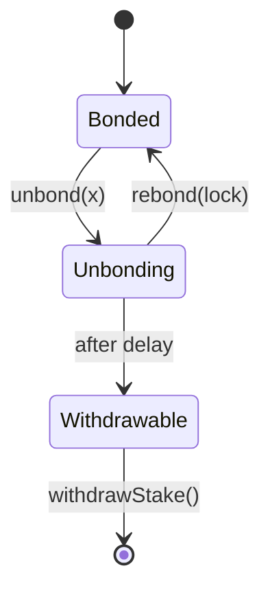
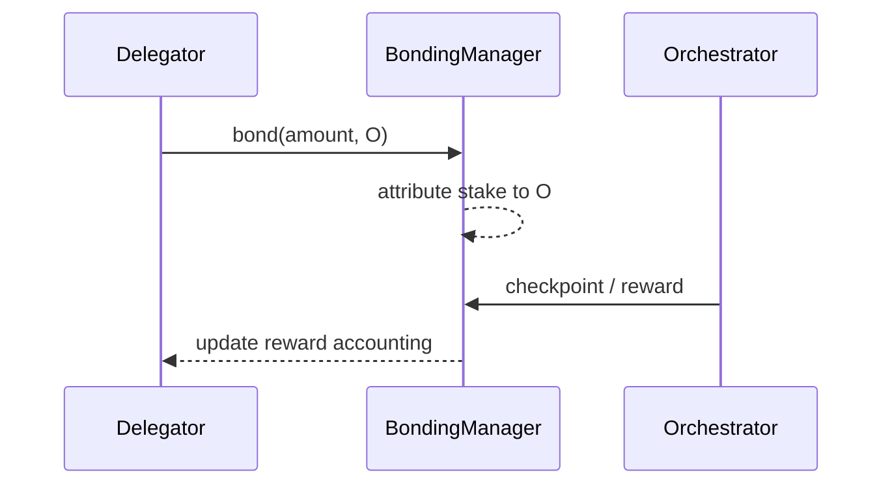

# About Delegators

## Executive Summary

A **delegator** is an LPT holder who bonds stake and attributes it to an orchestrator. Delegators do not run infrastructure, but they are economically responsible participants: their stake increases protocol security, shapes capital allocation across orchestrators, and contributes stake-weighted governance power.

Delegation is strictly a **protocol-layer (on-chain)** mechanism. Delegators do not route or execute jobs; they participate in the on-chain economic substrate that constrains and incentivizes network-layer operators.

---

## 1. Formal Definition

Let:

- D: a delegator address
- O: an orchestrator address
- b(D,O): stake bonded by D toward O
- B_self(O): self-bonded stake of O

Total stake attributed to O:

B(O) = B_self(O) + Σ_D b(D,O)

Total bonded stake:

B_T = Σ_O B(O)

Delegator stake changes protocol accounting state (bonding attribution) and therefore stake-weighted reward and governance outcomes.

---

## 2. Architectural Context

### 2.1 Protocol Layer (On-Chain)

Delegators interact with protocol contracts that:

- track bonded stake per address
- attribute stake to a delegate (orchestrator)
- enforce unbonding delays
- allocate issuance (and, where applicable, fees)
- compute stake-weighted governance power

Canonical contract addresses and networks are published in the registry:

- https://docs.livepeer.org/references/contract-addresses

### 2.2 Network Layer (Off-Chain)

Orchestrators operate node software and infrastructure (GPUs/compute, routing, ops processes) to execute work. Delegators are economically coupled to operator performance and behavior, but do not control execution pathways directly.

---

## 3. Economic Role

Delegators serve three protocol goals.

### 3.1 Security Participation

Security cost scales with total bonded stake:

Security ∝ B_T

Delegators increase B_T, raising the economic cost required to capture stake-weighted outcomes.

### 3.2 Capital Allocation

Delegation redistributes stake across orchestrators, shaping operator market structure.

Orchestrator weight:

W(O) = B(O) / B_T

Delegators selecting O increase W(O), affecting issuance allocation and governance influence.

### 3.3 Governance Participation

Voting power derives from bonded stake. For a participant i:

V(i) = B(i) / B_T

Delegators therefore influence protocol parameter changes, upgrades, and treasury decisions.

---

## 4. Reward Model (Issuance and Fees)

Per round t, protocol issuance:

R(t) = S(t) · r(t)

Orchestrator gross issuance allocation:

R(O) = R(t) · B(O) / B_T

Delegator net issuance allocation with commission c(O):

R(D,O) = R(O) · (1 − c(O)) · b(D,O) / B(O)

Delegator total return decomposes into:

Reward(D,O) = Issuance(D,O) + Fees(D,O)

Issuance is protocol-determined; fees are market-driven (network demand).

---

## 5. Rights, Constraints, and Responsibilities

### 5.1 Rights

Delegators can:

- bond and delegate stake to an orchestrator
- unbond stake (subject to protocol delay)
- rebond during the unbonding window
- withdraw stake after the unbonding period
- claim/rebond rewards depending on protocol mechanics

### 5.2 Constraints

Delegators cannot:

- accelerate unbonding beyond the protocol-defined delay
- guarantee job flow or fee revenue
- override orchestrator operational decisions

Delegation is capital exposure without operational control.

### 5.3 Responsibilities (Practical)

Delegators should monitor:

- commission rate c(O)
- reward checkpoint consistency
- stake concentration and decentralization
- governance proposals affecting inflation/security parameters

Delegation is best modeled as long-duration capital allocation.

---

## 6. Evaluation Framework for Orchestrator Selection

Delegator selection is multi-objective.

Define a delegator utility function:

U(O) = f(NetYield(O), Reliability(O), Concentration(O), GovernanceAlignment(O))

Where:

- NetYield(O) is reduced by commission c(O)
- Reliability(O) captures checkpoint consistency and operational stability
- Concentration(O) penalizes already-dominant stake share
- GovernanceAlignment(O) reflects long-term stewardship preferences

---

## 7. Risks and Failure Modes

Delegators face a layered risk profile.

1. Commission risk: higher c(O) reduces net returns.
2. Checkpoint / realization risk: realized issuance can diverge from theoretical allocation if checkpointing is not performed.
3. Liquidity risk: unbonding delay restricts exit.
4. Concentration risk: systemic exposure increases with stake centralization.
5. Slashing risk (if enabled): stake may be reduced under defined protocol conditions.

---

## 8. Diagrams

### 8.1 State Model

### 8.2 Reward Flow

---

## 9. Protocol vs Network Separation

Protocol (On-Chain): bonded stake accounting and attribution, issuance and stake-weighted allocation, unbonding delays, governance voting power.

Network (Off-Chain): job execution and routing, fee generation, operational performance and uptime.

Delegators participate in protocol economics; orchestrators participate in network operations.

---

## References

- Livepeer protocol repository: https://github.com/livepeer/protocol
- Contract registry: https://docs.livepeer.org/references/contract-addresses

---

**Status:** Expanded to the 2026 authoring standard (formal model, equations, risk framework, diagrams, and explicit protocol/network separation).

