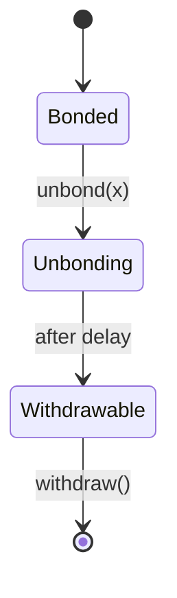
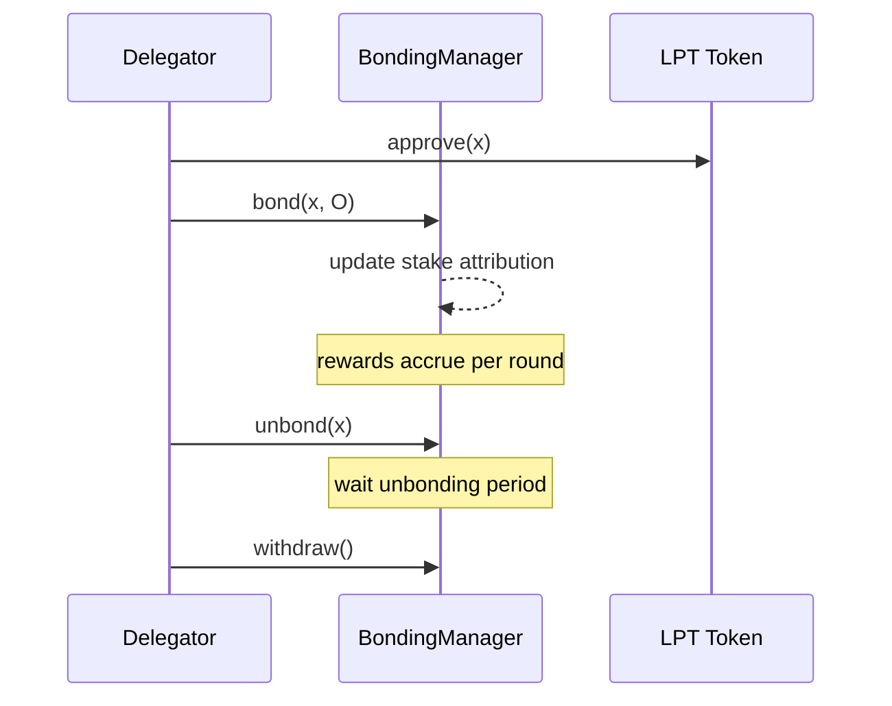

# Delegation Guide

## Executive Summary

This guide provides a protocol-accurate, contract-aware walkthrough of delegating LPT. It focuses strictly on on-chain mechanics: bonding, stake attribution, reward checkpointing, unbonding, and withdrawal.

Delegation modifies protocol state. It does not modify network routing or execution directly.

---

# 1. Preconditions

Before delegating, a participant must:

1. Hold LPT in a self-custodied wallet.
2. Be connected to the correct deployment network (see contract registry).
3. Understand the unbonding delay and liquidity constraints.

Canonical contract references:

https://docs.livepeer.org/references/contract-addresses

Delegation interacts primarily with the BondingManager contract.

---

# 2. Step 1 — Approve Token Transfer

If interacting directly with contracts, the LPT token contract must be approved to transfer the desired bonding amount.

Let x be the amount to delegate.

Approval does not change bonding state; it only authorizes the staking contract to transfer tokens.

State impact: none (allowance update only).

---

# 3. Step 2 — Bond and Delegate

Call bond(x, O) where:

- x = LPT amount
- O = chosen orchestrator address

State transition:

B_i(new) = B_i(old) + x

B_O(new) = B_O(old) + x

B_T(new) = B_T(old) + x

Delegation immediately affects stake attribution for subsequent rounds (subject to protocol timing rules).

---

# 4. Step 3 — Verify On-Chain State

After bonding, verify:

1. Bonded amount for your address.
2. Delegate (orchestrator) address attribution.
3. Total stake attributed to orchestrator.

Verification methods:

- Block explorer read of BondingManager state.
- Livepeer Explorer or equivalent indexer.

Delegation must be verifiable via on-chain state, not UI display alone.

---

# 5. Reward Accrual and Checkpointing

Per round t:

R(t) = S(t) · r(t)

Orchestrator allocation:

R(O) = R(t) · B(O) / B_T

Delegator net allocation with commission c(O):

R(D,O) = R(O) · (1 − c(O)) · b(D,O) / B(O)

Rewards may require checkpointing before they are claimable or rebondable.

Checkpointing updates internal accounting but does not automatically transfer tokens unless explicitly claimed.

---

# 6. Step 4 — Rebond (Optional Compounding)

Instead of withdrawing rewards, a delegator may rebond.

If reward amount = y:

B_i(new) = B_i(old) + y

Compounding increases future weight:

W_i = B_i / B_T

---

# 7. Step 5 — Initiate Unbonding

To exit delegation, call unbond(x).

State transition:

B_i(new) = B_i(old) − x

B_O(new) = B_O(old) − x

B_T(new) = B_T(old) − x

Stake enters an unbonding state.

During unbonding:

- Stake does not earn rewards.
- Stake cannot be immediately withdrawn.

---

# 8. Unbonding Delay

The protocol enforces a delay measured in rounds.

This delay:

- Prevents rapid stake rotation attacks.
- Stabilizes security participation.
- Introduces liquidity risk for delegators.

State model:

---

# 9. Step 6 — Withdraw Stake

After the unbonding period completes, call withdraw().

State impact:

- Bonded balance remains reduced.
- Liquid LPT balance increases.

Withdrawal finalizes the exit.

---

# 10. Risk Review Checklist

Before delegating, evaluate:

1. Commission rate c(O)
2. Orchestrator stake concentration
3. Historical checkpoint consistency
4. Governance alignment
5. Liquidity needs (given unbonding delay)

Delegation is a capital allocation decision under constrained liquidity.

---

# 11. Protocol vs Network Separation

Protocol (On-Chain):

- bond()
- unbond()
- withdraw()
- reward allocation
- governance voting weight

Network (Off-Chain):

- node uptime
- job execution
- fee generation

Delegation changes protocol state; it does not change routing behavior directly.

---

# 12. Sequence Diagram (End-to-End)

---

## References

- Livepeer protocol repository: https://github.com/livepeer/protocol
- Contract registry: https://docs.livepeer.org/references/contract-addresses

---

**Status:** Contract-level delegation lifecycle guide aligned with 2026 documentation standard (formal state transitions, equations, verification guidance, and strict protocol/network separation).

