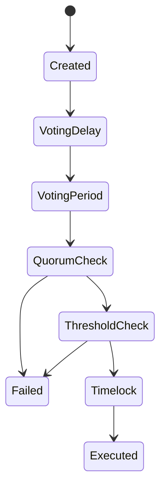

# Governance Model

## Executive Summary

Livepeer governance is a capital-weighted, proposal-based system enforced entirely by smart contracts. Authority is proportional to bonded stake, and execution is deterministic once quorum and threshold conditions are met.

This page formalizes the governance decision process, including quorum mechanics, voting thresholds, timelock semantics, and attack surface considerations.

Governance operates strictly at the **protocol layer (on-chain)**.

---

# 1. Governance Primitives

Let:

- \(B_i\) = bonded stake attributed to participant \(i\)
- \(B_T\) = total bonded stake
- \(V_i\) = voting power of participant \(i\)

Voting power:

\[
V_i = \frac{B_i}{B_T}
\]

All governance weight is derived from bonded stake.

---

# 2. Proposal Lifecycle

A governance proposal typically follows these deterministic phases:

1. **Creation** — proposal submitted with encoded actions.
2. **Voting Delay** — period before voting opens.
3. **Voting Period** — bonded participants cast votes.
4. **Quorum Check** — minimum participation requirement.
5. **Threshold Check** — majority condition.
6. **Queue (Timelock)** — execution delay.
7. **Execution** — state transition if conditions met.

These transitions are enforced by governance contracts.

---

# 3. Quorum Requirement

Let:

- \(Q\) = quorum fraction
- \(V_{cast}\) = total voting power cast

Quorum condition:

\[
V_{cast} \ge Q \cdot B_T
\]

Quorum ensures minimum participation before changes are applied.

---

# 4. Majority / Threshold Condition

Let:

- \(V_{for}\) = stake-weighted votes in favor
- \(V_{against}\) = stake-weighted votes against

Majority condition (simple majority example):

\[
V_{for} > V_{against}
\]

Other threshold types (e.g., supermajority) may be parameterized within governance contracts.

---

# 5. Timelock Semantics

Approved proposals enter a timelock period before execution.

Timelock properties:

- Introduces delay between approval and execution.
- Provides opportunity for stakeholder reaction.
- Reduces sudden-parameter-change risk.

Timelock delay \(T_{delay}\) is defined at the protocol level.

---

# 6. Execution Model

If quorum and threshold conditions are satisfied and timelock has elapsed:

- Encoded actions are executed.
- Contract state transitions deterministically.

Execution may include:

- Parameter modification
- Proxy implementation updates
- Treasury transfers

Execution is atomic per proposal.

---

# 7. Security and Game-Theoretic Considerations

## 7.1 Capital Requirement for Control

Let \(\theta\) represent the minimum fraction required to control outcomes.

Minimum capital required:

\[
Capital_{control} \ge \theta B_T
\]

Higher bonded stake increases governance capture cost.

---

## 7.2 Stake Concentration Risk

If a small number of addresses control a large fraction of \(B_T\), governance capture risk increases.

Security is inversely proportional to concentration.

---

## 7.3 Voter Apathy Risk

If quorum fraction \(Q\) is high relative to typical participation:

- Proposals may fail due to insufficient turnout.

If \(Q\) is low:

- Small coordinated groups may pass proposals.

Quorum calibration is therefore a security parameter.

---

## 7.4 Parameter Manipulation Risk

Governance may modify inflation parameters.

If inflation rate \(r_t\) changes:

\[
R_t = S_t \cdot r_t
\]

Thus governance decisions propagate into:

- Supply trajectory
- Bonding incentives
- Security equilibrium

Governance authority is therefore economically powerful.

---

# 8. Diagram — Governance State Machine

---

# 9. Protocol vs Network Separation

Protocol (On-Chain):

- Proposal submission
- Vote casting
- Quorum and threshold enforcement
- Timelock execution
- Parameter modification

Network (Off-Chain):

- Node operation
- Performance
- Job execution

Governance modifies the rules; network actors operate within those rules.

---

# References

- Livepeer protocol repository: https://github.com/livepeer/protocol
- Contract registry: https://docs.livepeer.org/references/contract-addresses

---

**Status:** Formal governance model including quorum math, threshold mechanics, execution flow, and security analysis per 2026 documentation standard.

