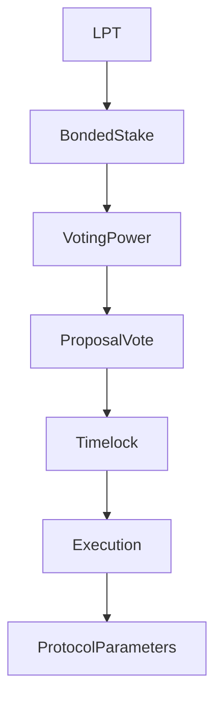

# Governance Overview

## Executive Summary

Livepeer governance is a stake-weighted, on-chain decision system that controls protocol parameter updates, contract upgrades (where upgradeable), and treasury allocations.

Governance authority derives exclusively from **bonded LPT**. It operates at the **protocol layer (on-chain)** and modifies economic and contractual rules that constrain the network layer.

This page defines the governance surface, voting power mechanics, and security model.

---

## 1. Formal Definition

Let:

- \(B_i\) = bonded stake attributed to participant \(i\)
- \(B_T\) = total bonded stake

Voting power:

\[
V_i = \frac{B_i}{B_T}
\]

Governance is therefore a capital-weighted decision system over bonded stake.

Only bonded stake contributes to voting weight.

---

## 2. Governance Scope

Governance may modify:

1. Inflation parameters (e.g., adjustment coefficient, target bonding rate)
2. Contract implementations (via upgrade patterns where enabled)
3. Treasury disbursements
4. Protocol configuration constants

Governance does **not** directly control:

- GPU scheduling
- Job routing
- Gateway pricing strategies
- Off-chain operational behavior

Those belong to the network layer.

---

## 3. Architectural Context

### 3.1 Protocol Layer Contracts

Governance logic interacts with contracts responsible for:

- Proposal creation
- Vote casting and tallying
- Timelock enforcement
- Execution of approved proposals

Canonical contract addresses and networks are published in:

https://docs.livepeer.org/references/contract-addresses

### 3.2 Network Layer Interaction

Governance decisions may indirectly influence network behavior by modifying:

- Incentive parameters
- Reward dynamics
- Upgradeable contract logic

However, execution of workloads remains off-chain.

---

## 4. Voting Mechanics

Let a proposal P be active during a voting window.

Total voting power cast:

\[
V_{cast} = \sum_{i \in voters} B_i
\]

A proposal passes if it satisfies quorum and majority thresholds as defined in governance contract logic.

These thresholds are enforced on-chain.

---

## 5. Governance as Security Layer

Governance security depends on bonded stake distribution.

Let \(\theta\) be the fraction of stake required to influence an outcome.

Minimum capital required:

\[
Capital_{control} \geq \theta B_T
\]

Security increases with total bonded stake and decreases with stake concentration.

Thus:

\[
Security \propto B_T
\]

---

## 6. Upgrade and Parameter Risk

Governance introduces flexibility and risk.

### 6.1 Upgradeability Tradeoff

If contracts are upgradeable via governance:

- Benefit: adaptability and iterative improvement
- Risk: governance capture or malicious proposal execution

### 6.2 Parameter Adjustment Risk

Changing inflation parameters affects:

- Issuance rate
- Bonding incentives
- Security participation equilibrium

Governance must weigh long-term equilibrium stability against short-term incentives.

---

## 7. Economic Implications

Governance affects tokenomics directly.

Example:

If inflation rate \(r_t\) is modified, issuance becomes:

\[
R_t = S_t \cdot r_t
\]

Changes to \(r_t\) alter dilution dynamics and security incentives.

Therefore governance decisions propagate through:

- supply trajectory
- stake participation
- reward distribution

---

## 8. System Diagram

---

## 9. Protocol vs Network Separation

Protocol (On-Chain):

- proposal creation
- vote casting and tallying
- parameter updates
- contract upgrades
- treasury execution

Network (Off-Chain):

- node operation
- workload execution
- routing and pricing

Governance modifies rules; network actors execute within those rules.

---

## References

- Livepeer protocol repository: https://github.com/livepeer/protocol
- Contract registry: https://docs.livepeer.org/references/contract-addresses
- Livepeer Improvement Proposals (LIPs)

---

**Status:** Governance overview aligned with 2026 authoring standard (formal definitions, voting math, security model, diagram, and protocol/network separation).

