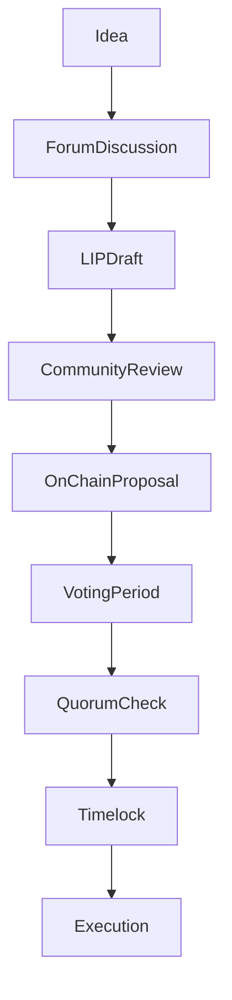

# Governance Processes

## Executive Summary

Livepeer governance consists of both off-chain coordination processes and on-chain execution logic. While voting and parameter enforcement are handled by smart contracts, proposal formation, review, and social consensus-building occur off-chain.

This page formalizes the complete governance lifecycle from idea formation to on-chain execution.

Governance execution is strictly **protocol-layer (on-chain)**. Social coordination and proposal drafting occur off-chain.

---

# 1. Governance Lifecycle Overview

Governance unfolds in two coordinated domains:

1. **Off-Chain Process Layer** (discussion, drafting, signaling)
2. **On-Chain Execution Layer** (proposal submission, voting, execution)

These layers are complementary but distinct.

---

# 2. Off-Chain Process Layer

## 2.1 Idea Formation

Governance typically begins with:

- Identification of protocol parameter inefficiency
- Security model adjustments
- Economic misalignment
- Treasury allocation needs
- Contract upgrade requirements

Ideas are usually discussed in public forums before formalization.

---

## 2.2 Livepeer Improvement Proposals (LIPs)

A Livepeer Improvement Proposal (LIP) formalizes protocol changes.

A LIP generally includes:

- Motivation
- Technical specification
- Economic impact analysis
- Security considerations
- Backward compatibility analysis

LIPs serve as the canonical documentation for governance changes.

---

## 2.3 Social Signaling and Feedback

Before on-chain submission, proposals typically undergo:

- Community discussion
- Technical review
- Risk assessment
- Stakeholder signaling

This reduces the probability of adversarial or poorly constructed proposals reaching execution.

---

# 3. On-Chain Governance Layer

## 3.1 Proposal Submission

A formal governance proposal encodes executable contract actions.

Proposal payload may include:

- Parameter updates
- Contract implementation upgrades
- Treasury transfers

Submission triggers the deterministic governance state machine described in Governance Model.

---

## 3.2 Voting Window

During the voting period:

Voting power:

V(i) = B(i) / B_T

Votes are stake-weighted and recorded on-chain.

---

## 3.3 Quorum and Threshold Checks

Proposal must satisfy:

V_cast ≥ Q · B_T

And majority condition (example):

V_for > V_against

Conditions are enforced by governance contracts.

---

## 3.4 Timelock Queue

Approved proposals enter a timelock period before execution.

Timelock properties:

- Delay between approval and execution
- Risk mitigation against sudden parameter shifts
- Allows participants to assess consequences

---

## 3.5 Execution

If conditions are met and timelock expires:

- Encoded actions execute atomically.
- Contract state changes.
- Treasury transfers occur if included.

Execution is irreversible at the transaction level.

---

# 4. Treasury Coordination

Treasury allocations follow the same governance lifecycle:

1. Off-chain proposal discussion
2. On-chain encoded treasury action
3. Voting and quorum
4. Timelock
5. Execution

Treasury governance therefore uses identical stake-weighted enforcement logic.

---

# 5. Risk Mitigation and Process Safeguards

## 5.1 Multi-Stage Review

Separation of:

- Social review (off-chain)
- Deterministic execution (on-chain)

Reduces accidental or malicious parameter changes.

---

## 5.2 Transparency

All votes and execution transactions are publicly verifiable on-chain.

Governance is auditable via block explorers.

---

## 5.3 Parameter Calibration

Quorum Q and timelock duration T_delay are governance-level security parameters.

If Q is too low:

- Small coalitions may pass proposals.

If Q is too high:

- Governance stagnation may occur.

---

# 6. Governance Process Flow Diagram

---

# 7. Protocol vs Network Separation

Protocol (On-Chain):

- Proposal submission
- Vote casting
- Quorum enforcement
- Timelock queue
- Execution of contract changes

Network (Off-Chain):

- Discussion forums
- LIP drafting
- Social signaling
- Infrastructure execution

Governance modifies protocol rules; network actors operate within updated parameters.

---

# References

- Livepeer protocol repository: https://github.com/livepeer/protocol
- Contract registry: https://docs.livepeer.org/references/contract-addresses
- Livepeer Improvement Proposals (LIPs)

---

**Status:** Governance lifecycle fully documented (off-chain + on-chain separation, deterministic enforcement, and risk calibration) per 2026 documentation standard.

