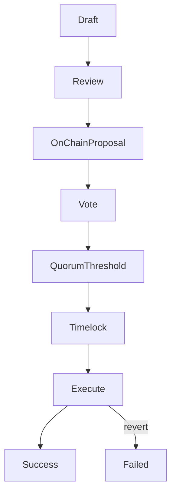

# Treasury Proposals

## Executive Summary

A treasury proposal is a governance proposal whose executable payload authorizes an on-chain treasury action (typically a transfer, grant, or contract call). In Livepeer, treasury proposals are enforced at the **protocol layer (on-chain)**: once quorum and thresholds are met and the timelock expires, the encoded actions execute deterministically.

This page defines the structure of treasury proposal payloads, their execution semantics, and the primary failure modes.

---

## 1. Formal Definition

A treasury proposal \(P\) is a tuple of executable actions:

\[
P = \{ a_1, a_2, \dots, a_n \}
\]

Each action \(a_k\) is defined as:

\[
a_k = (Target_k, Value_k, Data_k)
\]

Where:

- **Target** is the contract or address called.
- **Value** is the native token amount attached (if any).
- **Data** is ABI-encoded calldata specifying the function selector and arguments.

The proposal passes through governance and executes after timelock.

---

## 2. Governance Authorization

Let bonded stake variables:

- \(B_i\) = bonded stake of voter i
- \(B_T\) = total bonded stake

Voting power:

\[
V_i = \frac{B_i}{B_T}
\]

Quorum condition:

\[
V_{cast} \ge Q \cdot B_T
\]

Threshold condition (example):

\[
V_{for} > V_{against}
\]

Only proposals meeting governance conditions enter the timelock queue.

---

## 3. Timelock Queue Semantics

Once approved, the proposal is queued in a timelock for a delay \(T_{delay}\).

Timelock provides:

- predictable execution window
- reaction time for stakeholders
- mitigation against sudden or malicious changes

Execution is only possible after the delay elapses.

---

## 4. Execution Semantics

After timelock expiry, execution attempts to apply each action \(a_k\) atomically within the execution transaction.

Two important properties:

1. **Determinism:** execution is strictly defined by calldata.
2. **Atomicity:** if any action reverts, the transaction reverts unless the execution model explicitly tolerates partial failure.

Treasury proposals must therefore be authored with calldata correctness and failure model in mind.

---

## 5. Treasury Transfer as Canonical Case

A common action is a treasury transfer.

If treasury balance is \(T\) and allocation amount is \(A\):

\[
T' = T - A
\]

Recipient balance increases by \(A\) under the asset’s transfer semantics.

---

## 6. Failure Modes

Treasury proposal execution can fail for several reasons.

### 6.1 Calldata Error

Incorrect function selector or malformed ABI encoding causes revert.

### 6.2 Insufficient Treasury Balance

Transfer amount exceeds treasury holdings.

### 6.3 Target Contract Revert

The called contract rejects the call due to access controls, paused state, or parameter validation.

### 6.4 Asset Transfer Semantics

Some token contracts may:

- return false instead of reverting
- apply transfer fees
- enforce allowlists

Proposal authors must verify target asset behavior.

### 6.5 Timelock Configuration

If timelock delay or execution window conditions are misconfigured, proposals may become unexecutable.

---

## 7. Risk Mitigation Checklist

Before submitting a treasury proposal:

1. Verify target addresses and contracts via registry.
2. Confirm ABI encoding is correct.
3. Confirm treasury balance is sufficient.
4. Simulate execution where possible.
5. Ensure calldata is auditable and minimally scoped.

---

## 8. Diagram — Proposal Execution Flow

---

## 9. Protocol vs Network Separation

Protocol (On-Chain):

- proposal payload definition
- vote tally and authorization
- timelock queue
- deterministic execution
- treasury transfers

Network (Off-Chain):

- drafting and review
- grant delivery and operational execution by recipients

Treasury proposals are enforced by protocol logic; outcomes require off-chain delivery.

---

## References

- Livepeer protocol repository: https://github.com/livepeer/protocol
- Contract registry: https://docs.livepeer.org/references/contract-addresses

---

**Status:** Treasury proposal structure and execution semantics documented to 2026 authoring standard (formal model, failure modes, diagram, and separation).