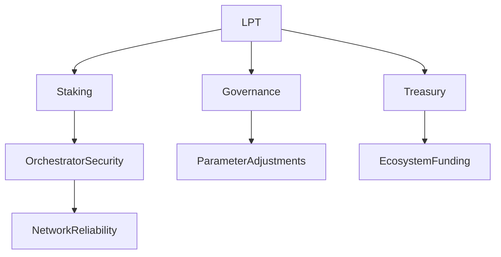

# Purpose of LPT

## Executive Summary

LPT exists to coordinate decentralized infrastructure without a central authority.

Its purpose is not speculative.
Its purpose is structural.

LPT enables:

1. Cryptoeconomic security
2. Supply-side bootstrapping
3. Incentive alignment between capital and operators
4. Permissionless governance
5. Public goods funding

Without LPT, Livepeer cannot function as a decentralized protocol.

---

## Formal Definition of Purpose

Let the Livepeer Protocol be defined as a decentralized coordination mechanism for video and AI compute infrastructure.

To operate securely, such a system requires:

- Bonded capital
- Incentivized service provision
- Deterministic reward distribution
- Governance authority
- Treasury allocation logic

LPT is the mechanism that fulfills these requirements.

It is the protocol’s **economic security primitive**.

---

## Architectural Context

### Protocol Layer (On-Chain)

LPT participates in:

- BondingManager (stake accounting)
- Minter (inflation issuance)
- RoundsManager (epoch-based accounting)
- Governance contracts (proposal and voting execution)

All staking, reward, and governance weight are derived from bonded LPT balances.

### Network Layer (Off-Chain)

Orchestrators provide:

- Video transcoding
- Real-time AI inference
- GPU compute services

LPT does not execute jobs.
It economically secures the actors who do.

---

## Purpose 1: Economic Security

In decentralized systems, security must be capital-backed.

Let:

- B_i = bonded stake of orchestrator i
- B_T = total bonded stake

The economic weight of orchestrator i is:

W_i = B_i / B_T

Higher bonded stake increases job allocation probability.

This creates a cost to attack:

To dominate job allocation, an attacker must acquire a majority of bonded stake.

Thus, LPT converts capital into Sybil resistance.

---

## Purpose 2: Supply-Side Bootstrapping

In early network stages, demand is low.

Inflation issuance provides rewards independent of fees.

Let:

- R = total inflation minted per round
- B_i = bonded stake of orchestrator i
- B_T = total bonded stake

Then:

R_i = R × (B_i / B_T)

This incentivizes GPU operators to join before fee revenue dominates.

Over time, fee-based rewards increase in relative importance.

Inflation is therefore a temporary bootstrapping mechanism, not the end state.

---

## Purpose 3: Capital Allocation via Delegation

Delegation enables non-operators to contribute capital.

Delegators signal trust.

Stake flows toward:

- Reliable operators
- Low-latency nodes
- Competitive commission rates

This creates a capital efficiency market.

Poor operators lose stake.
High-performing operators attract stake.

LPT becomes a decentralized routing signal.

---

## Purpose 4: Governance Authority

Livepeer protocol parameters are not fixed.

They include:

- Inflation rate adjustments
- Treasury allocations
- Contract upgrades
- Reward parameters

Governance weight derives from bonded LPT.

Let:

- V_i = voting weight of participant i

Then:

V_i = bonded LPT of participant i

No off-chain committee controls the protocol.

Authority flows from token holders.

---

## Purpose 5: Treasury Sustainability

A portion of issuance may be directed to a treasury.

Treasury purpose includes:

- Funding ecosystem builders
- Supporting infrastructure
- Financing research
- Supporting Special Purpose Entities (SPEs)

This enables long-term decentralization.

---

## Design Tradeoffs

| Design Decision | Tradeoff |
|------------------|----------|
| Inflation issuance | Dilution vs bootstrapping |
| Delegated stake | Accessibility vs concentration risk |
| Token-based governance | Participation vs voter apathy |
| Capital-weighted security | Strong security vs wealth influence |

These tradeoffs are explicit and intentional.

---

## What LPT Is Not For

- Paying for video consumption
- Paying gas for application usage
- Guaranteeing fixed yield
- Representing corporate ownership

LPT is a coordination asset.

---

## Security & Economic Implications

As fee volume grows:

- Inflation dependency decreases
- Real demand becomes dominant reward driver
- Stake weight reflects operational performance

If participation falls below target bonding rate:

- Inflation may increase
- Security incentives strengthen

This feedback loop stabilizes network security over time.

---

## Diagram: Purpose Flow

---

## References

- Livepeer Protocol Smart Contracts (Arbitrum)
- Livepeer Improvement Proposals (LIPs)
- "Why Delegation Still Matters in a Low-Inflation Environment" (Livepeer Blog)

---

**Status:** Production-ready canonical purpose definition.

