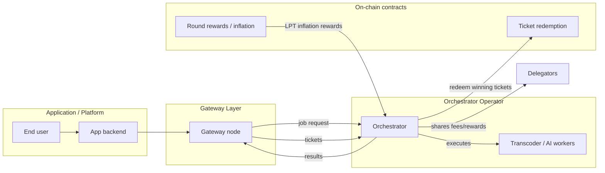

import { Callout, Card, CardGroup, Tabs, Tab, Steps, Step, Accordion, Accordions, Badge } from '@mintlify/mdx'

# Orchestrator Economics

Orchestrators are the supply-side operators of Livepeer: they run GPU infrastructure, advertise services, and earn revenue when they **successfully process jobs**.

This page is intentionally **network-economics forward** (how operators actually get paid), while clearly separating:

- **Protocol-level economics** (LPT staking, inflation rewards, on-chain parameters)
- **Network-level economics** (pricing, routing, job execution, ticket redemption, operational costs)

> **Key distinction:**
> - **Video / transcoding network** routing is constrained by the *active set* (top N by stake) and price/service quality.
> - **AI network** routing is performed by **AI Gateway nodes**, which select AI Orchestrators based on capability/load, while still relying on Livepeer’s payment + on-chain registration mechanisms. (See “Video vs AI” below.)

---

## TL;DR

<CardGroup>
  <Card title="How you earn" icon="coins">
    Orchestrators earn (1) **usage fees** paid by applications (via probabilistic tickets) and (2) **protocol rewards** (LPT inflation) when staked/active.
  </Card>
  <Card title="What determines earnings" icon="scale-balanced">
    Earnings are driven by: routing share (stake + availability + price), workload type (video vs AI), reward/fee cuts, and your real-world ops cost structure.
  </Card>
  <Card title="What you must optimize" icon="gauge">
    **Reliability, latency, throughput, model availability, and pricing**—plus avoiding downtime and redemption failures.
  </Card>
</CardGroup>

---

## Economic primitives

### Revenue streams

<Tabs>
  <Tab title="Usage fees (work paid)">

**What it is:** Payment for jobs your node completes.

- **Video transcoding** uses **probabilistic micropayments** (tickets) that can be redeemed on-chain to pay out ETH/arbETH. Orchestrators must be active to receive jobs and fees. The docs describe the active set as the top 100 orchestrators by stake for the transcoding network.  

- **AI inference** similarly compensates AI Orchestrators via Livepeer’s decentralized payment infrastructure, with AI Gateways directing tasks based on capability and load (and current AI network design prerequisites).  

**Where you see it:** fees accrued, winning tickets, redemption events, and payout history.

  </Tab>
  <Tab title="Protocol rewards (LPT inflation)">

**What it is:** Newly minted LPT distributed each round to orchestrators + delegators (pro‑rata by stake) under Livepeer’s dynamic inflation model.

**Why it exists:** In early/mid network growth, fees alone may not fully incentivize enough high-quality supply. Inflation bootstraps security + capacity while usage scales.

**Where you see it:** inflation rate, stake participation, and reward events.

  </Tab>
  <Tab title="Orchestrator commission">

Orchestrators set two “cuts” that determine how revenue splits between the orchestrator operator and delegators:

- **Reward cut (%):** how much of **LPT inflation rewards** the orchestrator keeps
- **Fee cut (%):** how much of **usage fees** (ETH/arbETH) the orchestrator keeps

The orchestrator setup flow in the official docs shows both values being configured during activation via `livepeer_cli`.  

  </Tab>
</Tabs>

**Sources:** Orchestrators overview + setup docs.  

---

## Video vs AI economics (important separation)

<Callout type="info" title="Do not assume the Video routing model applies to AI">
Livepeer’s **transcoding** network has a long‑standing concept of an **active set** (top N by stake, often presented as top 100). Routing and eligibility is constrained by that set.

Livepeer **AI** introduces **AI Gateways** and AI‑specific discovery and task allocation logic (capability, current load, and service URI), while still integrating with Livepeer’s payment system and (currently) requiring the AI operator to be tied to an established mainnet orchestrator.
</Callout>

### Video (transcoding network)

- **Eligibility:** The public docs describe the active orchestrator set as the **top 100 by stake**. If you fall out of the active set, you stop receiving jobs until reactivated / stake conditions change.  
- **Pricing:** You advertise a price per unit (commonly described as **wei per pixel**), and apps/gateways route work based on price + availability + performance.
- **Payout:** Fees are paid via probabilistic tickets; winning tickets are redeemed on-chain for ETH/arbETH.

### AI (inference network)

- **Core actors:** The AI docs define two primary actors: **AI Gateway nodes** and **AI Orchestrator nodes**. Gateways “direct tasks … based on capability and current load.”  
- **Current prerequisite (Beta design):** The AI on-chain setup docs list a prerequisite of “an established Mainnet Orchestrator within the Top 100” for AI Orchestrators, and recommend setting the AI ticket recipient to the main orchestrator address for fee redemption.  
- **Payout mechanics:** Still tied to Livepeer’s on-chain ticket redemption mechanics, but with AI-specific service advertising + discovery.

---

## How fees and rewards flow

### High-level flow

### Delegator split economics

Orchestrators are economically “two-sided” operators:

1) they sell compute services (fees), and
2) they run a staking business (delegate attraction and retention).

Your **reward cut** and **fee cut** are pricing knobs—set too high, you may struggle to attract delegation; set too low, you may not cover ops.

---

## Modeling your profitability

### A simple unit-economics model

Let:

- `F` = gross usage fees earned (ETH/arbETH) over a time window
- `r_fee` = orchestrator fee cut (fraction)
- `R` = gross LPT inflation rewards earned over a time window
- `r_reward` = orchestrator reward cut (fraction)
- `C_fixed` = fixed ops costs (servers, bandwidth commitments, monitoring, etc)
- `C_var` = variable costs (GPU time, energy, egress, model hosting overhead)

Then:

- **Operator take (fees)** = `F * r_fee`
- **Operator take (LPT rewards)** = `R * r_reward`
- **Delegator share (fees)** = `F * (1 - r_fee)`
- **Delegator share (LPT rewards)** = `R * (1 - r_reward)`

**Operator gross profit**:

`Π = (F * r_fee) + (R * r_reward) - (C_fixed + C_var)`

### Practical guidance

<Steps>
  <Step title="Start with ops-first pricing">
    For new operators, set a fee price that covers your worst-case variable costs + redemption overhead. Don’t compete to zero.
  </Step>
  <Step title="Then choose cuts to attract stake">
    Your cuts are part of your “delegator product.” If you want delegation, you need to compete on **fees + reliability + transparency**.
  </Step>
  <Step title="Optimize conversion to revenue">
    Downtime, failed tickets, and slow workers reduce real revenue even if demand exists.
  </Step>
</Steps>

---

## Cost structure: what you’re actually paying for

<table>
  <thead>
    <tr>
      <th>Cost category</th>
      <th>Video (transcoding)</th>
      <th>AI (inference)</th>
      <th>What to monitor</th>
    </tr>
  </thead>
  <tbody>
    <tr>
      <td>GPU compute</td>
      <td>NVENC/NVDEC throughput, memory bandwidth</td>
      <td>VRAM, model load time, batching, kernel efficiency</td>
      <td>GPU utilization, queue length, p95 latency</td>
    </tr>
    <tr>
      <td>Bandwidth + egress</td>
      <td>High egress for segments, ingest stability</td>
      <td>Lower egress per job but higher request volume possible</td>
      <td>Mbps in/out, packet loss, retransmits</td>
    </tr>
    <tr>
      <td>Storage</td>
      <td>Transient segment storage (if any)</td>
      <td>Model weights / caches / artifacts</td>
      <td>Disk IOPS, cache hit rate</td>
    </tr>
    <tr>
      <td>On-chain ops</td>
      <td>Ticket redemption gas/fees</td>
      <td>Ticket redemption + AI service advertising</td>
      <td>Redemption success rate, pending txs</td>
    </tr>
    <tr>
      <td>Reliability</td>
      <td>ServiceAddr reachability + segment SLA</td>
      <td>AI service URI health + model warm uptime</td>
      <td>Uptime %, health checks, retries</td>
    </tr>
  </tbody>
</table>

---

## Common pitfalls (what kills ROI)

<Accordions>
  <Accordion title="1) You’re ‘active’ but not reachable">
    Your service address must be reachable (NAT/firewall misconfigs are common). If gateways can’t reach you, you earn nothing.
  </Accordion>
  <Accordion title="2) You win tickets but can’t redeem">
    Ticket redemption failures convert revenue into “dead” balances. Ensure Arbitrum connectivity and redemption configuration.
  </Accordion>
  <Accordion title="3) You treat AI like video">
    AI economics depend on model capability and latency characteristics more than pure stake dominance. Optimize the AI worker pipeline.
  </Accordion>
  <Accordion title="4) Cuts are uncompetitive">
    Delegation is a market. If your cuts are high and you don’t provide differentiated quality, stake may not flow to you.
  </Accordion>
</Accordions>

---

## Operator playbooks

### Playbook: Video-first orchestrator

- Get into (and stay in) the active set
- Focus on bandwidth reliability and NVENC throughput
- Price competitively, but don’t race to the bottom
- Keep redemption healthy and automated

### Playbook: AI-capable orchestrator

- Treat AI as its own product line
- Run dedicated AI ports/services and keep models warm
- Optimize VRAM usage and model loading
- Ensure ticket recipient/redemption configuration is correct

---

## Media, demos, and deep dives

### Official (recommended)

- **Orchestrator docs (setup + activation):** https://docs.livepeer.org/orchestrators  
- **AI introduction + architecture:** https://docs.livepeer.org/ai/introduction  
- **AI orchestrator on-chain setup:** https://docs.livepeer.org/ai/orchestrators/onchain  
- **Network vision update (Cascade → real-time AI):** https://blog.livepeer.org/a-real-time-update-to-the-livepeer-network-vision/  
- **Delegation + inflation context:** https://blog.livepeer.org/why-delegation-still-matters-in-a-low-inflation-environment/  

### Third-party coverage (use selectively)

- Messari Livepeer quarterly reports (reference the specific quarter you cite): *(link the exact report page you’re using)*

### Fun + visual embeds to add

<Callout type="tip" title="Make this page less texty">
Add 1–2 short GIFs that illustrate:

- “GPU fans spinning up” (work starts)
- “tickets / lottery” metaphor for probabilistic micropayments

Keep them lightweight (optimize file size) and place near the Fee Flow section.
</Callout>

---

## Related pages

- `quickstart/orchestrator-setup` (hands-on)
- `advanced-setup/rewards-and-fees` (deep mechanics)
- `advanced-setup/ai-pipelines` (AI operator config)
- `orchestrator-tools-and-resources/orchestrator-tools` (monitoring + ops tooling)

