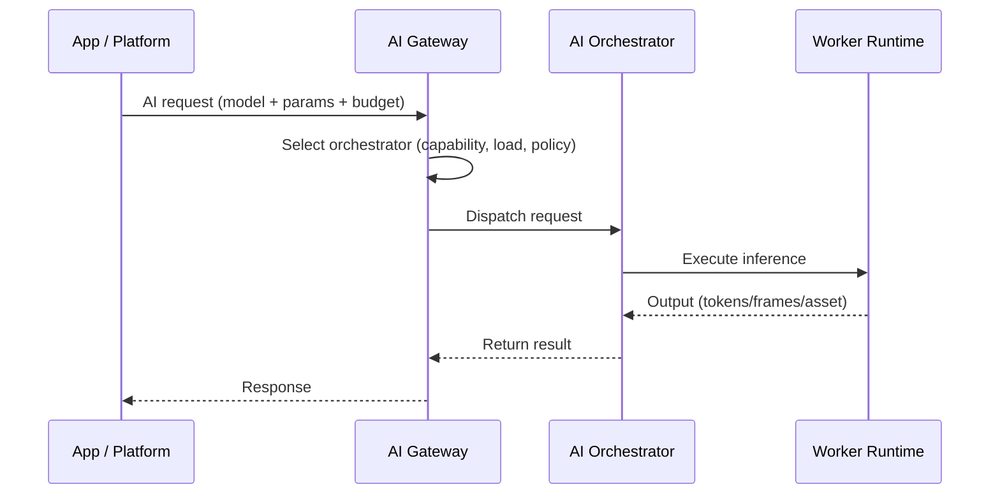
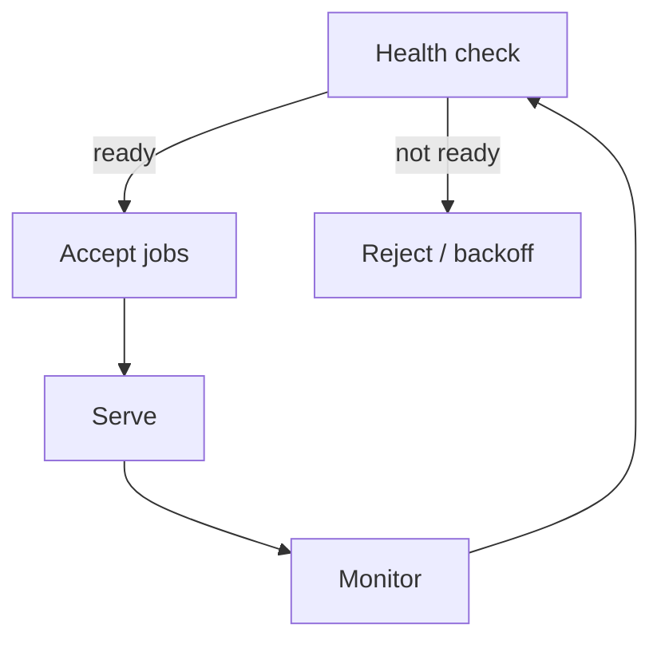

import { Callout, Card, CardGroup, Tabs, Tab, Steps, Step, Accordion, Accordions, Badge } from '@mintlify/mdx'

# AI Pipelines (Advanced)

This page explains how to operate AI inference workloads on Livepeer **as an Orchestrator**, and how AI pipelines differ from the legacy video transcoding stack.

It is written for GPU operators who already understand the basics of running an orchestrator and want to:

- Enable AI inference services
- Understand how AI jobs are routed (and what stake does *not* do)
- Choose pipeline architecture (BYOC vs hosted workers vs ComfyStream)
- Optimize throughput/latency
- Avoid common failure modes

<Callout type="info" title="Strict protocol vs network separation">
**Protocol layer (on-chain):** staking, activation, reward distribution, governance.

**Network layer (off-chain + gateways):** AI job routing, model execution, batching, latency/throughput, service discovery.

AI pipelines are mostly **network-layer mechanics** with protocol prerequisites.
</Callout>

---

## TL;DR

<CardGroup>
  <Card title="AI routing" icon="route">
    AI jobs are routed by **AI Gateway nodes**, which select AI Orchestrators based on capability and current load—not purely by stake.
  </Card>
  <Card title="Stake still matters" icon="shield">
    Stake is still required for **activation + economic credibility** and (currently) AI participation prerequisites.
  </Card>
  <Card title="Your operator KPI" icon="gauge">
    Optimize **p95 latency**, **queue stability**, **VRAM utilization**, and **model warm-start**. Earnings follow reliability.
  </Card>
</CardGroup>

---

## 1) Actors in the AI compute path

AI introduces new roles in the *network layer*.

<table>
  <thead>
    <tr>
      <th>Actor</th>
      <th>Layer</th>
      <th>Role</th>
      <th>Notes</th>
    </tr>
  </thead>
  <tbody>
    <tr>
      <td>AI Gateway node</td>
      <td>Network</td>
      <td>Receives AI requests, selects orchestrators based on capability/load</td>
      <td>Gateway is the routing/control plane for AI</td>
    </tr>
    <tr>
      <td>AI Orchestrator node</td>
      <td>Network + Protocol prerequisite</td>
      <td>Executes inference workloads using attached GPUs/workers</td>
      <td>Often bound to an established mainnet orchestrator identity</td>
    </tr>
    <tr>
      <td>Worker / Runtime</td>
      <td>Network</td>
      <td>Runs model inference (container, server, pipeline)</td>
      <td>May be BYOC (your infra) or orchestrator-managed</td>
    </tr>
    <tr>
      <td>Bonding / Identity</td>
      <td>Protocol</td>
      <td>Staked LPT identity used for eligibility and economic alignment</td>
      <td>Not an AI scheduler</td>
    </tr>
  </tbody>
</table>

**Primary sources:** AI introduction and AI orchestrator setup docs describe AI Gateway vs AI Orchestrator responsibilities and the “capability + load” routing model. ([docs.livepeer.org](https://docs.livepeer.org/ai/introduction?utm_source=chatgpt.com))

---

## 2) AI job lifecycle (sequence diagram)

**What to notice:** This is **not** stake-weighted selection. Gateways decide.

---

## 3) Capability model (what you must advertise)

AI routing is capability-aware. Your node must be able to answer:

- What models are available?
- What GPU class and VRAM?
- What throughput / concurrency?
- What endpoint is reachable?

In practice, this typically maps to:

- **Model registry** (which models are enabled)
- **Runtime registry** (which backends exist: ComfyUI, LLM server, diffusion)
- **Health / load metrics** (queue length, GPU util)

<Callout type="warning" title="Don’t reuse video assumptions">
Video transcoding is profile-driven (renditions). AI is **model-driven** and often memory-bound. Your primary scheduling constraint is VRAM + batching.
</Callout>

---

## 4) Pipeline architectures

<Tabs>
  <Tab title="BYOC (Bring Your Own Container)">

**When to use:** You already run production inference infrastructure and want Livepeer demand + payment.

- You control the container runtime
- You control model artifacts and upgrades
- You control autoscaling

Key requirements:

- Stable service endpoint
- GPU isolation
- Observability
- Failure handling for cold start

  </Tab>
  <Tab title="ComfyStream">

**When to use:** You want a structured real-time pipeline for video AI effects (ComfyUI-based workflows).

Operational focus:

- Model warm state
- Frame-by-frame latency
- VRAM management

Use cases:

- real-time video style transfer
- live VJ pipelines
- interactive video filters

(See official ComfyStream docs/content where applicable.)

  </Tab>
  <Tab title="Hosted Worker Runtimes">

**When to use:** You want a simpler operational model: orchestrator runs worker processes and manages scaling.

Tradeoffs:

- less control
- easier onboarding
- relies on Livepeer runtime compatibility

  </Tab>
</Tabs>

---

## 5) Pricing and unit economics (AI)

AI is not priced like video.

### Common pricing units

- Per request
- Per token (LLMs)
- Per frame / second (video diffusion)
- Per GPU-second

### Why cost modeling is harder

- Latency varies with prompt length and batching
- VRAM constraints limit concurrency
- Some models require long warm-up

### Throughput model (example)

Let:

- `t_first` = time to first token (seconds)
- `t_token` = average time per token (seconds/token)
- `n` = tokens generated

Then latency:

`L = t_first + n * t_token`

If you run batch size `b` with effective parallel efficiency `η` (0..1), then effective throughput improves by:

`TPS_eff ≈ (b * η) / t_token`

This is the kind of math operators should publish as benchmarks.

---

## 6) Reliability requirements

AI routing punishes instability more than video.

Why:

- Requests are interactive
- Users notice p95 latency
- Failures are harder to mask

You must implement:

- liveness probes
- readiness probes (model loaded)
- queue backpressure
- timeout management

---

## 7) Common failure modes

<Accordions>
  <Accordion title="Cold starts and model load time">
    If your node advertises a model but loads it on first request, gateways will route you traffic you can’t serve within SLA.
    Use warm pools or pre-load models.
  </Accordion>
  <Accordion title="VRAM fragmentation / OOM">
    AI pipelines frequently fail due to VRAM fragmentation. Use strict model limits, fixed batch sizes, and restart policies.
  </Accordion>
  <Accordion title="Gateway mismatch">
    If your service URI or API contract differs from what gateways expect, you will receive jobs you cannot parse.
    Validate against official gateway API specs.
  </Accordion>
  <Accordion title="Treating stake as routing">
    Stake increases credibility and keeps you eligible, but **does not guarantee AI traffic**. Performance wins.
  </Accordion>
</Accordions>

---

## 8) Newcomer example: “How does Livepeer AI work?”

<Callout type="tip" title="Explain it simply">
Livepeer AI has **AI Gateways** that receive requests from apps. Gateways route each request to an AI Orchestrator that has the right GPU + model available. The orchestrator runs the model and returns results. Payment happens using Livepeer’s decentralized payment system, while LPT staking provides security and alignment.
</Callout>

---

## 9) Metrics you should publish (operator transparency)

Operators should publish:

- supported models
- GPU type + VRAM
- p50/p95 latency
- max concurrency
- uptime
- pricing policy

This improves both gateway routing success and delegation conversion.

---

## 10) References (official first)

- AI intro (gateway vs orchestrator, routing model): https://docs.livepeer.org/ai/introduction ([docs.livepeer.org](https://docs.livepeer.org/ai/introduction?utm_source=chatgpt.com))
- Orchestrator node implementation: https://github.com/livepeer/go-livepeer ([github.com](https://github.com/livepeer/go-livepeer?utm_source=chatgpt.com))
- Livepeer org repos: https://github.com/livepeer ([github.com](https://github.com/livepeer?utm_source=chatgpt.com))

---

## Related pages

- `advanced-setup/rewards-and-fees`
- `advanced-setup/staking-LPT`
- `advanced-setup/run-a-pool`
- `orchestrator-tools-and-resources/orchestrator-tools`

---

## Media suggestions

Inline:

- 10–20s clip of a real-time AI effect demo (ComfyStream / Daydream demos)
- Small GIF: “request routing” (packets → GPU)

Alternatives list:

- Livepeer Summit talks about AI compute
- Official blog posts announcing AI network updates
- GitHub demo repos (ComfyStream examples)

