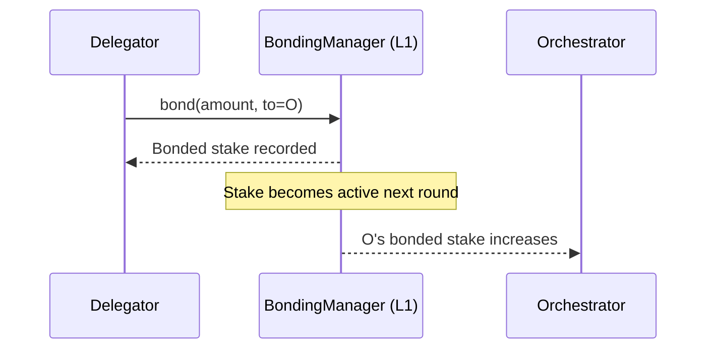

import { Callout, Card, CardGroup, Tabs, Tab, Steps, Step, Accordions, Accordion, Badge } from '@mintlify/mdx'

# Delegation (Advanced)

Delegation is the mechanism that lets LPT holders (delegators) **bond stake to an orchestrator** without running infrastructure. For orchestrators, delegation is the “capital layer”: it increases your bonded stake, improves your position in the **active set** (for video), and increases your share of inflation rewards.

This page is written for **orchestrators** optimizing delegation.

<Callout type="info" title="Protocol vs Network">
**Delegation is protocol-level (on-chain).** It changes stake, reward distribution, and active-set membership.

Delegation is *not* a routing rule for AI jobs. AI jobs are routed by **AI Gateways** using capability + load + service availability.
</Callout>

---

## TL;DR

<CardGroup>
  <Card title="What delegators want" icon="handshake">
    Competitive cuts, consistent uptime, transparent ops, stable performance, and predictable rewards.
  </Card>
  <Card title="What you want" icon="chart-line">
    Enough stake to remain active (video), maximize inflation share, and build long-term operator reputation.
  </Card>
  <Card title="What actually moves stake" icon="arrow-up-right">
    Track record + predictable economics beat marketing. Delegators follow *earnings stability*.
  </Card>
</CardGroup>

---

## 1) What delegation is (protocol layer)

Delegation = bonding LPT to an orchestrator address via the **BondingManager** contract.

- Delegators keep custody of LPT (it’s bonded, not transferred)
- Bonded LPT becomes active in the next round
- Unbonding starts a protocol-defined waiting period

### Core state

Let:
- `B_i` = total bonded stake to orchestrator `i` (self + delegated)
- `B_total` = total bonded stake across all orchestrators

Inflation rewards are distributed per-round proportional to `B_i / B_total`.

**Protocol reference:** on-chain staking/roles are implemented in Livepeer’s core protocol repos (see `go-livepeer` and the `protocol` repo for contracts and role logic). ([github.com](https://github.com/livepeer/go-livepeer?utm_source=chatgpt.com))

---

## 2) Delegation economics: cuts and shares

Orchestrators publish two independent parameters:

- **Reward cut**: portion of **LPT inflation rewards** kept by the orchestrator
- **Fee cut / fee share**: portion of **work fees** (ETH/arbETH settlement) shared with delegators

<Tabs>
  <Tab title="LPT inflation split">

Let:
- `R_i` = total LPT rewards attributed to orchestrator `i` for a round
- `c` = reward cut (0..1)

Then:

- Orchestrator keeps: `R_i * c`
- Delegators receive: `R_i * (1 - c)`

  </Tab>
  <Tab title="Fees split">

Let:
- `F_i` = total fees earned by orchestrator `i`
- `s` = fee share paid to delegators (0..1)

Then:

- Delegators receive: `F_i * s`
- Orchestrator keeps: `F_i * (1 - s)`

  </Tab>
</Tabs>

<Callout type="warning" title="Commission is a product">
Delegation is competitive. If your cuts are uncompetitive, you must compensate with performance, transparency, or differentiated capability.
</Callout>

---

## 3) Active set and why delegation matters for video

For the **video transcoding network**, Livepeer historically constrains active participation to an **active set** (commonly described as top *N* orchestrators by stake). If you fall out of the active set:

- you stop receiving video jobs
- you stop receiving inflation rewards until active again

Delegation is the primary way most operators sustain sufficient stake to remain active.

---

## 4) Delegation does not route AI jobs

For **AI inference**, routing is performed by **AI Gateways**, which direct tasks to AI Orchestrators based on capability and current load (and other policy inputs). Your stake still matters as:

- an activation prerequisite (current AI setup docs require an established orchestrator)
- a trust signal

…but **stake does not deterministically allocate AI traffic**.

**Implication:** If you’re targeting AI revenue, optimize:

- model availability
- p95 latency
- queue/backpressure behavior
- pricing strategy
- gateway compatibility

---

## 5) What delegators evaluate in 2026

<table>
  <thead>
    <tr>
      <th>Delegator criterion</th>
      <th>Why it matters</th>
      <th>What you should publish</th>
    </tr>
  </thead>
  <tbody>
    <tr>
      <td>Reward cut</td>
      <td>Determines LPT inflation share</td>
      <td>Explicit % with rationale and change policy</td>
    </tr>
    <tr>
      <td>Fee share</td>
      <td>Determines fee income split</td>
      <td>Explicit % and expected range by demand</td>
    </tr>
    <tr>
      <td>Uptime & reliability</td>
      <td>Missed jobs means lower fee yield</td>
      <td>Status page + incident history</td>
    </tr>
    <tr>
      <td>Consistency</td>
      <td>Stable earnings beat spikes</td>
      <td>Historical rewards and fees graphs</td>
    </tr>
    <tr>
      <td>Operational transparency</td>
      <td>Reduces fear of rug / negligence</td>
      <td>Docs: redemption automation, monitoring stack</td>
    </tr>
    <tr>
      <td>AI capability (optional)</td>
      <td>Future revenue optionality</td>
      <td>Supported models, VRAM, throughput, SLA targets</td>
    </tr>
  </tbody>
</table>

---

## 6) Designing a delegation strategy

<Steps>
  <Step title="Choose your operator archetype">
    **Video-first**, **AI-first**, or **hybrid**. Delegation needs differ:
    - Video-first: prioritize active set stability and redemption reliability.
    - AI-first: prioritize capability, latency, and gateway friendliness.
  </Step>
  <Step title="Set cuts you can sustain">
    Cuts should cover ops costs *and* remain competitive.
    Write down a policy for when you will change them.
  </Step>
  <Step title="Publish proof">
    Delegators respond to evidence:
    - uptime stats
    - rewards history
    - fee earnings
    - incident logs
  </Step>
</Steps>

---

## 7) Operational mechanics that affect delegators

<Accordions>
  <Accordion title="Reward calls and missed rounds">
    If reward distribution requires periodic actions (e.g., per-round reward calls), missed operations reduce rewards. Automate round monitoring.
  </Accordion>
  <Accordion title="Ticket redemption failure">
    Failing to redeem winning tickets reduces realized fees. Delegators will notice fee underperformance compared to peers.
  </Accordion>
  <Accordion title="Service URI instability">
    If gateways can’t reach you, you won’t earn. Delegators interpret this as operator negligence.
  </Accordion>
</Accordions>

---

## 8) Example: explaining delegation to a newcomer (copy-ready)

<Callout type="tip" title="Explain it like this">
When you delegate LPT, you’re not paying an orchestrator—you’re **staking** behind them. Your stake helps secure the network and increases the orchestrator’s participation share. In return, you earn a portion of protocol inflation rewards and a portion of the fees the orchestrator earns for doing real work.
</Callout>

---

## 9) Where to implement and reference delegation

### Explorer and on-chain UX

- Livepeer Explorer (stake, cuts, delegation actions): https://explorer.livepeer.org

### Implementation references

- `go-livepeer` (role logic + node implementation): https://github.com/livepeer/go-livepeer ([github.com](https://github.com/livepeer/go-livepeer?utm_source=chatgpt.com))
- Livepeer GitHub org (contracts + docs + tooling): https://github.com/livepeer ([github.com](https://github.com/livepeer?utm_source=chatgpt.com))

---

## 10) Related pages

- `advanced-setup/rewards-and-fees` (deep mechanics)
- `advanced-setup/run-a-pool` (stake aggregation + ops)
- `advanced-setup/ai-pipelines` (AI services and routing)
- `orchestrator-tools-and-resources/community-pools` (pool landscape)

---

## Media suggestions

Inline (pick 1–2):

- A short GIF of “staking/locking” (visual metaphor for bonding)
- A simple animated chart GIF (stake rising → active set entry)

Alternatives list:

- Embed an official Livepeer explainer video from recent Summit content (if available)
- Link to a forum post explaining delegation in low-inflation era (use a recent thread)

