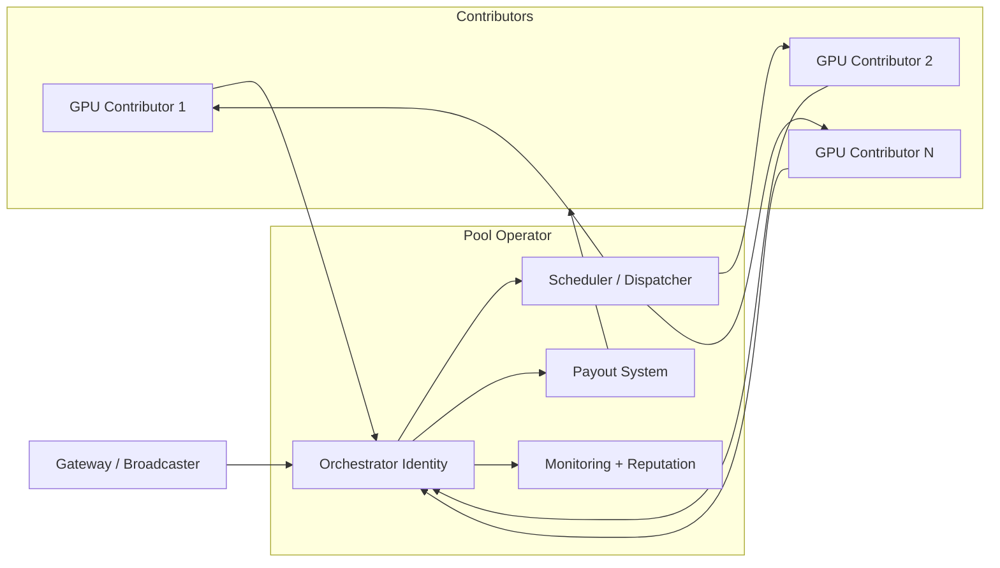

import { Callout, Card, CardGroup, Tabs, Tab, Steps, Step, Accordions, Accordion, Badge } from '@mintlify/mdx'

# Run a Pool (Advanced)

A **pool** in Livepeer is an *off-chain operational model* that aggregates many GPU contributors under a single **orchestrator identity** (or a coordinated set of identities), with unified routing, payouts, and operations.

This page is for **operators** who want to:

- run a pool for *video transcoding*, *AI inference*, or both
- accept GPUs from third parties (contributors)
- manage payout policies and operational risk

<Callout type="info" title="Protocol vs Network">
Pools are **not a protocol primitive**. Pools are a **network/business model** built on top of the protocol.

Protocol provides: stake identity + reward distribution (LPT), and fee settlement primitives.

Pools provide: contributor onboarding, capacity aggregation, scheduling policies, and payout coordination.
</Callout>

---

## 1) Pool models (what “pool” can mean)

Pools can be implemented several ways. The right model depends on your trust assumptions.

<table>
  <thead>
    <tr>
      <th>Pool model</th>
      <th>Contributor trust</th>
      <th>How compute is contributed</th>
      <th>Typical use</th>
    </tr>
  </thead>
  <tbody>
    <tr>
      <td>Contributor transcoder pool</td>
      <td>Medium</td>
      <td>Contributors run a pool client that performs work and reports back</td>
      <td>Video transcoding pools (mining-pool style)</td>
    </tr>
    <tr>
      <td>Managed GPU fleet</td>
      <td>High</td>
      <td>Operator controls infra; contributors fund or lease resources</td>
      <td>Enterprise or professional pools</td>
    </tr>
    <tr>
      <td>BYOC contributor pool</td>
      <td>Variable</td>
      <td>Contributors supply containers or GPU endpoints; pool routes jobs</td>
      <td>AI inference pooling, heterogeneous infra</td>
    </tr>
  </tbody>
</table>

**Third-party examples (video pool tooling):**

- Livepool describes a “transcoding pool” concept and shows a pool client workflow. ([livepool.io](https://www.livepool.io/?utm_source=chatgpt.com))
- Titan Node describes “video mining pool” operations and contributor onboarding. ([titan-node.com](https://titan-node.com/join-titan-node-pool/?utm_source=chatgpt.com))

<Callout type="warning" title="Avoid outdated assumptions">
Many pool implementations in the ecosystem were built for **video-era economics**. If you run AI workloads, you must revalidate assumptions (routing, pricing, latency targets).
</Callout>

---

## 2) Why pools exist (product + operator rationale)

Pools exist because:

1. **GPU ownership is fragmented** (many small holders)
2. **Protocol identity is expensive to run well** (ops burden)
3. **Delegation + reputation are sticky** (delegators prefer stable operators)
4. **Routing wants a stable front door** (gateways benefit from consistent endpoints)

A pool turns “many unreliable nodes” into “one reliable service surface.”

---

## 3) Pool architecture (high level)

### Key components you must build or adopt

- **Admission control**: who can contribute and under what constraints
- **GPU capability registry**: model support, VRAM, throughput
- **Scheduling**: video (segment-based) vs AI (request-based)
- **Payouts**: transparent, auditable, frequent enough for contributors
- **Abuse prevention**: cheating, double claiming, misreporting

---

## 4) Video vs AI pools (do not mix assumptions)

<Tabs>
  <Tab title="Video transcoding pool">

Video pools tend to optimize for:

- **throughput** (segments/sec)
- **GPU codec support** (NVENC/NVDEC)
- **stable ingest/egress**

Scheduling is typically **stateless per segment**.

Key pool risks:

- contributor node unreliability
- misreporting completed work
- inconsistent output quality

  </Tab>
  <Tab title="AI inference pool">

AI pools must optimize for:

- **latency** (p95 matters)
- **model availability** (warm models)
- **VRAM constraints**
- **batching efficiency**

Scheduling is **stateful** and often **memory-bound**.

Key pool risks:

- cold-start latency kills routing
- VRAM OOM and fragmentation
- model drift and version mismatch

**AI routing note:** AI Gateways route by capability + load; pool must expose these signals accurately. (AI overview docs reference the gateway/orchestrator model.) ([livepeer.org](https://www.livepeer.org/network?utm_source=chatgpt.com))

  </Tab>
</Tabs>

---

## 5) Pool operations checklist

<Steps>
  <Step title="Define your pool SLA">
    Choose what you optimize: video throughput vs AI latency.
    Publish uptime, incident policy, and a simple contributor contract.
  </Step>
  <Step title="Choose your contributor trust model">
    Decide whether contributors run software you control, or provide endpoints you call.
    Higher trust → simpler; lower trust → requires verification.
  </Step>
  <Step title="Build admission + verification">
    Don’t accept any GPU blindly.
    Require benchmark proof, driver versions, and connectivity tests.
  </Step>
  <Step title="Implement payouts">
    Contributors need clarity:
    - how rewards are calculated
    - payout frequency
    - audit logs
  </Step>
  <Step title="Instrument everything">
    Without metrics, you cannot keep delegators or gateways.
  </Step>
</Steps>

---

## 6) Payout design (pool-internal)

Pools generally implement an internal payout ledger distinct from protocol-level distribution.

Typical pool payout factors:

- compute contributed (time, segments, requests)
- quality score / success rate
- latency score (AI)
- availability score

<Callout type="info" title="Keep protocol rewards separate">
Protocol-level LPT inflation rewards and network-level ETH fees are distinct. Your pool should report both separately.
</Callout>

---

## 7) Pool economics: why delegators still matter

Even if contributors supply GPUs, **stake still gates participation and credibility**.

Delegators care about:

- predictable operator performance
- commission fairness
- transparent pool ops

Publishing a pool governance/payout policy improves delegation retention.

---

## 8) Security and compliance

Pools create additional risks beyond a solo orchestrator:

<Accordions>
  <Accordion title="Contributor cheating">
    Video: fake work proofs, low-quality encode, skipped segments.
    AI: returning cached outputs, misrepresenting models, prompt injection exploitation.
  </Accordion>
  <Accordion title="Key management">
    Pool operator must manage orchestrator keys safely. Do not run signing keys on contributor machines.
  </Accordion>
  <Accordion title="Abuse and content risk">
    Pools may serve many apps; enforce acceptable use policy and logs (privacy-preserving where possible).
  </Accordion>
  <Accordion title="Operational centralization risk">
    If pool is too dominant, it becomes a single point of failure for the network. Build redundancy.
  </Accordion>
</Accordions>

---

## 9) Newcomer explanation (copy-ready)

<Callout type="tip" title="Explain pools simply">
A Livepeer pool is like a mining pool, but for video and AI work. Many GPU owners contribute compute to one well-run operator, and that operator handles routing, payments, and reliability. The protocol doesn’t define pools — they’re an operational model built on top.
</Callout>

---

## 10) References and further reading

Official-first references:

- Livepeer GitHub org (source of truth for implementations): https://github.com/livepeer ([github.com](https://github.com/livepeer?utm_source=chatgpt.com))
- `go-livepeer` (node implementation): https://github.com/livepeer/go-livepeer ([github.com](https://github.com/livepeer/go-livepeer?utm_source=chatgpt.com))

Community/third-party pool references (validate recency before relying):

- Livepool pool client: https://www.livepool.io ([livepool.io](https://www.livepool.io/?utm_source=chatgpt.com))
- Titan Node pool onboarding: https://titan-node.com/join-titan-node-pool ([titan-node.com](https://titan-node.com/join-titan-node-pool/?utm_source=chatgpt.com))

<Callout type="warning" title="Recency requirement">
Some pool sites and tutorials are older. Use them for conceptual understanding only; confirm any operational steps against current Livepeer repos and docs.
</Callout>

---

## Related pages

- `advanced-setup/ai-pipelines`
- `advanced-setup/rewards-and-fees`
- `orchestrator-tools-and-resources/community-pools`
- `quickstart/join-a-pool`

---

## Media suggestions

Inline:

- Short GIF: “pooling compute” (many nodes → one service)
- Diagram image showing pool architecture (use the mermaid above rendered as SVG)

Alternatives:

- Embed a community video tutorial for joining a pool (ensure date > 2024 before promoting)

