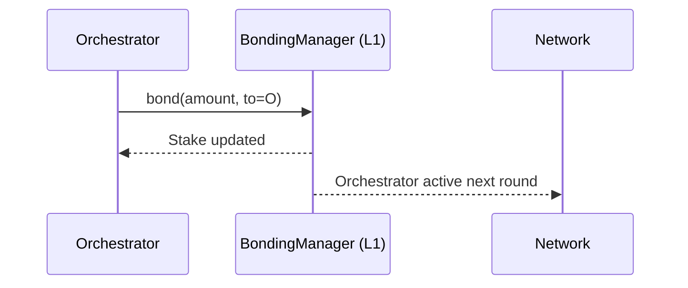

# Staking LPT as an Orchestrator

Staking Livepeer Token (LPT) is a **protocol-level requirement** for participating in the Livepeer network as an orchestrator. It is the primary mechanism that aligns economic incentives, secures the protocol, and determines eligibility for work allocation (video transcoding) at the protocol layer.

This page explains:

- Why staking exists
- How stake affects work eligibility
- Bonding mechanics
- Reward distribution
- Slashing risk
- Differences between video workload stake weighting and AI routing

---

## 1. Why Staking Exists

Livepeer uses delegated Proof-of-Stake (dPoS) to secure the protocol.

At the protocol layer, staking serves three purposes:

1. **Sybil resistance** — prevents unlimited fake orchestrator identities
2. **Economic collateral** — enables slashing for provable misbehavior
3. **Work allocation weighting** — determines eligibility in video transcoding selection

Without staking, there would be no cryptoeconomic enforcement mechanism.

---

## 2. Bonding Mechanics

An orchestrator must bond LPT to themselves in order to:

- Register as a Transcoder
- Become eligible for reward distribution
- Participate in video work selection

### Bonding Flow

Bonded stake becomes active in the next round.

Unbonding initiates a waiting period (unbonding period defined by protocol parameter). During this time, stake is locked.

---

## 3. Delegated Stake

Orchestrators do not need to self-stake 100% of their bonded stake.

Delegators may bond their LPT to an orchestrator.

Total Active Stake = Self Stake + Delegated Stake

This total bonded amount:

- Determines reward share
- Determines video selection weighting
- Influences delegator attractiveness

---

## 4. Work Allocation — Video vs AI

### Video Transcoding (Protocol Weighted)

For traditional video transcoding:

- Orchestrator selection is weighted proportionally to bonded stake.
- Higher stake → higher probability of being selected.

Selection Probability:

P_i = S_i / S_total

Where:

- S_i = orchestrator bonded stake
- S_total = total bonded stake in system

This applies to protocol-governed transcoding rounds.

---

### AI Inference (Market Routed)

AI workloads do **not** strictly follow stake-weighted routing.

AI routing depends on:

- Gateway selection
- Performance metrics
- Latency
- Model availability
- Pricing
- Reputation

Stake still matters for:

- Eligibility
- Economic credibility

But routing is performance and marketplace driven.

This distinction is critical.

---

## 5. Reward Distribution

Rewards are distributed per round.

Two reward sources:

1. Inflationary LPT rewards
2. ETH fees (video) or credits/ETH (AI workloads)

### LPT Rewards

Each round:

Reward_i = S_i / S_total × Inflation_minted

Orchestrators set:

- Reward cut (percentage retained from LPT rewards)
- Fee share (percentage retained from ETH fees)

Delegators receive the remainder.

---

## 6. Slashing Risk

Slashing may occur if:

- Double signing
- Proven protocol-level misbehavior

Slashing reduces bonded stake.

This impacts:

- Orchestrator credibility
- Delegator trust
- Future selection probability

AI performance failures are generally handled via marketplace reputation rather than protocol slashing.

---

## 7. Explorer Metrics to Monitor

Orchestrators should regularly monitor:

- Total bonded stake
- Bonding rate (%)
- Inflation rate (%)
- Active transcoder set
- Delegator growth
- Fee earnings

Explorer: https://explorer.livepeer.org

---

## 8. Strategic Considerations

### For Small Operators

- Joining a pool may increase effective stake weight
- Competitive fee share improves delegator attraction

### For Large Operators

- High stake improves video probability
- AI workloads depend more on performance

---

## 9. Summary

Staking LPT is:

- A protocol-level security requirement
- A selection weighting mechanism for video
- An economic credibility signal for AI

It is not merely symbolic — it directly impacts work eligibility, reward share, and network security.

---

Next: Rewards & Fees

