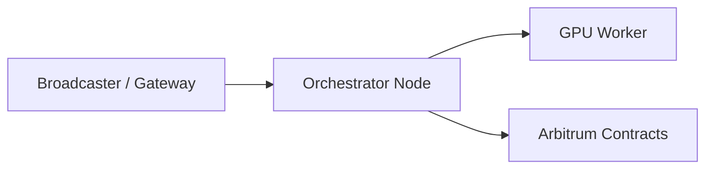

# Orchestrator Setup (Quickstart)

> This guide walks through setting up a production-ready Livepeer Orchestrator node for video transcoding and AI inference workloads.

---

## Overview

An **Orchestrator** is a GPU-backed node that performs compute work (video transcoding and/or AI inference) for the Livepeer Network and earns:

- ETH-based job fees
- LPT inflation rewards (if bonded)
- Delegation yield (if operating a pool)

This guide focuses on a minimal but production-safe setup. Advanced configuration (HA clusters, multi-GPU scaling, custom pipelines) is covered in later sections.

---

## Step 0 — Understand What You Are Running

Before installation, understand the architecture:



- **Gateway / Broadcaster** sends jobs.
- **Orchestrator** schedules and verifies work.
- **Worker (GPU)** executes compute.
- **Arbitrum contracts** handle bonding, reward accounting, and ticket redemption.

---

## Step 1 — Hardware Requirements

### Minimum (Test / Low Volume)

| Component | Requirement |
|------------|-------------|
| CPU | 4 cores |
| RAM | 16 GB |
| GPU | NVIDIA RTX 3060 (12GB+) |
| Storage | 500GB NVMe SSD |
| Network | 1 Gbps up/down |

### Recommended (Production)

| Component | Recommended |
|------------|------------|
| CPU | 8–16 cores |
| RAM | 32–64 GB |
| GPU | RTX 4090 / A5000 / L40 / A100 |
| Storage | 1TB+ NVMe |
| Network | Dedicated 1–10 Gbps |

AI pipelines (ComfyStream, diffusion, LLM inference) require larger VRAM (24GB+ preferred).

---

## Step 2 — System Preparation

### 1. Install Docker

```bash
sudo apt update
sudo apt install docker.io
sudo systemctl enable docker
```

### 2. Install NVIDIA Drivers + Container Toolkit

Verify GPU:

```bash
nvidia-smi
```

Install toolkit:

```bash
sudo apt install nvidia-container-toolkit
sudo systemctl restart docker
```

---

## Step 3 — Run Livepeer Node

Pull the official image:

```bash
docker pull livepeer/go-livepeer:latest
```

Run orchestrator:

```bash
docker run -d \
  --gpus all \
  -p 8935:8935 \
  -p 7935:7935 \
  livepeer/go-livepeer \
  -orchestrator \
  -serviceAddr 0.0.0.0:8935 \
  -transcoder \
  -network arbitrum
```

Key flags:

| Flag | Purpose |
|------|---------|
| `-orchestrator` | Enables orchestrator mode |
| `-transcoder` | Enables local GPU worker |
| `-serviceAddr` | Public job endpoint |
| `-network arbitrum` | Connects to L2 deployment |

---

## Step 4 — Create / Import Wallet

The orchestrator requires an Ethereum-compatible wallet.

Generate:

```bash
livepeer_cli wallet create
```

Or import private key via environment variable.

Fund the wallet with:

- ETH (for gas + ticket redemption)
- LPT (if bonding)

---

## Step 5 — Bond LPT (Optional but Required for Rewards)

Bonding enables:

- Eligibility for inflation rewards
- Delegation support
- Participation in stake-weighted scheduling

Bond using CLI:

```bash
livepeer_cli bond --amount 1000 --to <your_address>
```

Check bonding status via Explorer.

---

## Step 6 — Set Reward & Fee Parameters

Configure:

- `rewardCut` — % of LPT inflation retained
- `feeShare` — % of ETH fees shared with delegators

Example:

```bash
livepeer_cli setOrchestratorConfig --rewardCut 10 --feeShare 80
```

---

## Step 7 — Verify Node Health

Access stats endpoint:

```
http://<server-ip>:7935
```

Confirm:

- Connected to Arbitrum
- Registered as orchestrator
- GPU detected
- Accepting jobs

---

## Step 8 — Firewall & Production Hardening

### Recommended

- Reverse proxy (NGINX / Traefik)
- TLS termination
- Dedicated non-root Docker user
- Monitoring stack (Prometheus + Grafana)

---

## Step 9 — Monitoring & Metrics

Important metrics:

| Metric | Why It Matters |
|--------|----------------|
| Success Rate | Determines delegator trust |
| Ticket Win Rate | Impacts ETH earnings |
| GPU Utilization | Revenue efficiency |
| Uptime | Directly affects reputation |

Use:

- Built-in stats endpoint
- Explorer node metrics
- Custom Prometheus exporters

---

## Step 10 — Enable AI Pipelines (Optional)

To support AI inference:

- Install model runtimes
- Enable pipeline configuration
- Register compute capability

This allows:

- Diffusion pipelines
- ComfyStream workflows
- Real-time video AI effects

Advanced configuration documented in:

- `/advanced-setup/ai-pipelines`

---

## Economic Summary

Revenue streams:

1. ETH job fees
2. LPT inflation rewards
3. Delegation commissions

Costs:

- GPU power consumption
- Infrastructure rental
- Gas fees

Production orchestrators optimize:

- FeeShare vs RewardCut balance
- Hardware efficiency
- Delegator growth

---

## Final Checklist

- [ ] GPU drivers verified
- [ ] Docker running
- [ ] Orchestrator container live
- [ ] Wallet funded
- [ ] Bonded LPT
- [ ] Reward parameters set
- [ ] Public endpoint reachable
- [ ] Monitoring active

---

Next: Advanced Staking & Rewards Modeling → `advanced-setup/staking-LPT.mdx`

