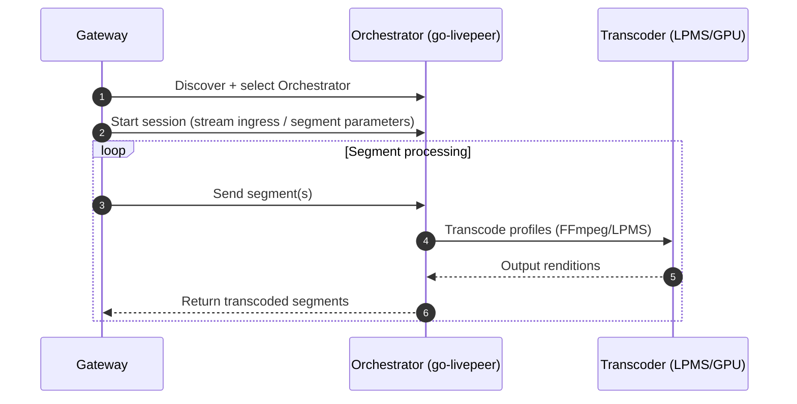
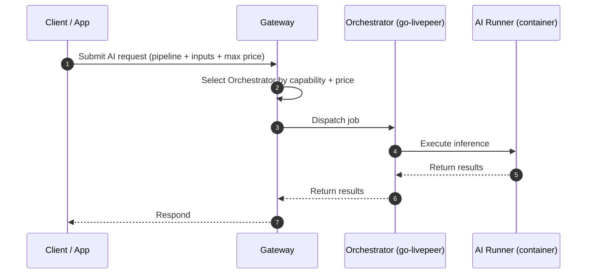

import { Callout, Card, CardGroup, Tabs, Tab, Accordion, AccordionItem, Steps, Step, Video } from "mintlify/components";

# Orchestrator Architecture

<CardGroup>
  <Card title="What you’ll learn" icon="microchip">
    <ul>
      <li>What actually runs inside an Orchestrator (processes, ports, GPU stack)</li>
      <li>How Gateways discover and route to Orchestrators</li>
      <li>Why video-transcoding and AI inference have different routing + pricing models</li>
      <li>Where on-chain protocol ends and off-chain network begins</li>
    </ul>
  </Card>
  <Card title="Source of truth" icon="code">
    <ul>
      <li><a href="https://github.com/livepeer/go-livepeer">go-livepeer (node implementation)</a></li>
      <li><a href="https://github.com/livepeer/lpms">LPMS (media server)</a></li>
      <li><a href="https://github.com/livepeer/ai-runner">ai-runner (inference runtime)</a></li>
      <li><a href="https://docs.livepeer.org/orchestrators">Orchestrator docs</a></li>
    </ul>
  </Card>
</CardGroup>

<Callout type="info" title="Protocol vs Network (read this first)">
  <p>
    <strong>Protocol</strong> = smart contracts and economic rules (bonding, rounds, rewards, slashing, governance).<br />
    <strong>Network</strong> = off-chain software + routing + media/inference execution (Gateways, Orchestrators, runners, transport).
  </p>
  <p>
    This page is <strong>network architecture</strong>. Where it touches the protocol (staking, reward calls, payments), we link to the relevant contract and docs.
  </p>
</Callout>

---

## 1) Mental model: Orchestrator as a “GPU service provider”

An Orchestrator is a node operator running GPU/CPU infrastructure plus Livepeer’s node software. In practice:

- **It advertises capabilities** (video transcoding profiles; AI pipelines/models; hardware limits)
- **It accepts work** from one or more **Gateways** (the request-routing layer)
- **It executes the work off-chain** on GPUs/CPUs
- **It gets paid** (for network services) through the network’s payment mechanism used by Gateways and/or job systems
- **It may participate in protocol security** (staking + rewards) if it’s also a staked Orchestrator address

> 🔥 Fun but accurate analogy: **Gateways are the “dispatch + billing layer.” Orchestrators are the “workforce.”**

---

## 2) High-level component diagram

```mermaid
flowchart LR
  subgraph Gateway[Gateway Node]
    GWAPI[Gateway APIs\n(WHIP/WHEP, HTTP, gRPC)]
    ROUTE[Routing + Pricing\nselection logic]
    PAY[Payment\naccounting]
  end

  subgraph Orch[Orchestrator Node]
    NODE[go-livepeer\n(orchestrator mode)]
    LPMS[LPMS\n(video transcoding)]
    AIR[AI Runner\n(container per pipeline)]
    OBS[Metrics + Logs\n(Prometheus/OTel)]
  end

  subgraph Chain[Livepeer Protocol Contracts\n(Arbitrum One)]
    BM[BondingManager]
    RM[RoundsManager]
    TB[TicketBroker]
  end

  GWAPI --> ROUTE --> NODE
  PAY --> TB
  NODE --> LPMS
  NODE --> AIR
  NODE --> OBS
  NODE <--> Chain
```

**Key separation:**
- The chain contracts define *roles/incentives* (stake, rounds, rewards) and *some payment primitives*.
- The node software (go-livepeer + LPMS + AI runner) does the *actual compute*.

---

## 3) What runs inside an Orchestrator

### Core processes

<Tabs>
  <Tab title="Video" icon="video">
    <ul>
      <li><strong>go-livepeer</strong> in orchestrator mode (control plane + networking)</li>
      <li><strong>LPMS</strong> for segment-based transcoding (FFmpeg pipeline, GPU acceleration where enabled)</li>
      <li>Optional: <strong>remote transcoders</strong> (separate workers connected to orchestrator)</li>
    </ul>
    <p>
      Source: <a href="https://github.com/livepeer/go-livepeer">go-livepeer</a>, <a href="https://github.com/livepeer/lpms">LPMS</a>
    </p>
  </Tab>
  <Tab title="AI" icon="sparkles">
    <ul>
      <li><strong>go-livepeer</strong> with AI worker / pipeline support (control plane + scheduling)</li>
      <li><strong>AI runner containers</strong> (pipeline-specific images, model loading, REST API)</li>
      <li>Optional: BYOC / generic pipelines (containerized workloads)</li>
    </ul>
    <p>
      Source: <a href="https://github.com/livepeer/ai-runner">ai-runner</a>, and recent node releases (see go-livepeer releases).
    </p>
  </Tab>
</Tabs>

### Ports and surfaces (typical)

> Exact ports depend on your flags/config. Treat this as an orientation map; confirm in your deployment.

- **Service URI**: the public endpoint Gateways connect to for work dispatch (set on-chain as your service URI)
- **Node HTTP API**: local admin/status endpoints
- **Metrics**: Prometheus scrape endpoint (recommended)
- **Runner APIs**: localhost container APIs for AI pipelines

---

## 4) How discovery works (and why it differs for Video vs AI)

### Video: stake-weighted security + discovery signals

For classic transcoding, the protocol’s staking system influences **who is eligible** and **who is more likely to be selected**.

- Orchestrators register a service URI and fee parameters.
- Gateways discover orchestrators and choose among them.
- Stake and protocol participation provide Sybil-resistance and economic alignment.

> Important nuance: stake-weighting is a *protocol security primitive*. Gateways may still apply additional selection logic (latency, reliability, price, geography, allowlists).

### AI: capability + price ceilings are first-class

For AI pipelines, selection is constrained by **capability compatibility** (pipeline/model availability, runner version, hardware) and **pricing**.

Livepeer’s AI pipeline docs explicitly describe:
- Orchestrators setting their own pricing
- Gateways setting a maximum price for a job
- Jobs routing to Orchestrators that can serve the pipeline at acceptable price

See (example pipelines):
- <a href="https://docs.livepeer.org/ai/pipelines/text-to-speech">Text-to-Speech pipeline</a>
- <a href="https://docs.livepeer.org/ai/pipelines/audio-to-text">Audio-to-Text pipeline</a>

<Callout type="warning" title="Don’t conflate stake-selection with AI routing">
  <p>
    If you’re coming from “transcoding-era” Livepeer, it’s easy to assume “most stake wins jobs.” That is not the right mental model for AI pipelines.
  </p>
  <p>
    AI routing is constrained by <strong>capabilities</strong> and frequently governed by <strong>price ceilings</strong> set by the Gateway/job requester.
  </p>
</Callout>

---

## 5) Workflows: end-to-end dataflows

### A) Real-time video transcoding flow



**Where to embed media:**
- GIF idea: “segments flowing through a pipeline” (small loop under this diagram)
- Optional: a short explainer clip from Livepeer’s official channels on segment-based transcoding

### B) AI pipeline inference flow (gateway-routed)



**Where to embed media:**
- Place a short pipeline demo video right under this diagram (Daydream/ComfyStream demos are great).

---

## 6) Where payments and the chain fit

This is the part that gets confusing fast, so here’s the clean separation:

### Protocol-level (on-chain)

- **Staking/bonding, rounds, rewards distribution** are protocol functions.
- Core protocol contracts are deployed on **Arbitrum One** (Confluence / L2 migration).

Contract addresses (Arbitrum mainnet) are maintained here:
- <a href="https://docs.livepeer.org/references/contract-addresses">docs: Contract Addresses</a>

### Network-level (off-chain)

- Payment accounting, session management, segment transport, inference execution, and orchestration happen in **go-livepeer + runners**.
- Network routing and selection logic is implemented in **Gateway software**.

If you’re trying to reason about “what is enforceable by contracts” vs “what is enforced by software + reputation,” treat this as the dividing line.

---

## 7) Observability: how you know you’re healthy

<CardGroup>
  <Card title="Recommended" icon="chart-line">
    <ul>
      <li>Prometheus metrics + Grafana dashboards</li>
      <li>Structured logs shipped to a searchable store</li>
      <li>Alerting on GPU memory pressure, dropped segments, runner health</li>
    </ul>
  </Card>
  <Card title="Useful tooling" icon="toolbox">
    <ul>
      <li><a href="https://github.com/livepeer/stream-tester">stream-tester</a> (measure stability/performance)</li>
      <li><a href="https://github.com/livepeer/go-livepeer/releases">go-livepeer releases</a> (track changes impacting ops)</li>
    </ul>
  </Card>
</CardGroup>

---

## 8) Common deployment patterns

<Accordion>
  <AccordionItem title="Single-machine Orchestrator (simple start)">
    <ul>
      <li>One server with GPU(s)</li>
      <li>go-livepeer + LPMS and/or AI runners locally</li>
      <li>Good for early ops, limited scaling</li>
    </ul>
  </AccordionItem>
  <AccordionItem title="Orchestrator + remote transcoders/workers (scale)">
    <ul>
      <li>Orchestrator is control plane + discovery endpoint</li>
      <li>Worker fleet handles compute (video transcoders / AI runners)</li>
      <li>Better horizontal scale + isolation</li>
    </ul>
  </AccordionItem>
  <AccordionItem title="Pool / multi-operator model">
    <ul>
      <li>A single on-chain identity represents a pool</li>
      <li>Multiple GPU operators contribute capacity behind it</li>
      <li>Unified pricing/routing/reputation at pool level</li>
    </ul>
  </AccordionItem>
</Accordion>

---

## 9) Implementation references (link-rich)

### Official

- Node implementation: <a href="https://github.com/livepeer/go-livepeer">livepeer/go-livepeer</a>
- Media server: <a href="https://github.com/livepeer/lpms">livepeer/lpms</a>
- AI runtime: <a href="https://github.com/livepeer/ai-runner">livepeer/ai-runner</a>
- Orchestrator docs: <a href="https://docs.livepeer.org/orchestrators">docs.livepeer.org/orchestrators</a>
- Contract addresses: <a href="https://docs.livepeer.org/references/contract-addresses">docs.livepeer.org/references/contract-addresses</a>

### Third-party / ecosystem (optional embeds)

- Add YouTube demos of Livepeer AI pipelines (ComfyStream / pipeline demos)
- Add GitHub tools used by operators (monitoring dashboards, infra-as-code)

> If you want, I can turn this into a “choose your path” page with Cards that route to: Setup → Config → Pricing → Monitoring → Pools.

