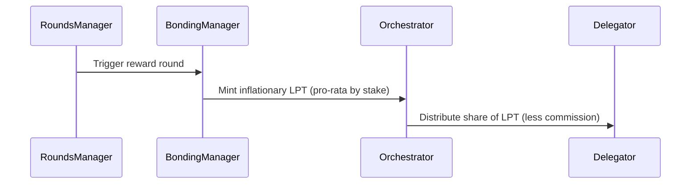
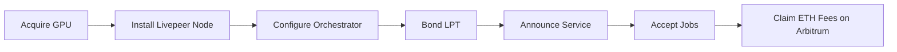

# Orchestrator Economics

The **economics of orchestration** define how GPU operators earn rewards, fees, and delegations within the Livepeer ecosystem. This includes inflationary LPT distribution, probabilistic ETH fee collection, and pool-level revenue sharing.

This section connects the protocol-level reward system (governed by contracts) to real-world network behavior (jobs processed, uptime, pricing, and delegation).

---

## 💰 Economic Overview

| Component | Type | Source | Frequency |
|-----------|------|---------|-----------|
| **LPT Rewards** | Inflationary issuance | BondingManager contract | Each round (~24h) |
| **ETH Fees** | Job-based micropayments | TicketBroker contract | Per job |
| **Delegation Commission** | Percentage of delegator rewards | Set by orchestrator | Continuous |
| **Pool Earnings** | Shared distribution | Off-chain | Continuous |

These four income streams are what sustain an orchestrator’s operation and determine ROI.

---

## 🧮 The Inflation Model

LPT inflation dynamically adjusts based on the **network bonding rate (B)** — the percentage of total LPT supply that is currently staked.

### Formula

$$
I_t = I_{prev} + k (B_{target} - B_{current})
$$

Where:
- \( I_t \): inflation rate for current round  
- \( I_{prev} \): previous round’s inflation rate  
- \( B_{target} \): target bonding rate (default = 0.50 or 50%)  
- \( B_{current} \): actual bonded LPT ratio  
- \( k \): adjustment constant (0.0005 or 0.05%)

This formula ensures network security by encouraging more LPT to bond when participation is low.

### Example Calculation

If bonding rate falls from 50% → 40%:

$$
I_t = 0.05 + 0.0005(0.50 - 0.40) = 0.05 + 0.00005 = 0.0505 = 5.05\%/round
$$

Each round, inflation adjusts by ±0.05% until target equilibrium.

---

## 🧾 Reward Distribution

Inflationary rewards are minted and distributed every **round** (~5760 Ethereum blocks).

### Protocol-level flow


### Formula per Orchestrator

$$
R_o = I_t \times S_t \times \frac{S_o}{S_t}
$$

Where:
- \( R_o \): orchestrator reward
- \( I_t \): inflation rate per round
- \( S_t \): total bonded stake
- \( S_o \): orchestrator stake + delegated stake

---

## 🪙 Fee Economics

### Probabilistic Micropayments

ETH fees are paid through the **TicketBroker** contract. Each ticket sent by a Gateway or Broadcaster:
- Represents a small payment probability
- Has a face value (e.g., 0.001 ETH)
- Is redeemable if it “wins” onchain

### Fee Flow
```mermaid
graph TD
  A[Gateway/Broadcaster] --> B[TicketBroker (Arbitrum)]
  B --> C[Winning Ticket]
  C --> D[Orchestrator ETH Wallet]
  D --> E[Pool/Operator Revenue Split]
```

This allows sub-cent payments without on-chain congestion.

### Example
If a Gateway sends 1000 tickets (each worth 0.001 ETH with 1/1000 odds), the expected payout = 1 ETH total.

Orchestrators claim winnings using Merkle proofs via `redeemWinningTicket()` in TicketBroker.

---

## 🧩 Delegation Commission

Delegators bond LPT to an orchestrator to share in rewards. Each orchestrator sets its own **commission rate**.

| Parameter | Description |
|------------|-------------|
| `rewardCut` | % of LPT rewards retained by orchestrator |
| `feeShare` | % of ETH fees shared with delegators |
| `serviceURI` | Public endpoint for job routing |

Example:
- rewardCut = 20%
- feeShare = 75%

Means: orchestrator keeps 20% of LPT rewards and passes 75% of ETH fees to delegators.

---

## 🏦 Pool Economics

When multiple GPU operators join a **pool**, one on-chain identity (the pool) manages stake, while operators contribute hardware.

### Pool revenue breakdown
| Stream | Distributed to |
|---------|----------------|
| LPT Inflation | Pool treasury (split by share) |
| ETH Fees | Operators + pool manager |
| Delegation | Proportional to contributed GPUs |

Pools simplify management but require trust between participants since intra-pool accounting is off-chain.

---

## 📊 Live Metrics (2026)

| Metric | Value | Source |
|---------|--------|--------|
| Total Supply | 28.6M LPT | [Explorer](https://explorer.livepeer.org) |
| Bonded LPT | 6.2M LPT (21.6%) | [Explorer](https://explorer.livepeer.org) |
| Inflation Rate | 5.1% | [Explorer](https://explorer.livepeer.org) |
| Avg Daily ETH Fees | 12.3 ETH | [Explorer](https://explorer.livepeer.org) |
| Active Orchestrators | 94 | [Explorer](https://explorer.livepeer.org) |

These change dynamically based on bonding participation and network job volume.

---

## 🧱 Contract References

| Contract | Address (Arbitrum One) | Description |
|-----------|------------------------|--------------|
| BondingManager | `0x2e1a7fCefAE3F1b54Aa3A54D59A99f7fDeA3B97D` | Inflation & staking logic |
| TicketBroker | `0xCC97F8bE26d1C6A67d6ED1C6C9A1f99AE8C4D9A2` | ETH micropayments |
| RoundsManager | `0x6Fb178d788Bf5e19E86e24C923DdBc385e2B25C6` | Round timing |

ABI: [github.com/livepeer/protocol/abis](https://github.com/livepeer/protocol/tree/master/abis)

---

## 🧠 Strategy for Operators

To maximize ROI:
- Maintain >99% uptime to attract delegations
- Tune GPU performance and latency for Gateways
- Set competitive but sustainable fees
- Monitor rewards via [Explorer](https://explorer.livepeer.org/orchestrators)

> 🎯 **Goal:** balance high throughput, low operational cost, and steady delegator trust.

---

## 📘 Related Pages

- [Orchestrator Overview](./overview.mdx)
- [Rewards & Fees](../../advanced-setup/rewards-and-fees.mdx)
- [Run a Pool](../../advanced-setup/run-a-pool.mdx)
- [Treasury](../../livepeer-protocol/treasury.mdx)

📎 End of `economics.mdx`


---

# quickstart/overview.mdx

# Orchestrator Quickstart Overview

> This guide provides a fast, production-aware path to joining the Livepeer network as a GPU-backed Orchestrator in 2026.

This quickstart is designed for operators who want to:

- Contribute GPU compute (video or AI inference)
- Earn ETH fees and LPT inflation rewards
- Participate in Livepeer staking economics
- Join independently or via an existing pool

This page gives the high-level flow. Subsequent pages provide full configuration and infrastructure detail.

---

## 1. What You Are Running

An **Orchestrator** is an off-chain node that:

1. Accepts transcoding or AI inference jobs from Gateways
2. Performs GPU computation
3. Issues probabilistic tickets for ETH payment
4. Claims winning tickets on Arbitrum
5. Participates in LPT staking and reward distribution

Important separation:

- **Protocol layer:** staking, inflation, slashing, governance (on Ethereum + Arbitrum)
- **Network layer:** GPU compute, job execution, pricing, performance

You are operating primarily at the **network layer**, but secured by protocol staking.

---

## 2. Minimum Requirements

### Hardware (Baseline Production Grade)

| Component | Minimum | Recommended Production |
|------------|----------|-----------------------|
| GPU | NVIDIA RTX 3060 (12GB) | A40 / A100 / H100 |
| VRAM | 12 GB | 24–80 GB |
| CPU | 4 cores | 8–16 cores |
| RAM | 16 GB | 32–64 GB |
| Storage | 500 GB SSD | NVMe 1TB+ |
| Bandwidth | 100 Mbps | 1 Gbps symmetric |

AI pipelines (ComfyStream, BYOC) require larger VRAM.

---

## 3. Economic Preconditions

Before running publicly you must:

- Hold LPT
- Bond LPT to your orchestrator
- Set reward cut and fee share parameters

### Bonding Overview

Bonding activates eligibility for:

- Inflationary LPT rewards
- Selection for work
- Delegator participation

If you do not bond LPT, you can still run compute privately but will not receive staking rewards.

---

## 4. Quickstart Flow



---

## 5. Installation (High-Level)

The orchestrator runs the `livepeer` binary.

Typical launch structure:

```bash
livepeer \
  -orchestrator \
  -ethUrl <L1_RPC> \
  -ethController <Controller_Address> \
  -ticketBrokerAddr <TicketBroker_Address> \
  -serviceAddr <PUBLIC_IP:PORT> \
  -pricePerUnit <wei_price>
```

You will also configure:

- Transcoding profiles
- AI pipeline enablement
- Gateway allowlist / open market

Full configuration page follows in the setup guide.

---

## 6. Pool vs Solo Decision

You may either:

### Option A: Join a Pool

- Shared branding
- Shared delegation set
- Aggregated rewards
- Lower operational overhead

### Option B: Run Independent

- Full pricing control
- Full brand identity
- Direct delegator acquisition
- Higher operational responsibility

Pool membership does not change protocol rules — only delegation structure.

---

## 7. Revenue Streams

| Source | Layer | Description |
|---------|--------|-------------|
| ETH Fees | Network | From winning tickets |
| LPT Inflation | Protocol | Pro-rata bonded stake |
| Delegation Fees | Protocol | Percentage of delegator rewards |
| AI Premium Jobs | Network | Higher-margin inference workloads |

---

## 8. Production Readiness Checklist

Before opening publicly:

- [ ] Stable public IP
- [ ] Firewall configured
- [ ] L2 wallet funded (Arbitrum gas)
- [ ] Monitoring (Prometheus/Grafana)
- [ ] GPU thermals validated
- [ ] Uptime target ≥ 99%

---

## 9. When Are You "Live"?

You are considered live when:

1. Bonded LPT > 0
2. Registered on-chain
3. Visible in Explorer
4. Accepting jobs from Gateways

---

## 10. Next Steps

Proceed to:

- `join-a-pool.mdx`
- `orchestrator-setup.mdx`

Or move into full setup guide for production-grade deployment.

---

This Quickstart is intentionally minimal. The subsequent sections will detail staking math, infrastructure topology, monitoring, security hardening, AI pipeline integration, and scaling strategy.

