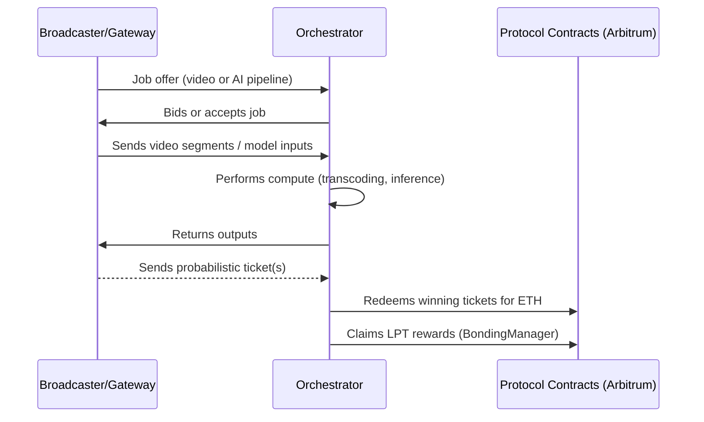
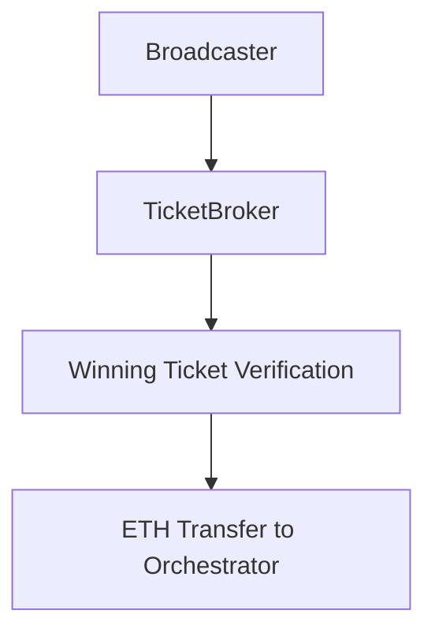
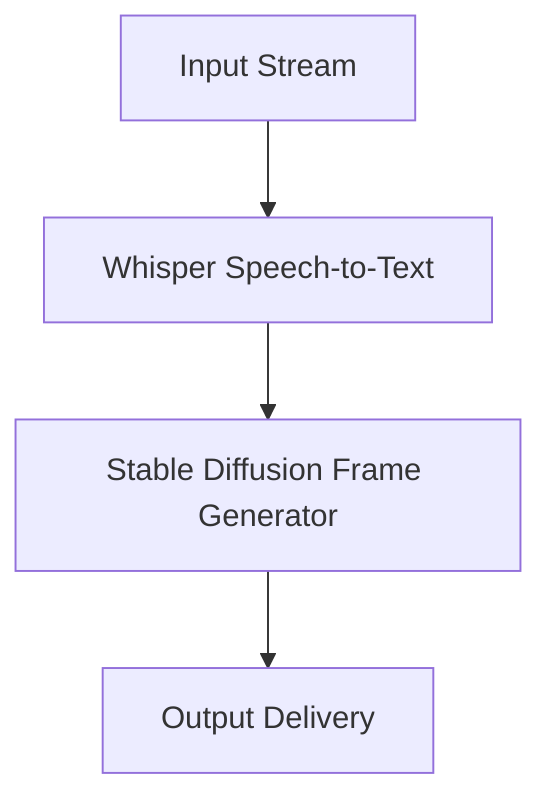

# Orchestrator Functions

Orchestrators are the operational core of the Livepeer network. Their primary function is to **perform and verify off-chain computational work** such as video transcoding, AI inference, and pipeline execution — while maintaining on-chain accountability through staking and probabilistic payment settlement.

They bridge the **protocol layer** (smart contracts, staking, rewards) and the **network layer** (off-chain compute, gateways, and clients).

---

## 🔁 Functional Overview

| Function | Description | Protocol/Network Layer |
|-----------|--------------|------------------------|
| Job Discovery | Receives work offers from gateways or broadcasters | Network |
| Task Execution | Performs video or AI processing off-chain | Network |
| Ticket Redemption | Redeems winning payment tickets on Arbitrum | Protocol |
| Reward Claiming | Claims LPT inflation rewards | Protocol |
| Verification | Runs redundancy or checksum validations | Network |
| Slashing | Penalized for dishonest behavior | Protocol |

---

## ⚙️ Workflow Breakdown

Each orchestrator continuously repeats this cycle, maintaining uptime and availability metrics that determine delegation attractiveness.

---

## 🧮 Core Responsibilities

### 1. Job Scheduling

Orchestrators run node software (`go-livepeer`) that automatically:
- Discovers new job offers
- Bids based on available capacity
- Balances multiple concurrent jobs
- Logs uptime, response latency, and GPU load

### 2. Verification

Integrity is checked via **verification tickets** or redundancy checks:
- Random sampling of video segments or inference outputs
- Cross-validation by other orchestrators or clients
- If discrepancies arise, a slashing process can be triggered on-chain

### 3. Payment Handling

ETH is earned via **probabilistic micropayments**:
- Broadcasters send signed tickets
- Orchestrators redeem winning ones on Arbitrum’s TicketBroker
- Redemption requires Merkle proofs for validity

### 4. Staking & Rewards

Staking involves bonding LPT to secure protocol participation:
- Orchestrators stake LPT directly or via delegations
- Bonding managed by **BondingManager** contract
- Each round distributes new LPT to active orchestrators

Reward distribution logic (simplified):

$$
R_o = I_t \times \frac{S_o}{S_t}
$$

Where:
- \( R_o \): orchestrator reward per round  
- \( I_t \): total LPT issued (inflation) in round  
- \( S_o \): orchestrator bonded stake  
- \( S_t \): total bonded stake network-wide

---

## 🤖 AI Pipeline Execution

Modern orchestrators can opt into **AI pipeline jobs**:
- Each orchestrator advertises available model plugins (e.g., Whisper, Stable Diffusion, ComfyUI)
- Tasks arrive via gateway nodes registered on the network
- Orchestrators run inference jobs locally or through containerized workers

### Example pipeline

These jobs are higher-value than traditional video work and may involve additional verification proofs.

---

## 🪙 Earnings Composition

| Source | Type | Frequency | Contract |
|--------|------|-----------|-----------|
| ETH | Work fees (ticket redemption) | Job-based | TicketBroker |
| LPT | Inflation reward | Each round | BondingManager |
| Delegation | Commission | Continuous | BondingManager |

Example:
- Inflation = 0.07 (7%)
- Total bonded = 15M LPT
- Orchestrator bonded = 300K LPT

$$
R = 0.07 \times 15{,}000{,}000 \times \frac{300{,}000}{15{,}000{,}000} = 21{,}000\ LPT
$$

---

## 🔐 Contracts

| Contract | Network | Address (Arbitrum) | Purpose |
|-----------|----------|------------------|----------|
| BondingManager | Arbitrum | `0x2e1a7fCefAE3F1b54Aa3A54D59A99f7fDeA3B97D` | Handles bonding, rewards, slashing |
| TicketBroker | Arbitrum | `0xCC97F8bE26d1C6A67d6ED1C6C9A1f99AE8C4D9A2` | ETH ticket redemption and deposits |
| RoundsManager | Arbitrum | `0x6Fb178d788Bf5e19E86e24C923DdBc385e2B25C6` | Tracks round progression |

Contract ABIs: [github.com/livepeer/protocol](https://github.com/livepeer/protocol/tree/master/abis)

---

## 📊 Monitoring Metrics

Track orchestrator performance at [explorer.livepeer.org](https://explorer.livepeer.org):

| Metric | Example (2026) |
|---------|----------------|
| Global Bonding Rate | ~22% |
| Inflation Rate | 5.1% |
| Active Orchestrators | 94 |
| Avg ETH Fee/Day | 0.12 ETH |
| Total Supply | 28.6M LPT |

---

## 📘 See Also

- [Architecture](./architecture.mdx)
- [Economics](./economics.mdx)
- [Run a Pool](../../advanced-setup/run-a-pool.mdx)
- [Rewards & Fees](../../advanced-setup/rewards-and-fees.mdx)

📎 End of `orchestrator-functions.mdx`

