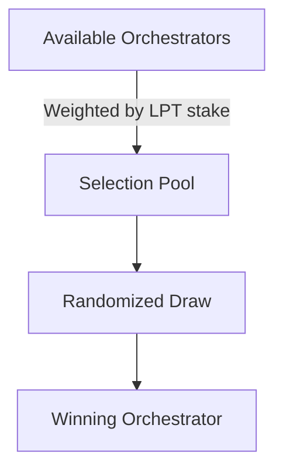

# Orchestrator Overview

Orchestrators are bonded infrastructure providers in the Livepeer protocol who perform off-chain computational work such as video transcoding or AI inference. They are the backbone of the network’s decentralized job execution layer and are compensated in both ETH and LPT for their services.

Unlike traditional validators in proof-of-stake networks who produce blocks, orchestrators execute jobs and submit probabilistic proofs of work via ticketing mechanisms. Their role is both technical and economic: they must manage reliable infrastructure while attracting stake from delegators and maintaining performance.

---

## 🔧 What Orchestrators Do

Orchestrators:
- Register on-chain with a bonded LPT stake
- Run GPU-enabled nodes capable of executing compute jobs
- Accept and process work from gateways or broadcasters (e.g., video encoding, model inference)
- Submit probabilistic tickets to earn ETH from completed work
- Receive LPT inflation rewards each round based on stake share and performance
- Risk slashing if found cheating or failing verification

---

## 💸 Orchestrator Compensation

They earn in two main ways:

### 1. ETH Payments
- Paid via **probabilistic micropayments** (TicketBroker contract)
- Each ticket has a win probability and a face value (e.g. 1/1000 chance to win 1 ETH)
- Winners are redeemed onchain by the orchestrator

### 2. LPT Inflation Rewards
- The Livepeer protocol issues LPT each round
- Rewards go to orchestrators and their delegators proportional to bonded stake
- More stake → more selection → more jobs → higher inflation yield

:::tip
Rewards increase when the global bonding rate is low due to dynamic inflation.
:::

---

## 🧾 Trust Model & Slashing

Orchestrators must:
- Maintain honest behavior (don’t double-claim tickets, don’t drop work)
- Participate in verification (e.g. transcoding checks)
- Accept potential **slashing** (loss of bonded LPT) for misconduct

This creates an incentive alignment model:
- Delegators only bond to reliable orchestrators
- Orchestrators are incentivized to keep uptime high and perform work accurately

---

## 📈 Orchestrator Selection

When a job is broadcasted, the network selects orchestrators probabilistically:

This selection algorithm ensures:
- Incentives to accumulate stake
- Even load distribution
- No single party dominates execution

---

## 🧪 Supporting AI & Video Jobs

Orchestrators may specialize in:
- Video encoding (H.264, HLS, etc)
- AI inference pipelines (e.g. stable diffusion, whisper)

They can register pipelines using plugin registries and serve multiple job types in parallel.

See [AI Pipelines](../../advanced-setup/ai-pipelines) for more.

---

## 🧮 Economics Preview

| Parameter | Description |
|----------|-------------|
| Min LPT Stake | 0 (but higher stake → more selection) |
| ETH Earning | Paid via winning tickets, withdrawn from TicketBroker |
| LPT Rewards | From bonded inflation, distributed each round |
| Slashing Risk | Up to 50% for fraud or inactivity |

For more, see [Orchestrator Economics](./economics.mdx).

---

## 📚 Learn More

- [Architecture](./architecture.mdx)
- [Economics](./economics.mdx)
- [Run a Pool](../../advanced-setup/run-a-pool.mdx)
- [Orchestrator Tools](../../orchestrator-tools-and-resources/orchestrator-tools)

📎 End of `overview.mdx`

