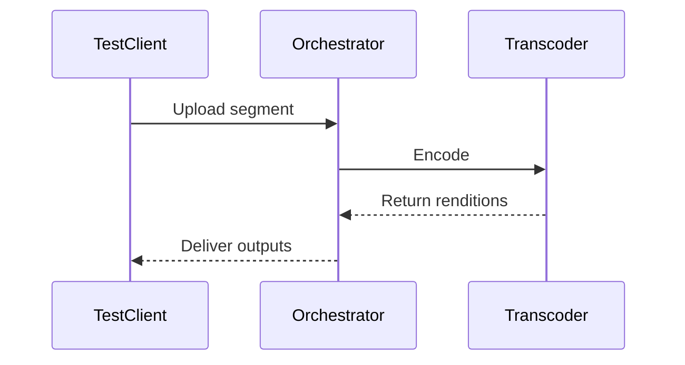

# Testing & Validation

This section covers how to properly test and validate a Livepeer Orchestrator for both **video transcoding** and **AI inference workloads** before exposing it to real network traffic.

Testing is critical because:
- Incorrect configuration leads to lost revenue
- Poor performance reduces delegation
- Misconfiguration may cause failed tickets or degraded job success rates

---

# 1. Testing Modes Overview

Orchestrators can test in three primary modes:

| Mode | Purpose | Network Impact |
|------|----------|---------------|
| Local Testing | Validate GPU + pipeline | No on-chain impact |
| Staging / Private Gateway | Controlled traffic | Limited economic exposure |
| Mainnet Live | Real jobs + tickets | Full economic participation |

---

# 2. Video Transcoding Validation

Video validation ensures:
- FFmpeg pipelines function correctly
- GPU acceleration is enabled
- Segment latency is within acceptable bounds
- Output profiles match broadcaster requirements

## 2.1 CLI Validation

```bash
livepeer -orchestrator -transcoder
```

Confirm:
- GPU detected
- NVENC / hardware encoder active
- No software fallback unless intended

## 2.2 Segment Round Trip Test

Use a test stream and verify:



Validate:
- Bitrate ladder accuracy
- Resolution scaling correctness
- Segment time consistency

---

# 3. AI Inference Validation

AI workloads differ fundamentally from video.

Video:
- Deterministic
- Segment-based
- Fixed profiles

AI:
- Non-deterministic outputs
- Model-specific memory requirements
- Variable latency

## 3.1 Model Load Test

Confirm model memory footprint:

```bash
nvidia-smi
```

Verify:
- VRAM capacity
- No OOM during inference
- Stable GPU clock rates

## 3.2 Throughput Benchmarking

Measure:
- Tokens/sec (LLMs)
- Frames/sec (video diffusion)
- Latency per request

---

# 4. Ticket & Payment Validation

Ensure:
- Ticket redemption works
- Arbitrum RPC connectivity stable
- Gas wallet funded

Check:

```bash
livepeer_cli ticket info
```

Verify:
- Winning tickets redeem
- No nonce errors
- No RPC timeout

---

# 5. Network Visibility Testing

Confirm:
- Orchestrator visible on Explorer
- Correct price parameters
- Correct reward cut & fee share

Checklist:

- Registered
- Bonded stake
- Active status
- Price correctly advertised

---

# 6. Performance Benchmarks

Recommended minimums:

| Workload | Metric | Target |
|----------|--------|--------|
| 1080p Transcoding | Segment latency | < 2x segment duration |
| AI Inference (LLM) | First token latency | < 1.5s |
| AI Diffusion | Frame latency | < 300ms/frame |

---

# 7. Stress Testing

Simulate:
- Concurrent jobs
- Ticket bursts
- Network interruptions

Observe:
- Memory leaks
- GPU overheating
- Process crashes

---

# 8. Go-Live Checklist

Before enabling live traffic:

- Stable GPU thermals
- RPC redundancy configured
- Monitoring enabled
- Log rotation active
- Backup wallet secured

---

# 9. Ongoing Validation

Testing is not one-time.

Operators should:
- Re-benchmark after driver updates
- Re-test after model upgrades
- Validate performance quarterly

---

This concludes the Testing & Validation section.

Ready for the next page.

