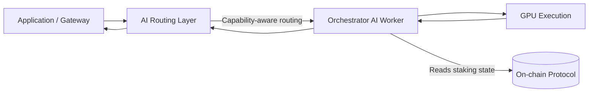
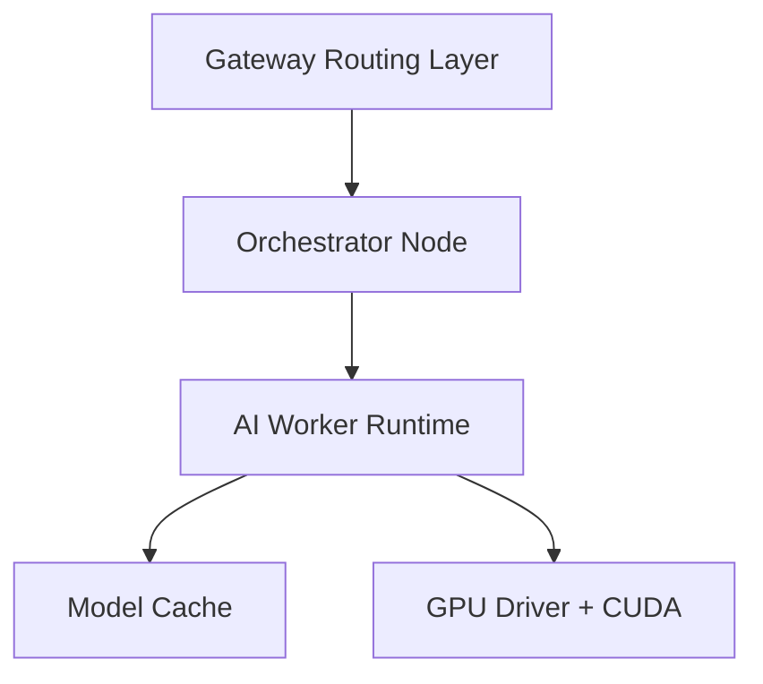
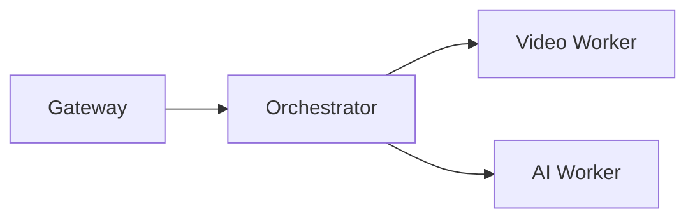

import { Callout, Tabs, Tab, Card, CardGroup, Steps, Accordion, AccordionItem, Badge } from "@mintlify/components";

# AI Pipelines (Orchestrators)

Livepeer AI extends the network beyond video transcoding into **GPU-backed inference workloads**.

This document explains:

- How AI workloads differ from video at the **network layer**
- How AI interacts with the **protocol layer** (staking + rewards)
- GPU, software, and orchestration requirements
- Capability-aware routing (why stake ≠ AI job volume)
- Production-grade operational standards for 2026

<Callout type="info" title="Critical distinction">
AI routing and execution are primarily a <strong>network-layer concern</strong> (gateway + worker stack). LPT staking remains a <strong>protocol-layer mechanism</strong> for security and reward distribution.
</Callout>

---

# 1. Architecture Overview

AI workloads introduce a different execution path from classic transcoding.

## 1.1 High-Level Flow

### Key Observations

- Routing is **capability-aware**, not purely stake-weighted.
- Workers execute inference locally on GPU.
- Protocol staking governs participation and rewards, not inference scheduling.

---

# 2. Video vs AI: Explicit Separation

<Tabs>
  <Tab title="Video Transcoding">
    <ul>
      <li>Segment-based workload</li>
      <li>ETH ticket payments</li>
      <li>Latency bounded by stream cadence</li>
      <li>Routing may use protocol participation sets</li>
    </ul>
  </Tab>
  <Tab title="AI Inference">
    <ul>
      <li>Model-based workloads (diffusion, LLM, transformation)</li>
      <li>Latency sensitive (p95 and cold-start critical)</li>
      <li>GPU memory constraints dominate scheduling</li>
      <li>Routing prioritizes capability, availability, and price</li>
    </ul>
  </Tab>
</Tabs>

<Callout type="warning" title="Do not assume">
More bonded LPT does NOT automatically mean more AI inference jobs.
</Callout>

---

# 3. AI Routing Realities (2026)

Modern AI routing layers evaluate:

| Factor | Why It Matters |
|--------|----------------|
| GPU Model (A100, H100, RTX, etc.) | Model compatibility + VRAM |
| VRAM | Determines max model size / batch size |
| Model Warm State | Cold start penalties are expensive |
| p95 Latency | UX-critical for real-time pipelines |
| Error Rate | Gateways will stop routing to unreliable nodes |
| Regional Proximity | Edge-like behavior improves performance |
| Price Signals | Marketplace competitiveness |

Stake can influence **credibility and protocol participation**, but AI jobs are often routed by:

- hardware capability
- performance benchmarks
- pricing policy
- gateway-level routing rules

---

# 4. AI Worker Stack (Operator Perspective)

AI pipelines generally involve:

- Orchestrator node (control plane)
- AI worker runtime (model execution layer)
- GPU drivers + CUDA stack
- Model management layer (local cache)
- Health + metrics exporters

## 4.1 Separation of Concerns

---

# 5. GPU Requirements (Production Standard)

Minimum viable AI orchestrator (real workloads):

- 24–80GB VRAM GPUs depending on model class
- PCIe Gen4 or higher
- NVMe storage for model caching
- Dedicated bandwidth (1Gbps+ recommended)
- Isolated GPU scheduling (no noisy neighbors)

### Enterprise-Grade

- Redundant power + networking
- Telemetry stack (Prometheus/Grafana)
- Automated model preloading
- Autoscaling or GPU pool coordination

---

# 6. AI + Staking Interactions

Staking affects:

- LPT inflation rewards
- Protocol-level participation eligibility
- Slashing exposure

Staking does NOT directly determine:

- AI job assignment
- Model selection
- GPU memory allocation

However, higher stake may:

- Increase perceived credibility
- Attract delegators
- Improve Explorer visibility

---

# 7. Revenue Model for AI Operators

Revenue can derive from:

1. LPT inflation rewards
2. AI workload payments (gateway-defined)

AI payments may depend on:

- per-token pricing
- per-image pricing
- per-second pricing
- negotiated rates via gateway

Operators must model:

- GPU amortization
- energy cost
- VRAM efficiency
- model switching cost

---

# 8. Failure Modes (AI-Specific)

| Failure | Impact | Mitigation |
|----------|--------|------------|
| OOM errors | Routing drops | Preload + memory headroom |
| Cold starts | Latency spikes | Warm pools |
| Model mismatch | Zero routing | Publish supported models |
| Driver instability | Node churn | Controlled upgrade policy |

---

# 9. Benchmarking & Proof

AI operators should publish:

- Model list + versions
- Throughput benchmarks (tokens/sec, imgs/sec)
- p95 latency
- Error rate
- Hardware configuration

Transparency directly affects routing probability.

---

# 10. Example: Hybrid Operator (Video + AI)

Hybrid operators must isolate workloads to prevent AI jobs from starving video segments.

---

# 11. Contract & Repo References

Protocol contracts:
https://github.com/livepeer/protocol

Node implementation:
https://github.com/livepeer/go-livepeer

AI runtime components:
https://github.com/livepeer/ai-runner

Explorer:
https://explorer.livepeer.org

---

# 12. Operator Checklist (AI)

<CardGroup cols={2}>
  <Card title="Before Launch" icon="check">
    <ul>
      <li>Benchmark and publish results</li>
      <li>Verify VRAM headroom</li>
      <li>Pin driver + CUDA versions</li>
      <li>Test cold start scenarios</li>
    </ul>
  </Card>
  <Card title="Ongoing" icon="activity">
    <ul>
      <li>Monitor p95 latency</li>
      <li>Monitor GPU memory pressure</li>
      <li>Maintain model version policy</li>
      <li>Communicate upgrades in advance</li>
    </ul>
  </Card>
</CardGroup>

---

# 13. Strategic Positioning (2026)

AI operators compete on:

- Hardware capability
- Latency
- Reliability
- Model support breadth
- Price-performance ratio

Delegation improves your protocol weight.
Performance earns you AI jobs.

Both matter — but for different reasons.

