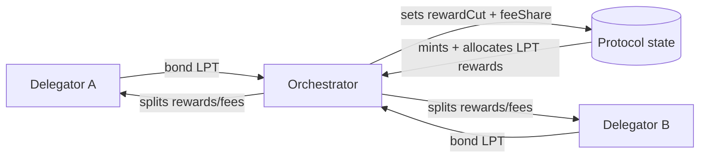
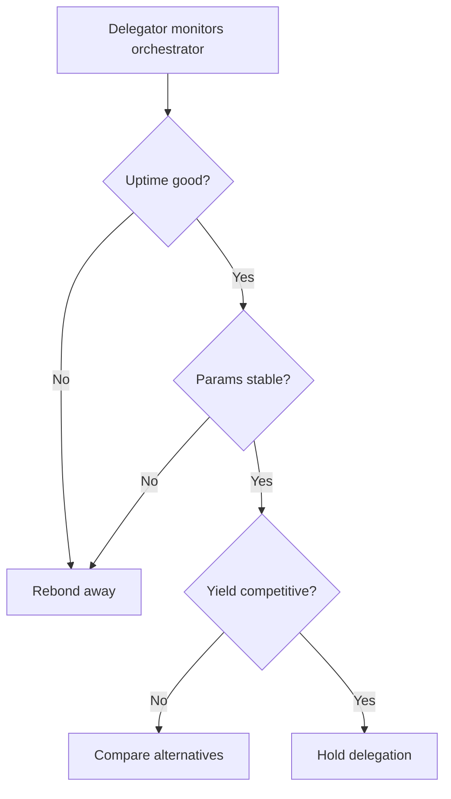

import { Callout, Tabs, Tab, Card, CardGroup, Steps, Accordion, AccordionItem, Badge } from "@mintlify/components";

# Delegation (Orchestrators)

Delegation is how third parties **bond LPT to your orchestrator**. It increases your bonded stake, can improve your position in protocol-defined sets, and increases your share of inflationary rewards. In return, you share rewards/fees with delegators according to your configured parameters.

This page is written for **orchestrators**, not delegators.

<Callout type="info" title="Protocol vs Network">
  <ul>
    <li><strong>Protocol</strong>: delegation changes bonded stake and therefore LPT reward allocation.</li>
    <li><strong>Network</strong>: delegation may influence perceived credibility, but routing and workload assignment can be gateway-driven (especially for AI).</li>
  </ul>
</Callout>

---

## 1) What delegation changes (protocol mechanics)

### Definitions

- \(b_{self}\): your self-bonded LPT
- \(b_{del}\): total delegated LPT bonded to you
- \(b_o = b_{self} + b_{del}\): total bonded stake to your orchestrator

Your share of minted LPT rewards each round scales with \(b_o\):

\[
R_{o,r} = M_r \cdot \frac{b_{o,r}}{B_r}
\]

Where \(M_r\) is minted LPT per round and \(B_r\) is total bonded LPT across all orchestrators.

### Practical takeaway

Delegation increases:

- total LPT rewards (inflation share)
- your network visibility (Explorer ranking, social proof)
- your ability to weather downtime without immediate delegator exit

Delegation does **not** guarantee more jobs.

---

## 2) What delegators evaluate (2026 reality)

Delegators behave like capital allocators. They decide based on:

1. **Uptime** (proof, not promises)
2. **Parameter stability** (rewardCut/feeShare churn kills trust)
3. **Yield expectations** (historic reward performance)
4. **Operator credibility** (incident response, transparency)
5. **Specialization** (video vs AI capability)

<CardGroup cols={3}>
  <Card title="Uptime" icon="activity">
    Publish uptime dashboards and historical downtime incidents.
  </Card>
  <Card title="Stability" icon="lock">
    Change parameters on a predictable schedule (monthly max).
  </Card>
  <Card title="Transparency" icon="eye">
    Public changelog + incident reports + roadmap.
  </Card>
</CardGroup>

---

## 3) Parameter strategy (rewardCut + feeShare)

Delegators care about what they keep.

- **rewardCut** determines the split of inflationary LPT rewards.
- **feeShare** determines the split of fees.

See `advanced-setup/rewards-and-fees` for full math.

### Operator best practices

- Keep parameters stable.
- If you must change, announce beforehand and explain why.
- Do not set “bait” parameters and then ratchet them.

<Callout type="warning" title="What gets you punished">
  Delegators coordinate. If you behave opportunistically (sudden cuts), you can lose delegation faster than you can replace it.
</Callout>

---

## 4) Delegation and routing: video vs AI

<Tabs>
  <Tab title="Video (transcoding)">
    <ul>
      <li>Delegation increases bonded stake, which can improve your position in protocol-defined participation sets.</li>
      <li>However, broadcaster/gateway routing policies still matter for actual job volume.</li>
      <li>Your strongest lever is still operational excellence: low error rate and fast segments.</li>
    </ul>
  </Tab>

  <Tab title="AI (inference pipelines)">
    <ul>
      <li>Do <strong>not</strong> assume “more stake = more AI jobs.” AI routing is frequently capability-aware (GPU/VRAM/model readiness/latency).</li>
      <li>Delegation still matters for protocol rewards and reputation, but AI job volume is primarily driven by gateway policy and demand characteristics.</li>
      <li>Your strongest lever is published benchmarks + model support + reliability under load.</li>
    </ul>
    <Callout type="info" title="Operator positioning">
      Delegation makes you a stronger protocol participant. AI jobs come when you’re the best match for a request.
    </Callout>
  </Tab>
</Tabs>

---

## 5) What to publish to attract delegators (operator “prospectus”)

A 2026-grade orchestrator should publish a one-page operator prospectus:

### Minimum contents

- Orchestrator address + Explorer link
- Uptime history (last 30/90/365 days)
- Hardware summary (GPU class, regions)
- Workload focus: video / AI / hybrid
- Parameters: rewardCut, feeShare, pricing
- Incident history (downtime, mitigations)
- Upgrade policy (how you handle releases)
- Support contact (Discord, email, forum)

<Callout type="tip" title="Where to put it">
  Put your operator prospectus in:
  <ul>
    <li>your orchestrator website</li>
    <li>a pinned forum post</li>
    <li>a GitHub repo README</li>
    <li>your Explorer profile fields (if supported)</li>
  </ul>
</Callout>

---

## 6) Operational behaviors that retain delegation

### Fast incident response

The fastest way to lose delegators is silence during outages.

Best practice:

- publish a status page
- announce incidents within minutes
- give ETA and updates
- post a postmortem

### Predictable upgrades

- pin versions
- stage upgrades
- announce major upgrades
- avoid “random restarts” during peak usage

### Proof of performance

- publish benchmark results
- publish p95 latency and error rates
- for AI: model list and versioning policy

---

## 7) Failure model: what can go wrong

<table>
  <thead>
    <tr>
      <th>Failure mode</th>
      <th>Impact</th>
      <th>Delegator perception</th>
      <th>Mitigation</th>
    </tr>
  </thead>
  <tbody>
    <tr>
      <td>Frequent downtime</td>
      <td>Lower fees + lower routing</td>
      <td>“Operator is unreliable”</td>
      <td>Redundancy, monitoring, SRE discipline</td>
    </tr>
    <tr>
      <td>Parameter churn</td>
      <td>Delegation exits</td>
      <td>“Untrustworthy”</td>
      <td>Stable schedule + transparent policy</td>
    </tr>
    <tr>
      <td>High error rate</td>
      <td>Gateways stop routing</td>
      <td>“Bad quality”</td>
      <td>QA, capacity headroom, canary testing</td>
    </tr>
    <tr>
      <td>AI mismatch (wrong models)</td>
      <td>Low AI job volume</td>
      <td>“Claims don’t match reality”</td>
      <td>Publish supported models + benchmarks</td>
    </tr>
  </tbody>
</table>

---

## 8) Mermaid diagrams

### Delegation relationship

### Delegator decision loop

---

## 9) Contract and ABI references (for automation)

If you’re building delegation tooling, use:

- protocol contracts source: https://github.com/livepeer/protocol
- explorer data: https://explorer.livepeer.org
- node implementation: https://github.com/livepeer/go-livepeer

<Callout type="warning" title="ABI best practice">
  Pin ABIs to:
  <ul>
    <li>protocol repo commit hash</li>
    <li>deployment address (chain-specific)</li>
    <li>verified explorer source (if available)</li>
  </ul>
</Callout>

---

## 10) Next pages

- `advanced-setup/run-a-pool` (if you want to operate a pool)
- `orchestrator-tools-and-resources/orchestrator-tools` (tooling)
- `orchestrator-tools-and-resources/orchestrator-community-and-help`

