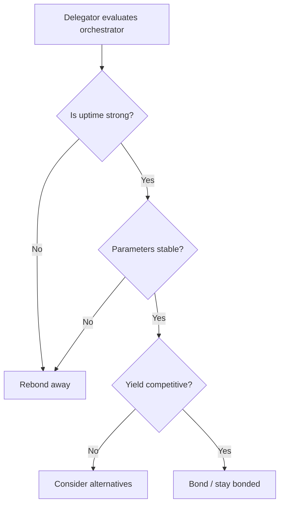

import { Callout, Tabs, Tab, Card, CardGroup, Steps, Accordion, AccordionItem } from "@mintlify/components";

# Rewards and Fees (Orchestrators)

Orchestrators earn from **two distinct mechanisms**:

1. **Protocol rewards (LPT inflation)** — minted each round and distributed to bonded stake.
2. **Network fees (ETH / payments for work)** — paid for successful work execution (classic transcoding uses ETH ticketing; AI payment paths depend on the product/gateway implementation).

This page explains:

- the exact conceptual math for reward distribution
- how orchestrator parameters affect operator vs delegator splits
- how to set parameters responsibly (and competitively)
- the difference between **protocol reward mechanics** and **network routing/market dynamics**

<Callout type="info" title="Protocol vs Network">
  <ul>
    <li><strong>Protocol</strong>: LPT issuance per round + distribution rules + parameter definitions.</li>
    <li><strong>Network</strong>: how jobs are routed, how prices are set, and which workloads your node actually receives.</li>
  </ul>
</Callout>

---

## 1) Definitions (you will see these everywhere)

Let:

- \(S_r\): total LPT supply in round \(r\)
- \(B_r\): total bonded LPT in round \(r\)
- \(p_r = B_r/S_r\): participation rate
- \(i_r\): inflation rate per round
- \(M_r = i_r \cdot S_r\): minted LPT rewards in round \(r\)

For orchestrator \(o\):

- \(b_{o,r}\): total bonded stake to orchestrator \(o\) (self + delegations)
- \(R_{o,r}\): minted LPT allocated to orchestrator \(o\) before splitting

Orchestrator configuration parameters:

- **rewardCut**: fraction of minted LPT that the orchestrator keeps as operator reward (0–100%)
- **feeShare**: fraction of fees that go to delegators (0–100%)

> Naming note: some UIs invert these (e.g. “delegator share”). Always verify which direction the UI uses.

---

## 2) Protocol rewards (LPT inflation)

### 2.1 How much LPT is minted each round?

Conceptual:

\[
M_r = i_r \cdot S_r
\]

Where \(i_r\) is adjusted each round based on participation vs target.

(See: `advanced-setup/staking-LPT` for the inflation adjustment rule.)

### 2.2 How does the protocol allocate minted LPT to an orchestrator?

Pro-rata to stake:

\[
R_{o,r} = M_r \cdot \frac{b_{o,r}}{B_r}
\]

This is the *gross* reward allocation associated with the orchestrator’s stake.

### 2.3 How is \(R_{o,r}\) split between operator and delegators?

Let **rewardCut** = fraction kept by operator.

\[
R^{op}_{o,r} = R_{o,r} \cdot rewardCut
\]
\[
R^{del}_{o,r} = R_{o,r} \cdot (1 - rewardCut)
\]

Then each delegator \(d\) bonded to \(o\) gets a proportional share:

\[
R_{d,r} = R^{del}_{o,r} \cdot \frac{b_{d,r}}{b_{o,r}}
\]

<Callout type="tip" title="Practical meaning">
  If you lower rewardCut, delegators earn more — which often attracts more delegation — which can increase \(b_{o,r}\) and therefore increase total rewards earned by your orchestrator.
</Callout>

---

## 3) Fees (payments for work)

Fees are **not minted**. Fees come from the demand side paying for work.

### 3.1 Video transcoding fee model (classic path)

For transcoding, Livepeer historically uses **probabilistic micropayments** (tickets) funded with **ETH**. Conceptually:

- a broadcaster/gateway deposits ETH
- sends probabilistic “tickets” as payment IOUs
- winning tickets are redeemed on-chain for ETH

This avoids per-segment on-chain payments.

<Callout type="info" title="Key point">
  Work is paid in <strong>ETH</strong>. LPT is for security + incentives.
</Callout>

### 3.2 AI fee model (product/gateway defined)

AI routing and payment can differ from video depending on the gateway implementation and billing path.

Do **not** assume “stake-weighted selection” for AI the same way as video. AI job assignment can be capability-aware:

- GPU model + VRAM
- model availability + warm state
- p95 latency
- error rates

Always treat AI routing as a **network/gateway policy**, not a protocol guarantee.

---

## 4) Fee split: orchestrator vs delegators

Let:

- \(F_{o}\): total fees earned by orchestrator \(o\) over some period
- **feeShare**: fraction passed to delegators

Then:

\[
F^{del}_{o} = F_{o} \cdot feeShare
\]
\[
F^{op}_{o} = F_{o} \cdot (1 - feeShare)
\]

And each delegator gets:

\[
F_{d} = F^{del}_{o} \cdot \frac{b_{d}}{b_{o}}
\]

---

## 5) Setting rewardCut and feeShare (operator strategy)

Setting parameters is both a **market decision** and a **trust decision**.

### Common parameter goals

- attract/stabilize delegation
- maximize long-term operator earnings
- remain competitive in your workload category

<Tabs>
  <Tab title="Video operators">
    <ul>
      <li>Delegators compare you to other orchestrators by <strong>uptime</strong>, <strong>historic yield</strong>, and <strong>parameter stability</strong>.</li>
      <li>Frequent parameter changes are a trust killer.</li>
      <li>Compete on reliability first, pricing second.</li>
    </ul>
  </Tab>

  <Tab title="AI operators">
    <ul>
      <li>Routing is often capability-driven; your GPU class and latency profile can dominate.</li>
      <li>Parameters still matter for attracting bonded stake and earning LPT rewards.</li>
      <li>Publish benchmarks and model/version policy; that is the AI equivalent of “uptime proof.”</li>
    </ul>
  </Tab>
</Tabs>

### Suggested operator policy (simple, high-trust)

<CardGroup cols={2}>
  <Card title="Parameter stability" icon="lock">
    Commit to changing rewardCut/feeShare no more than monthly unless there is an emergency.
  </Card>
  <Card title="Transparency" icon="eye">
    Publish a changelog: what changed, why, and when.
  </Card>
</CardGroup>

---

## 6) Worked examples

### Example A: rewardCut tradeoff

Assume in a round:

- \(R_{o,r} = 100\) LPT gross rewards allocated to orchestrator \(o\)
- Delegator stake exists (not just self-bond)

If **rewardCut = 10%**:

- operator gets \(10\) LPT
- delegators get \(90\) LPT split pro-rata

If **rewardCut = 30%**:

- operator gets \(30\) LPT
- delegators get \(70\) LPT

If a lower rewardCut increases delegation enough to increase \(b_{o,r}\), you may end up earning **more total LPT** even at a lower operator percentage.

### Example B: feeShare

Assume monthly fees \(F_o = 5\) ETH.

If **feeShare = 70%**:

- delegators get \(3.5\) ETH
- operator gets \(1.5\) ETH

---

## 7) Operational risks that affect rewards

If you lose uptime, you lose:

- job routing
- fee revenue
- delegator trust (delegation can leave rapidly)

### The three failure modes that kill operator earnings

1. **Unreliable ticket redemption** (you did work but can’t collect)
2. **High error rates** (gateways stop routing)
3. **Parameter churn** (delegators leave)

---

## 8) Mermaid diagrams

### How value flows (protocol + network)

```mermaid
flowchart LR
  subgraph Network[Off-chain network]
    GW[Gateway/Broadcaster] -->|routes job| O[Orchestrator node]
    O -->|returns output| GW
  end

  subgraph Payments[Fees]
    GW -->|pays fees (ETH path for video)| O
  end

  subgraph Protocol[On-chain protocol]
    INF[Inflation per round] --> BM[Bonding state]
    BM -->|allocates LPT rewards| O
    BM -->|allocates delegator share| D[Delegators]
  end

  O -->|config: rewardCut + feeShare| Protocol
  D -->|bond LPT| BM
```

### Parameter impact on delegator decision



---

## 9) Builder references (ABI / contracts)

For production tooling:

- Protocol contracts: https://github.com/livepeer/protocol
- Node implementation: https://github.com/livepeer/go-livepeer
- Explorer: https://explorer.livepeer.org

<Callout type="warning" title="ABI sourcing">
  ABIs should be sourced from compiled artifacts pinned to a specific commit hash of the protocol repo, and matched to the deployed contract addresses.
</Callout>

---

## 10) What to do next

- If you’re setting up an orchestrator: go to `setting-up-an-orchestrator/orchestrator-stats` and `orchestrator-tools-and-resources/orchestrator-tools`.
- If you want delegation: go to `advanced-setup/delegation`.
- If you’re running AI: go to `advanced-setup/ai-pipelines`.

