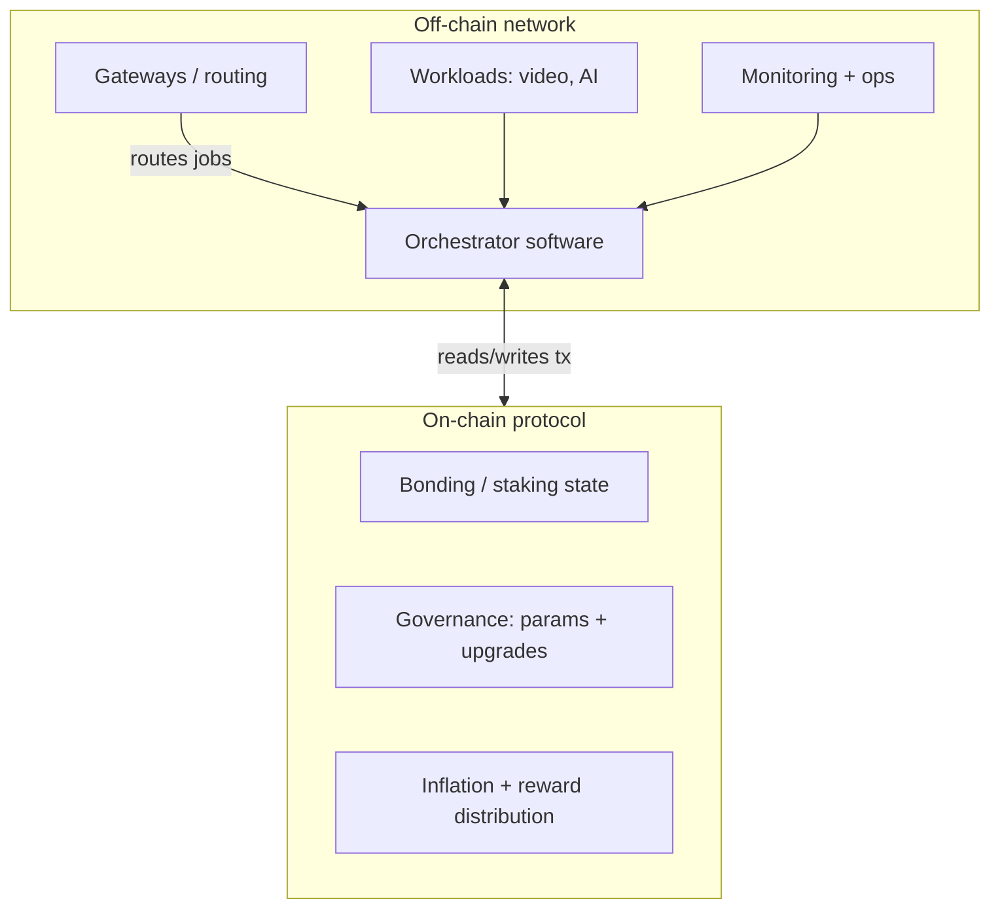

import { Callout, Tabs, Tab, Card, CardGroup, Steps, Accordion, AccordionItem } from "@mintlify/components";

# Staking LPT (Orchestrators)

LPT staking is how Livepeer **secures participation and aligns incentives** for work that happens off-chain. In plain terms:

- **ETH pays for work** (video transcoding fees; and, depending on the product path, other workloads).
- **LPT secures the network** by putting value at risk and distributing inflationary rewards to participants who keep the system honest.

This page explains the *mechanics* of staking for orchestrators (and delegators), what it affects in the protocol, and how it relates to the off-chain network.

<Callout type="info" title="Protocol vs Network (keep this mental split)">
  <ul>
    <li><strong>Protocol</strong>: on-chain rules (bonding, rounds, inflation rate adjustment, reward distribution, governance).</li>
    <li><strong>Network</strong>: off-chain nodes + routing (orchestrator software, gateways, selection/routing policies, benchmarking, marketplace UX).</li>
  </ul>
</Callout>

---

## Who stakes, and why

<CardGroup cols={2}>
  <Card title="Orchestrators" icon="microchip">
    Run GPU infrastructure and node software. Stake (self-bond) LPT to become eligible for certain protocol roles and to receive protocol rewards.
  </Card>
  <Card title="Delegators" icon="handshake">
    Bond LPT to an orchestrator. Delegators amplify the orchestrator’s stake and share in rewards/fees according to that orchestrator’s fee and reward policies.
  </Card>
</CardGroup>

### What staking does (in the protocol)

Staking affects:

1. **Bonding weight / participation rate** (the ratio of bonded LPT to total supply).
2. **Reward distribution** (inflationary LPT minted each round and distributed pro‑rata to bonded stake).
3. **Orchestrator activation sets** (an “active set” of orchestrators can be used for protocol-defined eligibility).
4. **Slashing exposure** (bonded stake is the economic backstop when penalties apply).

### What staking does *not* do (in the protocol)

- It does **not** pay for jobs. Work is paid with **ETH** (for the classic transcoding micropayment path).
- It does **not** inherently guarantee an orchestrator gets tasks. **Routing and selection** can be workload- and product-specific (network layer).

---

## High-level staking lifecycle

<Steps>
  <Steps.Step title="Choose how you participate">
    Decide whether you are:
    <ul>
      <li><strong>Running an orchestrator</strong> (self-bond + optional delegated stake)</li>
      <li><strong>Delegating only</strong> (bond to an orchestrator)</li>
    </ul>
  </Steps.Step>

  <Steps.Step title="Bond (stake) LPT">
    You bond LPT to an orchestrator address. Bonded stake is tracked by the protocol.
  </Steps.Step>

  <Steps.Step title="Accrue rewards each round">
    Each round, the protocol mints new LPT (inflationary rewards) and distributes it across participating stake. Orchestrators may also accrue fees from work.
  </Steps.Step>

  <Steps.Step title="Unbond and withdraw (cooldown)">
    Unbonding starts a cooldown period. After it completes, you can withdraw.
  </Steps.Step>
</Steps>

---

## Rounds, participation rate, and inflation

Livepeer progresses in discrete **rounds** (roughly daily cadence). Each round:

- The protocol reads the **participation rate** (bonded stake ÷ total supply).
- The **inflation rate** is adjusted up/down to push participation toward a target.
- New LPT is minted and distributed to participating stake.

### Definitions

Let:

- \(S_r\) = total LPT supply at round \(r\)
- \(B_r\) = total bonded LPT at round \(r\)
- \(p_r\) = participation rate at round \(r\) = \(B_r / S_r\)
- \(p^*\) = participation target (protocol parameter)
- \(i_r\) = inflation per round at round \(r\) (protocol parameter)
- \(\Delta i\) = inflationChange per round (protocol parameter)

### Inflation adjustment rule

The protocol adjusts inflation based on whether \(p_r\) is above or below the target:

- If \(p_r < p^*\): increase inflation
  \[
  i_{r+1} = i_r + \Delta i
  \]

- If \(p_r > p^*\): decrease inflation
  \[
  i_{r+1} = \max(0, i_r - \Delta i)
  \]

### Minted LPT per round

Newly minted LPT for rewards in a round is approximately:

\[
M_r = i_r \cdot S_r
\]

Where \(i_r\) is expressed as a fraction per round (e.g. 0.0004985 for 0.04985% per round).

<Callout type="warning" title="Where to verify the current parameters">
  Inflation, participation target, and inflationChange are protocol parameters and can change via governance. Always verify current on-chain values via the Livepeer Explorer and the contract read methods.
</Callout>

### Example (human-readable)

If:

- Total supply \(S_r = 33,380,245\) LPT
- Inflation \(i_r = 0.0004985\) (0.04985% per round)

Then minted that round:

\[
M_r \approx 33,380,245 \times 0.0004985 \approx 16,640\,\text{LPT}
\]

---

## Reward distribution: orchestrator + delegator splits

At a high level, minted rewards are distributed **pro‑rata** to bonded stake, then split between:

- the **orchestrator** (as operator reward), and
- the **delegators** bonded to that orchestrator,

based on the orchestrator’s configured fee/reward parameters.

### Reward math (conceptual)

Let:

- \(b_{o,r}\) = total bonded stake to orchestrator \(o\) at round \(r\)
- \(B_r\) = total bonded stake across all orchestrators
- \(M_r\) = minted rewards for round \(r\)

Then orchestrator \(o\)’s gross reward allocation is approximately:

\[
R_{o,r} = M_r \cdot \frac{b_{o,r}}{B_r}
\]

Each delegator \(d\) bonded to \(o\) receives a share according to their bonded amount \(b_{d,r}\) and the orchestrator’s reward cut.

<Accordion>
  <AccordionItem title="What you should take away (don’t overfit the formula)">
    <ul>
      <li>Rewards scale with <strong>your share of total bonded stake</strong>.</li>
      <li>Orchestrator configuration (reward cut / fees) determines the split.</li>
      <li>Bonded stake exposes you to <strong>orchestrator behavior risk</strong> if slashing applies.</li>
    </ul>
  </AccordionItem>
</Accordion>

---

## Slashing and risk model

LPT staking only works if there’s real downside for misbehavior.

### What slashing is

Slashing is a protocol penalty applied to bonded stake when an orchestrator violates protocol rules or fails required checks.

### Who takes the hit

- If you are an **orchestrator**: your self-bond is at risk.
- If you are a **delegator**: the stake you bonded to that orchestrator can be at risk.

<Callout type="danger" title="Practical consequence">
  Delegating is not “set and forget.” You are choosing an operator and inheriting their operational and compliance risk.
</Callout>

---

## Network layer nuance: video vs AI workloads

Livepeer supports multiple workload paths. The relationship between staking and *job routing* depends on the workload and the product surface.

<Tabs>
  <Tab title="Video transcoding">
    <ul>
      <li><strong>Payment</strong>: ETH via probabilistic micropayments (ticketing).</li>
      <li><strong>Stake</strong>: secures participation and drives protocol rewards; can influence eligibility in protocol-defined sets.</li>
      <li><strong>Routing</strong>: depends on broadcaster/gateway selection policies and available orchestrators (network layer).</li>
    </ul>
  </Tab>

  <Tab title="AI Pipelines">
    <ul>
      <li><strong>Payment + routing</strong>: depends on the Livepeer AI pipeline implementation (gateway + worker stack). Routing may prioritize capability (GPU model, memory), performance, and price signals.</li>
      <li><strong>Stake</strong>: may still be used for protocol participation and incentives, but <em>do not assume</em> “more stake = more AI jobs.”</li>
      <li><strong>Source of truth</strong>: check the current AI worker + runner repos and the gateway docs for routing/selection logic.</li>
    </ul>
    <p>
      Start here: <a href="https://github.com/livepeer/ai-runner">livepeer/ai-runner</a> and <a href="https://github.com/livepeer/go-livepeer">livepeer/go-livepeer</a>.
    </p>
  </Tab>
</Tabs>

---

## How to stake (operator and delegator)

<Callout type="info" title="Tools you’ll use">
  Typical paths include:
  <ul>
    <li>Livepeer Explorer (UI for bonding/delegating)</li>
    <li>CLI / scripts (advanced operators)</li>
    <li>Contracts + ABI (for custom tooling)</li>
  </ul>
</Callout>

### Delegator path (bond to an orchestrator)

1. Choose an orchestrator with strong uptime, reasonable fees, and transparent ops.
2. Bond your LPT to that orchestrator address.
3. Track performance and reward parameters.
4. Rebond if the operator deteriorates.

### Orchestrator path (self-bond + attract delegation)

1. Run the orchestrator stack reliably (GPU, networking, monitoring).
2. Self-bond enough LPT to signal alignment.
3. Publish clear fee/reward parameters.
4. Provide proof of performance (uptime, benchmarks, responsiveness).

---

## ABI and contract references (for builders)

If you’re building tools (dashboards, bots, custom staking UIs), you’ll want:

- The **protocol contracts repository** (Solidity source):
  - https://github.com/livepeer/protocol
- A canonical list of **contract addresses by chain** (docs page):
  - https://docs.livepeer.org (search “contracts” / “addresses”)
- Explorer read methods for current values (inflation, participation, stake distributions):
  - https://explorer.livepeer.org

<Callout type="warning" title="ABI note">
  The protocol repo contains Solidity sources; ABIs are typically produced by compiling the repo (Hardhat) and/or referenced via deployment artifacts. For production tooling, always pin:
  <ul>
    <li>repo commit hash</li>
    <li>deployment network</li>
    <li>contract address</li>
    <li>ABI artifact file</li>
  </ul>
</Callout>

---

## Mermaid diagrams

### Staking + rewards flow (protocol view)

```mermaid
flowchart LR
  D[Delegator] -->|bond LPT| BM[(Bonding Manager)]
  O[Orchestrator] -->|self-bond LPT| BM
  BM -->|tracks bonded stake| S[(State)]

  subgraph Round[Each round]
    M[Minter] -->|mints M_r = i_r * S_r| BM
    BM -->|distributes rewards pro-rata| O
    BM -->|distributes rewards via orchestrator| D
  end

  G[Governance] -->|can update params (p*, Δi)| BM
```

### Protocol vs network boundary (operator mental model)



---

## Practical checklist (operators)

<CardGroup cols={2}>
  <Card title="Before you stake" icon="check">
    <ul>
      <li>Baseline hardware + bandwidth meets your workload (video vs AI).</li>
      <li>Monitoring + alerting is in place.</li>
      <li>Wallet security: hardware wallet / multisig operational process.</li>
      <li>Clear public operator policy: fees, reward cut, uptime promises.</li>
    </ul>
  </Card>
  <Card title="After you stake" icon="activity">
    <ul>
      <li>Track rounds: reward accrual and parameter shifts.</li>
      <li>Benchmark performance and publish results.</li>
      <li>Keep software current (node releases).</li>
      <li>Respond fast to incidents; delegators churn when you go dark.</li>
    </ul>
  </Card>
</CardGroup>

---

## Further resources

- Protocol contracts (source of truth): https://github.com/livepeer/protocol
- Node implementation (orchestrator + broadcaster): https://github.com/livepeer/go-livepeer
- Livepeer Explorer (stake + parameters): https://explorer.livepeer.org
- Official docs: https://docs.livepeer.org

<Callout type="info" title="Want this page to include exact current parameter values?">
  If you want, we can add a “Live parameters” panel that you update manually each quarter (or wire to an API if Livepeer exposes one). For now, this page is structured so the parameters are clearly defined and the verification steps are explicit.
</Callout>

