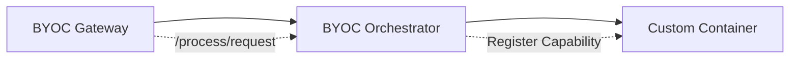

V2 Docs are being ported in to this repo.

I will work on a branch called docs-v2 and then merge into main when fully ready
and deprecate the old docs into a v1 on the new docs.

Add to all pages: [SEO](https://www.mintlify.com/docs/optimize/seo) eg

---

## "twitter:image": "/images/social-preview.jpg"

## Search Keywords eg:

## keywords: ['configuration', 'setup', 'getting started']

TODO:

- Remove/Change Navbar in V2 (Global Setting)
- Add redirects (Global Setting)
- Add Analytics (Global Setting)
- Add Footer (Global Setting)
- Add SEO (Global Setting)
- Add Custom Domain (Global Setting)
- Add Custom 404 (Global Setting)?
- "description":
  "
  \n Sorry About That."
- "description":
  ""

Notes from stakeholders/feedback

- “The gateways section should definitely include… technical documentation on
  how to run and operate a gateway node because that’s missing.”
-

Notes on layout

- Consider moving resource and help anchors to right tabs on menu (styling).
  Would prefer navbar buttons - but external links only there :/

- Consider having an Index & FAQ/Glossary page in each tab - Possibly use AI to
  make it per page (llm intiially then n8n integration keeps it updated)

About:

- Protocol: Called Protocol Actors or Network Participants? Both?
- I am not convinced about the side bar sections.

Removing: "v2/about/livepeer-protocol/livepeer-actors/gateways",
"v2/about/livepeer-protocol/livepeer-actors/orchestrators",
"v2/about/livepeer-protocol/livepeer-actors/delegators",
"v2/about/livepeer-protocol/livepeer-actors/end-users"

Community

- move HUBS to appropriate tabs
- Hate the naming of all connect items.

Developer

Gateways

## Components Organisation Options

**Atomic Design (Brad Frost)** atoms/ → Smallest units (Button, Icon, Input)
molecules/ → Combinations of atoms (SearchBar = Input + Button) organisms/ →
Complex sections (Header, Footer, Card) templates/ → Page layouts pages/ →
Specific instances

**2. By Function/Purpose**

primitives/ → Base UI (Button, Text, Box) forms/ → Inputs, Select, Checkbox,
Validation layout/ → Grid, Stack, Container, Spacer navigation/ → Tabs,
Breadcrumb, Menu, Sidebar feedback/ → Alert, Toast, Modal, Spinner data-display/
→ Table, List, Card, Badge media/ → Image, Video, Avatar, Icon

**3. By Complexity/Abstraction** base/ → Unstyled primitives core/ → Styled
basics with no logic composite/ → Composed from multiple core smart/ → Stateful,
connected to data

**4. Shadcn/Radix Style** (flat + registry) ui/ button.jsx card.jsx dialog.jsx
...

**5. Domain-First** (feature folders) components/ auth/ → LoginForm, SignupForm
dashboard/ → Charts, Stats checkout/ → Cart, Payment shared/ → Reusable across
domains

======

#### Direct Usage & Platform Integration

| Category           | Reason                 | Business Explanation                                                                                                                      |
| ------------------ | ---------------------- | ----------------------------------------------------------------------------------------------------------------------------------------- |
| Direct Usage / Ops | Run your own workloads | Content providers run gateways to process their own video/AI workloads end-to-end, controlling ingestion, routing, retries, and delivery. |

#### Reliability, Performance & QoS

| Category    | Reason                             | Business Explanation                                                                                  |
| ----------- | ---------------------------------- | ----------------------------------------------------------------------------------------------------- |
| Reliability | Enforce SLAs on orchestrators      | Gateways select orchestrators, apply retries/failover, and enforce latency and uptime guarantees.     |
| Reliability | QoS enforcement & workload shaping | Gateways control routing, retries, failover, and latency-vs-cost trade-offs beyond protocol defaults. |

#### Platform

| Category | Reason                    | Business Explanation                                                            |
| -------- | ------------------------- | ------------------------------------------------------------------------------- |
| Platform | Embed in a larger product | Gateways act as internal infrastructure powering broader media or AI platforms. |

#### Economics

| Category  | Reason                         | Business Explanation                                                                                    |
| --------- | ------------------------------ | ------------------------------------------------------------------------------------------------------- |
| Economics | Service-layer monetization     | Service providers charge end users above orchestrator cost for reliability, compliance, or convenience. |
| Economics | Avoid third-party gateway fees | Running your own gateway avoids routing fees, pricing risk, and policy constraints imposed by others.   |

#### Demand Control & Traffic Ownership

| Category       | Reason                                 | Business Explanation                                                                                           |
| -------------- | -------------------------------------- | -------------------------------------------------------------------------------------------------------------- |
| Demand Control | Demand aggregation & traffic ownership | Gateways own ingress, customer relationships, usage data, and traffic predictability across apps or customers. |
| Demand Control | Workload normalization                 | Gateways smooth bursty demand into predictable, orchestrator-friendly workloads.                               |

#### Performance

| Category    | Reason                      | Business Explanation                                                                                |
| ----------- | --------------------------- | --------------------------------------------------------------------------------------------------- |
| Performance | Geographic request steering | Gateways route users to regionally optimal orchestrators to reduce latency and improve reliability. |

#### Security & Compliance

| Category | Reason                            | Business Explanation                                                                       |
| -------- | --------------------------------- | ------------------------------------------------------------------------------------------ |
| Security | Enterprise policy enforcement     | Gateways enforce IP allowlists, auth, rate limits, audit logs, and deterministic behavior. |
| Security | Cost-explosion & abuse protection | Gateways block buggy or malicious clients before they generate runaway compute costs.      |

#### Product Differentiation & UX

| Category | Reason                                 | Business Explanation                                                                                    |
| -------- | -------------------------------------- | ------------------------------------------------------------------------------------------------------- |
| Product  | Product differentiation above protocol | Custom APIs, SDKs, dashboards, billing abstractions, and AI workflow presets live at the gateway layer. |
| Product  | Stable API surface                     | Gateways shield customers from protocol or orchestrator churn via versioning and controlled change.     |

#### Observability & Feedback Loops

| Category      | Reason                     | Business Explanation                                                                                   |
| ------------- | -------------------------- | ------------------------------------------------------------------------------------------------------ |
| Observability | Analytics & feedback loops | Gateways see end-to-end request patterns, failures, latency, model performance, and customer behavior. |

#### Strategy, Optionality & Ecosystem Power

| Category | Reason                 | Business Explanation                                                                                     |
| -------- | ---------------------- | -------------------------------------------------------------------------------------------------------- |
| Strategy | Strategic independence | Running your own gateway avoids pricing, roadmap, availability, and censorship risk from other gateways. |
| Strategy | Future optionality     | Early gateway operators gain leverage if incentives or network economics evolve.                         |

#### Ecosystem Influence

| Category  | Reason              | Business Explanation                                                                                                 |
| --------- | ------------------- | -------------------------------------------------------------------------------------------------------------------- |
| Ecosystem | Ecosystem influence | Gateways sit at a coordination choke-point that shapes standards, surfaces protocol gaps, and influences real usage. |

## NOTES ON SOME FETCHED DATA

Since useState, useEffect, and fetch work in Mintlify JSX components, you can
pull:

Release info - versions, release notes, assets, dates Repo stats - stars, forks,
open issues count File contents - README, config files, code examples (via
raw.githubusercontent.com) Contributors - list of contributors, avatars Commit
history - recent commits, changelog-style updates Issues/PRs - open issues
count, specific issue details

**EXAMPLE**

I'm fetching the latest release of livepeer dynamically in some places eg.
gateways/linux-install. with a github action `latestVersion` and
`latestVersionUrl` are saved in `/snippets/automations/globals/globals.mdx`.

### !!! Caveats:

- Rate limits - GitHub API is 60 requests/hour for unauthenticated requests. If
  many users load the page, could hit limits
- Client-side loading - Shows"loading..." briefly before content appears
- No SSR - Content won't be in the initial HTML (affects SEO if that matters)

### Future Recommendation:

For high-traffic pages, we might want a build-time approach instead (fetch once
during deploy, not on every page load).

Then we can use a n8n hook or github action to redeploy the docs when a new
release is published.

# AI Workers

AI workers are run when you start a node with the -aiWorker flag. They can run
in two modes:

Combined with Orchestrator (-orchestrator -aiWorker): The orchestrator also runs
AI processing locally Standalone AI Worker (-aiWorker only): Connects to a
remote orchestrator via gRPC

Key Points: AI workers are the component that actually runs Docker containers
starter.go:1345-1349 Gateways only route requests and handle payments; they
don't run containers byoc.go:25-35 BYOC containers are managed by the AI
worker's Docker manager For CPU models, you don't need the -nvidia flag
starter.go:1296-1300

Notes The -aiModels flag is required for AI workers to know which containers to
load starter.go:1499-1502 BYOC was introduced as the "Generic Processing
Pipeline" in v0.8.5 CHANGELOG.md:94 Your BYOC container must implement
Livepeer's processing API to be compatible

## RTMP

RTMP is required when:

You need to accept video streams from RTMP sources (OBS, FFmpeg, etc.) You're
running a traditional video broadcasting gateway RTMP is NOT needed when:

You only need HTTP API access You're using HTTP push ingest only The gateway is
purely for AI processing requests

## HTTP

You don't need to specify HTTP settings when:

Testing locally on the same machine Only need RTMP ingest from external sources
Don't need HLS playback or API access from outside

Add HTTP port when:

You need HLS video playback from external players Want HTTP video ingest from
remote sources Need API access from other services

## Off-chain PRODUCTION Gateways

An off-chain production gateway is possible because Livepeer doesn't require
blockchain interaction for basic video processing - it can operate as a
centralized service connecting directly to orchestrators. However, Livepeer is
not traditional P2P software; it's a **client-server architecture** with
specialized node types.

##### Off-Chain Production Gateway

Off-chain mode skips all Ethereum initialization and blockchain interactions.

The gateway operates by:

- Direct Orchestrator Connection: Uses -orchAddr to connect directly to
  orchestrator(s)
- No Blockchain Dependencies: No need for -ethUrl, keystore, or ETH tokens
- Local Verification Only: Disables on-chain verification by default

##### Architecture: Client-Server (Hub-and-Spoke), Not P2P

Livepeer uses a hub-and-spoke model, not P2P:

`Gateway → Orchestrator → Transcoder`

- Gateways accept streams and route jobs
- Orchestrators coordinate transcoding
- Transcoders process video

Communication happens via HTTP/gRPC protocols, notpeer-to-peer networking .

##### When to Use Off-Chain Production

Off-chain is suitable for:

- Private video processing infrastructure
- Development/testing environments
- When you don't need economic incentives or public discovery

On-chain is needed for:

- Public, decentralized video processing
- Economic incentives and staking
- Access to the broader Livepeer protocol network

##### Notes

- Off-chain gateways are fully functional for video processing but operate in
  isolation
- The test suite includes off-chain gateway tests
- Development configurations show both off-chain and on-chain modes as
  first-class citizens.

##### WILD, But enterprise whitelabel?

This is wild. It's seriously crazy you can use the software WITH **NO REAL
incentive** to join the network. Because Gateways have no real incentives & if
you have an Orchestrator... you have a gateway probably. And orchestrators are
doing no work and getting rewarded by an inflationary token. **WILD**.

!! **BUT** !! its a good basis for an enterprise version.

---

## Gateway Economics

gateways themselves don't receive direct protocol incentives. The economic
incentives in Livepeer are designed for orchestrators and transcoders, not
gateways.

**Who Gets Incentives** The Livepeer protocol's token incentives are targeted
at:

- Orchestrators: Earn fees for transcoding services and can redeem winning
  tickets multi-o.md:25-51
- Transcoders: Process video and get paid by orchestrators
- Reward Service: Registered addresses can call reward functions to mint LPT
  ethereum.md:3-13 _delegators_ ?

Gateways are essentially routing infrastructure - they accept streams and
forward jobs to orchestrators, but don't participate in the protocol's economic
system directly.

**Why Run a Gateway Anyway**

Despite no direct incentives, gateways serve important purposes:

1. Service Providers: Companies can offer video streaming services to customers,
   charging them directly while using Livepeer orchestrators for processing
2. Private Infrastructure: Off-chain gateways enable private video processing
   without blockchain overhead starter.go:743-749 Control & Customization:
3. Gateways can add authentication, custom APIs, and business logic on top of
   the core protocol
4. Development & Testing: Essential for building and testing applications on the
   Livepeer network

**Economic Model**

The incentive structure assumes:

- End users pay gateways for video services
- Gateways pay orchestrators for transcoding work
- Orchestrators earn protocol rewards and fees

This creates a market where gateways **compete on service quality, price, and
features**, while the protocol ensures reliable transcoding through orchestrator
incentives.

**Notes**

- Off-chain gateways operate entirely outside the economic system - they're just
  routing software starter.go:743-749
- On-chain gateways still don't earn rewards, but can participate in the broader
  protocol ecosystem
- The design separates concerns: infrastructure (gateways) from processing
  (orchestrators) from security (protocol incentives)

---

## Transcoder Role

Transcoders in Livepeer process video segments and receive payments from
orchestrators through a ticket-based micropayment system. The orchestrator
handles payments from broadcasters and then compensates transcoders for their
work.

#### Payment Flow

1. Broadcaster to Orchestrator The broadcaster sends payment tickets along with
   video segments to the orchestrator. The `ProcessPayment` function in the
   orchestrator validates these tickets and tracks the balance [1](#26-0) :

```go
func (orch *orchestrator) ProcessPayment(ctx context.Context, payment net.Payment, manifestID ManifestID) error
```

1. Fee Calculation After transcoding completes, the orchestrator debits fees
   based on the total pixels processed [2](#26-1) :

```go
// Debit the fee for the total pixel count
h.orchestrator.DebitFees(sender, core.ManifestID(segData.AuthToken.SessionId), payment.GetExpectedPrice(), pixels)
```

1. Payment Structure Payments use a probabilistic ticket system with these key
   components [3](#26-2) :

- `TicketParams` - Parameters for probabilistic micropayment tickets
- `ExpectedPrice` - The orchestrator's advertised price per pixel
- `Sender` - The broadcaster's Ethereum address

#### Transcoder Compensation

While the code shows how orchestrators receive payments from broadcasters, the
actual mechanism for orchestrators paying transcoders is not explicitly visible
in the provided snippets. However, based on the architecture:

1. **Local Transcoding**: When using `-orchestrator -transcoder`, the
   orchestrator processes jobs locally, so no external payment is needed
2. **Remote Transcoders**: For separate transcoder nodes, payment would happen
   through the `RemoteTranscoderManager` [4](#26-3)

#### Key Points

- Transcoders don't directly interact with broadcasters - all payments flow
  through orchestrators
- The system uses probabilistic micropayments to avoid on-chain transactions for
  every segment
- Payment amounts are calculated based on pixel count and price per pixel
  [5](#26-4)
- Winning tickets can be redeemed on-chain for actual ETH tokens

#### Notes

The actual payment flow from orchestrator to transcoder appears to be handled
internally within the orchestrator component, but the specific implementation
isn't visible in the provided code snippets. The architecture suggests this is
managed through balance tracking and off-chain settlement mechanisms.

## Transcoder Role 2

A transcoder is not the same as an orchestrator - they are distinct roles in the
Livepeer network, though they can be combined on the same node.

Key Differences

**Orchestrator**

- Coordinates work: Manages payments, job distribution, and orchestrator
  discovery orchestrator.go:48-53
- Handles economics: Processes payments and validates tickets
  orchestrator.go:105-130
- Manages capacity: Tracks available transcoders and their capabilities
  orchestrator.go:81-91

**Transcoder**

- Processes video: Actually performs the video transcoding work using ffmpeg
- Registers with orchestrator: Connects to orchestrators to receive work
  ot_rpc.go:99-104
- Standalone or combined: Can run separately or on the same node as orchestrator

**Architecture Flow**

`Gateway → Orchestrator → Transcoder`

The orchestrator acts as the middleman - it receives jobs from gateways, handles
payments, then distributes the actual transcoding work to registered transcoders
lp_rpc.proto:23-28 .

**Combined Mode**

Many operators run both roles together with -orchestrator -transcoder flags
README.md:36-37 . In this mode:

- The orchestrator processes jobs locally instead of sending to remote
  transcoders
- This is simpler for small deployments
- But they remain logically separate components

**Notes**

- The node types are explicitly defined as separate enums in the code
  livepeernode.go:44-51
- Orchestrators can manage multiple transcoders for scaling multi-o.md:5
- **In production, large operators often split these roles across different
  machines for better scaling and reliability**

---

## Node Types

a gateway cannot also be a transcoder. These are distinct node types in
Livepeer - a gateway runs as a BroadcasterNode while a transcoder runs as a
TranscoderNode livepeernode.go:44-51 .

**Node Types Are Mutually Exclusive**

When starting a Livepeer node, you choose one primary role:

-gateway makes the node a BroadcasterNode starter.go:694-698 -transcoder makes
the node a TranscoderNode starter.go:690-691 -orchestrator makes the node an
OrchestratorNode starter.go:681-682

The starter code enforces this by setting n.NodeType to exactly one type
starter.go:679-701 .

**What Can Be Combined**

Only orchestrators can have dual roles:

Orchestrator + Transcoder: Use -orchestrator -transcoder flags README.md:36-37
Orchestrator + AI Worker: Use -orchestrator -aiWorker flags A gateway always
remains just a gateway - it routes requests but doesn't process video itself.

**Architecture Flow**

`Gateway (BroadcasterNode) → Orchestrator (can also transcode) → Transcoder (if separate)`

The gateway's job is to accept streams and forward jobs to orchestrators . It
never performs transcoding itself.

**Notes** You cannot run -gateway -transcoder together - the flags are mutually
exclusive For small deployments, use -orchestrator -transcoder on one node For
large deployments, split roles: separate gateway, orchestrator, and transcoder
nodes

---

## -aiServiceRegistry (For on-chain AI gateways to discover AI orchestrators)

The -aiServiceRegistry flag is used to enable the AI Service Registry contract
for on-chain AI deployments. It's not exclusively for orchestrators - it can be
used by any node type (gateways, orchestrators, AI workers) when running in
on-chain mode with AI capabilities.

**Purpose**

When -aiServiceRegistry is set to true, the node uses a specific ServiceRegistry
contract address for the Livepeer AI Subnet instead of the default protocol
ServiceRegistry starter.go:842-844 :

```go
  if *cfg.AIServiceRegistry {
      // For the time-being Livepeer AI Subnet uses its own ServiceRegistry, so we define it here
      ethCfg.ServiceRegistryAddr = ethcommon.HexToAddress("0x04C0b249740175999E5BF5c9ac1dA92431EF34C5")
  }
```

**Who Uses It**

- Gateways: For on-chain AI gateways to discover AI orchestrators
  development.md:352-365
- Orchestrators: For on-chain AI orchestrators to register their AI capabilities
  development.md:314-326 AI Workers: Not typically needed since
- AI workers connect directly to orchestrators

**When to Use**

Use -aiServiceRegistry when:

- Running on-chain **(off-chain mode doesn't need it)**
- Your node needs to interact with AI services
- You want to use the Livepeer AI Subnet's dedicated service registry

**Example Usage**

```bash
# On-chain AI Gateway
livepeer -gateway -aiServiceRegistry -network arbitrum-one-mainnet

# On-chain AI Orchestrator
livepeer -orchestrator -aiWorker -aiServiceRegistry -network arbitrum-one-mainnet
```

**Notes**

- The flag defaults to false starter.go:229
- It's only relevant for on-chain deployments flags.go:57
- The AI Subnet uses a separate ServiceRegistry to isolate AI services from
  general transcoding services

---

## -transcodingOptions

You're right to be confused! Gateways don't transcode video themselves, but they
still need `transcodingOptions` to tell orchestrators WHAT video profiles to
create. [1](#31-0)

**Why Gateways Need Transcoding Options**

Gateways use `transcodingOptions` to:

1. **Specify desired output profiles** - Tell orchestrators which video
   renditions to create (240p, 360p, 720p, etc.)
2. **Include in segment requests** - The profiles are sent to orchestrators with
   each video segment [2](#31-1)
3. **Sign with requests** - The broadcaster signs segments including the profile
   hash [3](#31-2)

**How It Works**

When a gateway starts, it parses the transcoding options and stores them in
`BroadcastJobVideoProfiles` [4](#31-3) . Later, when processing streams:

```go
// In createRTMPStreamIDHandler
if resp.Profiles == nil && len(resp.Presets) <= 0 {
    profiles = BroadcastJobVideoProfiles  // Use the configured defaults
}
```

**Architecture Flow**

```
Gateway (specifies profiles) → Orchestrator (reads profiles) → Transcoder (creates profiles)
```

The gateway is like a customer ordering food - it specifies what it wants even
though the kitchen (transcoder) does the actual cooking.

**Notes**

- Default profiles are `P240p30fps16x9,P360p30fps16x9` [6](#31-5)
- You can override via CLI flag, webhook, or API [7](#31-6)
- The profiles are included in the segment signature for security [3](#31-2)

---

## Example Usage of -maxPricePerCapability

The `-maxPricePerCapability` flag sets maximum prices for AI capabilities
(pipelines and models) that a gateway will pay for AI processing services
[1](#34-0) .

**JSON File Format (Recommended)**

Create a JSON file with capability pricing:

```json
{
  "capabilities_prices": [
    {
      "pipeline": "text-to-image",
      "model_id": "stabilityai/sd-turbo",
      "price_per_unit": 1000,
      "pixels_per_unit": 1,
      "currency": "WEI"
    },
    {
      "pipeline": "image-to-video",
      "model_id": "default",
      "price_per_unit": 2000,
      "pixels_per_unit": 3,
      "currency": "WEI"
    },
    {
      "pipeline": "upscale",
      "model_id": "default",
      "price_per_unit": 1200,
      "pixels_per_unit": 1,
      "currency": "WEI"
    }
  ]
}
```

Then use it with:

```bash
-maxPricePerCapability=/path/to/your/config.json
```

**Direct String Format**

You can also pass the JSON directly:

```bash
-maxPricePerCapability='{"capabilities_prices": [{"pipeline": "text-to-image", "model_id": "stabilityai/sd-turbo", "price_per_unit": 1000, "pixels_per_unit": 1}]}'
```

**Key Fields**

- **pipeline**: The AI pipeline (e.g., "text-to-image", "image-to-video")
  [2](#34-1)
- **model_id**: Specific model ID or "default" for all models in pipeline
  [3](#34-2)
- **price_per_unit**: Maximum price to pay per unit
- **pixels_per_unit**: Number of pixels that make up one unit (default: 1)
- **currency**: Currency (WEI, USD, etc.) [4](#34-3)

**CLI API Usage**

You can also set prices via the CLI API:

```bash
curl -X POST http://localhost:5935/setMaxPriceForCapability \
  -d "maxPricePerUnit=1000" \
  -d "pixelsPerUnit=1" \
  -d "currency=WEI" \
  -d "pipeline=text-to-image" \
  -d "modelID=stabilityai/sd-turbo"
```

**Notes**

- Use `"model_id": "default"` to set the same price for all models in a pipeline
  [1](#34-0)
- The actual price per pixel is calculated as `price_per_unit / pixels_per_unit`
  [5](#34-4)
- This flag is only used for AI capabilities, not video transcoding [6](#34-5)
- Prices are validated and must be greater than 0 [7](#34-6)

Wiki pages you might want to explore:

- [Architecture (livepeer/go-livepeer)](/wiki/livepeer/go-livepeer#1.1)
- [Ethereum Integration (livepeer/go-livepeer)](/wiki/livepeer/go-livepeer#3.3)

---

## -livePaymentInterval

You can use `-livePaymentInterval` on AI-only gateways, but only for **Live AI
Video workflows**. It's not limited to dual gateways.

#### Key Points

**What It's For**

The `-livePaymentInterval` flag controls payment processing frequency
specifically for **Live AI Video** workflows where the gateway sends periodic
payments to the orchestrator [1](#35-0) . It defaults to 5 seconds [2](#35-1) .

**When It's Used**

The flag is used in two main scenarios:

1. **Live AI Video Processing** - When processing live video streams through AI
   models [3](#35-2)
2. **AI HTTP Video Processing** - For HTTP-based AI video workflows [4](#35-3)

**When It's NOT Needed**

- **Static AI Processing** - Not needed for text-to-image, image-to-video, or
  other non-live AI workflows
- **Regular Video Transcoding** - Not used for standard transcoding (that uses a
  different payment system)
- **Off-chain Gateways** - Only relevant for on-chain scenarios with payments

**How It Works**

When price info is available and non-zero, the gateway creates a
`LivePaymentProcessor` that sends payments at the specified interval [5](#35-4)
. The processor avoids processing payments for every segment to reduce
computational cost [6](#35-5) .

**Notes**

- The flag is stored in the `LivepeerNode` struct as `LivePaymentInterval`
  [7](#35-6)
- It's only relevant when processing live video streams with AI models
- You can leave it at the default (5 seconds) for most use cases
- The payment processor will only be created if there's a price per unit set
  [8](#35-7)

# Production Authentication with -authWebhookUrl

The `-authWebhookUrl` flag enables webhook-based authentication for incoming
streams in production Livepeer gateways. It's essential for securing publicly
accessible gateways.

## How It Works

When a stream connects to your gateway, Livepeer makes a POST request to your
webhook endpoint with the stream URL [1](#46-0) :

```json
{
  "url": "rtmp://livepeer.node/manifest"
}
```

Your webhook must respond with HTTP 200 to authorize the stream. Any other
status code denies it [2](#46-1) .

## Webhook Response Options

### Empty Response (200 OK)

- Uses manifestID from URL or generates random one
- Uses default transcoding profiles

### JSON Response

```json
{
  "manifestID": "ManifestID",
  "streamKey": "SecretKey",
  "presets": ["Preset", "Names"],
  "profiles": [
    {
      "name": "ProfileName",
      "width": 320,
      "height": 240,
      "bitrate": 1000000,
      "fps": 30,
      "fpsDen": 1,
      "profile": "H264Baseline",
      "gop": "2.5"
    }
  ]
}
```

The webhook can customize [3](#46-2) :

- **manifestID**: Stream identifier (alphanumeric only)
- **streamKey**: Optional RTMP playback protection
- **presets/profiles**: Override transcoding options
- **profile**: Codec selection (H264Baseline, H264Main, etc.)
- **gop**: GOP length in seconds

## Production Implementation

### Simple Auth Server Example

Livepeer provides a basic auth server example [4](#46-3) - ensure fast
responses 3. **Caching**: Livepeer caches webhook responses to reduce calls 4.
**Validation**: The gateway validates webhook URLs must be HTTP(S) [5](#46-4)

## Configuration

Add to your gateway command:

```bash
livepeer -gateway -authWebhookUrl https://your-auth-server.com/auth
```

## HTTP Ingest Requirement

When using `-httpAddr=0.0.0.0` (public access), HTTP ingest is disabled unless
you either [6](#46-5)

- Orchestrators can also use webhooks for discovery authentication [7](#46-6)
- Test your webhook endpoint thoroughly before production deployment
- Consider rate limiting to prevent abuse

Wiki pages you might want to explore:

- [Architecture (livepeer/go-livepeer)](/wiki/livepeer/go-livepeer#1.1)

Wiki pages you might want to explore:

- [Architecture (livepeer/go-livepeer)](/wiki/livepeer/go-livepeer#1.1)

Yes, it's possible to test on testnets, and there are orchestrators running on
them. The Livepeer codebase explicitly supports testnet deployments with
dedicated network configurations.

## Quick Answer

- **Testnets are supported**: Livepeer supports `arbitrum-one-goerli` and other
  testnets
- **Orchestrators exist**: The code assumes orchestrators are available on
  testnets
- **Deprecated testnets**: Rinkeby and arbitrum-one-rinkeby are deprecated but
  still functional

---

## Testnet Support in Codebase

### Network Configurations

The starter code includes specific configurations for testnets [1](#50-0) :

```go
configOptions := map[string]*NetworkConfig{
    "rinkeby": {
        ethController: "0x9a9827455911a858E55f07911904fACC0D66027E",
        redeemGas:     redeemGasL1,
    },
    "arbitrum-one-rinkeby": {
        ethController: "0x9ceC649179e2C7Ab91688271bcD09fb707b3E574",
        redeemGas:     redeemGasL2,
    },
    // ... other networks
}
```

### Test Scripts

The test suite includes testnet-specific tests [2](#50-1) :

```bash
# Run Rinkeby tests
if [ -z ${RINKEBY_ETH_URL+x} ]; then
  echo "RINKEBY_ETH_URL is not set - skipping Rinkeby tests"
else
  run_lp -gateway -network rinkeby $ETH_ARGS
  [ -d "$DEFAULT_DATADIR"/rinkeby ]
  kill $pid
fi
```

### Development Configurations

VS Code launch configurations show testnet setups [3](#50-2) :

```go
if *cfg.Network == "rinkeby" || *cfg.Network == "arbitrum-one-rinkeby" {
    glog.Warning("The Rinkeby/ArbRinkeby networks are deprecated in favor of the Goerli/ArbGoerli networks which will be launched in January 2023.")
}
```

## Testing on Testnets

### Configuration

Use the testnet configuration:

```yaml
command:
  "-gateway -network arbitrum-one-goerli -ethUrl=https://goerli.arbitrum.io/rpc
  -ethUrl=https://eth-goerli.g.alchemy.com/v2/YOUR_API_KEY"
```

### Finding Orchestrators

Testnets have fewer orchestrators than mainnet, but they exist:

1. Check the Livepeer explorer for testnet orchestrators
2. Use the CLI to discover available orchestrators:
   ```bash
   curl http://localhost:5935/getOrchestrators
   ```

### Benefits of Testnet Testing

- No real ETH costs (use testnet faucets)
- Safe environment for experimentation
- Test new features before mainnet deployment

## Notes

- Testnet orchestrators are run by community members and the Livepeer team
- Some testnets may have limited capacity compared to mainnet
- Always check the network status before deploying to testnet
- The codebase is designed to work identically across testnet and mainnet, just
  with different network parameters

## On-Chain Gateway Orchestrator Discovery and Connection

This codemap traces how on-chain Livepeer gateways discover and connect to
orchestrators. The system supports both direct orchestrator specification via
-orchAddr flag [1b] and automatic blockchain-based discovery when no addresses
are provided [1d]. The discovery process queries the BondingManager smart
contract to get all registered orchestrators [2c-2e], with different validation
rules for different node types - transcoders require explicit orchestrator
addresses [3a] while gateways can operate with or without them [3b].

### 1. Orchestrator Discovery Initialization

How a gateway sets up orchestrator discovery when starting in on-chain mode

### 1a. Discovery Setup Start (`starter.go:1576`)

Entry point for configuring orchestrator discovery

```text
// Set up orchestrator discovery
```

### 1b. Direct Orchestrator Pool (`starter.go:1584`)

Uses specific orchestrator addresses when provided

```text
if len(orchURLs) > 0 {
		n.OrchestratorPool = discovery.NewOrchestratorPool(bcast, orchURLs, common.Score_Trusted, orchBlacklist, *cfg.DiscoveryTimeout)
```

### 1c. On-Chain DB Cache (`starter.go:1591`)

Creates blockchain-based orchestrator cache for on-chain mode

```text
if *cfg.Network != "offchain" {
		ctx, cancel := context.WithCancel(ctx)
		defer cancel()
		dbOrchPoolCache, err := discovery.NewDBOrchestratorPoolCache(ctx, n, timeWatcher, orchBlacklist, *cfg.DiscoveryTimeout)
```

### 1d. Auto-Discovery Fallback (`starter.go:1600`)

Uses blockchain discovery when no specific orchestrators provided

```text
if *cfg.OrchWebhookURL == "" && len(orchURLs) == 0 {
			n.OrchestratorPool = dbOrchPoolCache
```

### 2. Blockchain Orchestrator Pool Query

How the gateway discovers orchestrators from smart contracts when no addresses
are specified

### 2a. HTTP Discovery Handler (`handlers.go:1077`)

Gateway endpoint for discovering available orchestrators

```text
func registeredOrchestratorsHandler(client eth.LivepeerEthClient, db *common.DB) http.Handler {
```

### 2b. Query Transcoder Pool (`handlers.go:1079`)

Calls Ethereum client to get registered orchestrators

```text
orchestrators, err := client.TranscoderPool()
```

### 2c. Ethereum Client Implementation (`client.go:980`)

Retrieves all transcoders from the bonding manager contract

```text
func (c *client) TranscoderPool() ([]*lpTypes.Transcoder, error) {
```

### 2d. Get First Orchestrator (`client.go:983`)

Smart contract call to get first registered orchestrator

```text
tAddr, err := c.GetFirstTranscoderInPool()
```

### 2e. Iterate Through Pool (`client.go:996`)

Loops through all registered orchestrators

```text
tAddr, err = c.GetNextTranscoderInPool(tAddr)
```

### 3. Error Handling and Validation

How the gateway validates orchestrator configuration and handles missing
connections

### 3a. Transcoder Validation (`starter.go:1827`)

Transcoders and AI workers require orchestrator addresses

```text
if n.NodeType == core.TranscoderNode || n.NodeType == core.AIWorkerNode {
		if len(orchURLs) <= 0 {
			glog.Exit("Missing -orchAddr")
```

### 3b. Gateway Pool Validation (`starter.go:1605`)

Gateways can run without orchestrators but won't transcode

```text
if n.OrchestratorPool == nil {
		// Not a fatal error; may continue operating in segment-only mode
		glog.Error("No orchestrator specified; transcoding will not happen")
```

### 3c. Flag Definition (`flags.go:23`)

Command line flag for specifying orchestrator addresses

```text
cfg.OrchAddr = fs.String("orchAddr", *cfg.OrchAddr, "Comma-separated list of orchestrators to connect to")
```

# BYOC (Bring Your Own Container) Summary

BYOC is Livepeer's Generic Processing Pipeline that allows you to run custom
Docker containers for media processing on the Livepeer network while integrating
with Livepeer's infrastructure for job distribution and payments. [1](#53-0)

## Key Points

- **BYOC is NOT just any Docker container** - it must implement Livepeer's
  processing API
- **Runs on Orchestrators with AI Workers** - containers execute on orchestrator
  nodes, not directly on-chain
- **Gateway routes jobs** - gateways accept requests and forward to
  orchestrators with BYOC capabilities
- **Payment model** - uses 1 ticket per second of compute (updated in v0.8.7)
  [2](#53-1)

## Architecture



The system consists of:

- **BYOCGatewayServer** - Handles job submission from clients [3](#53-2)
- **BYOCOrchestratorServer** - Manages job processing and capability
  registration [4](#53-3)

## Requirements

1. **Orchestrator with AI Worker** - Needed to run containers
2. **Custom Container** - Must implement Livepeer's API
3. **Off-chain or On-chain** - Works in both modes
4. **Payment Setup** - Tickets for compute time

## Notes

- BYOC was introduced as the "Generic Processing Pipeline" in v0.8.5
- Containers are managed similarly to AI worker containers
- Your container must expose the required HTTP endpoints for job processing

Wiki pages you might want to explore:

- [Architecture (livepeer/go-livepeer)](/wiki/livepeer/go-livepeer#1.1)
- [AI Workers (livepeer/go-livepeer)](/wiki/livepeer/go-livepeer#2.6)

Wiki pages you might want to explore:

- [Overview (livepeer/go-livepeer)](/wiki/livepeer/go-livepeer#1)
- [AI Workers (livepeer/go-livepeer)](/wiki/livepeer/go-livepeer#2.6)

# On-Chain Gateway Setup

For an on-chain dual gateway, you don't need to manually connect to
orchestrators - the system discovers them automatically from the blockchain.

## Quick Answer

**No special setup needed** - just run the gateway with on-chain flags. The
gateway will:

- Automatically discover all public orchestrators from the protocol
- Filter by capabilities (video transcoding, AI models)
- Select the best ones based on price and performance

---

## How On-Chain Discovery Works

### Automatic Orchestrator Discovery

When you start an on-chain gateway (`-network arbitrum-one-mainnet`), it
automatically creates a `DBOrchestratorPoolCache` that polls the blockchain for
registered orchestrators [1](#55-0) :

```go
if *cfg.Network != "offchain" {
    dbOrchPoolCache, err := discovery.NewDBOrchestratorPoolCache(ctx, n, timeWatcher, orchBlacklist, *cfg.DiscoveryTimeout)
    if err != nil {
        exit("Could not create orchestrator pool with DB cache: %v", err)
    }

    // Use DB cache as orchestrator pool if no specific orchestrators provided
    if *cfg.OrchWebhookURL == "" && len(orchURLs) == 0 {
        n.OrchestratorPool = dbOrchPoolCache
    }
}
```

### What Gets Discovered

The discovery system fetches:

- **All registered orchestrators** from the BondingManager contract
- **Their capabilities** (video transcoding profiles, AI models)
- **Pricing information** for each capability
- **Performance metrics** and capacity

### Capability Matching

When processing requests, the gateway:

1. Queries discovered orchestrators for required capabilities [2](#55-1)
2. Filters by price limits (`-maxPricePerUnit` for video,
   `-maxPricePerCapability` for AI)
3. Selects based on performance and availability

## Recommended On-Chain Settings

### Minimal Required Flags

```yaml
command:
  "-gateway -network arbitrum-one-mainnet -ethUrl=https://arb1.arbitrum.io/rpc
  -aiServiceRegistry  # Required for AI capabilities"
```

### Recommended Additions

```yaml
command:
  "-gateway -network arbitrum-one-mainnet -ethUrl=https://arb1.arbitrum.io/rpc
  -aiServiceRegistry -maxPricePerUnit=1000000000  # Video price limit
  -maxPricePerCapability=/path/to/ai-pricing.json  # AI price limits
  -monitor=true  # Enable metrics"
```

## No Manual Orchestrator List Needed

Unlike off-chain mode where you specify `-orchAddr`, on-chain gateways:

- **Discover all public orchestrators** automatically
- **Update the list periodically** (every 25 minutes)
- **Handle failures** by trying alternative orchestrators

You can verify discovery worked:

```bash
curl http://localhost:5935/getOrchestrators
```

This will show all discovered orchestrators with their capabilities and pricing.

## Notes

- On-chain discovery requires ETH in your gateway account for transactions
  [3](#55-2)
- The gateway will show "No orchestrator specified; transcoding will not happen"
  if discovery fails [4](#55-3)
- Test on testnet first to avoid gas costs while verifying setup [5](#55-4)

Wiki pages you might want to explore:

- [Discovery and Selection (livepeer/go-livepeer)](/wiki/livepeer/go-livepeer#3.5)
- [Architecture (livepeer/go-livepeer)](/wiki/livepeer/go-livepeer#1.1)

Wiki pages you might want to explore:

- [Discovery and Selection (livepeer/go-livepeer)](/wiki/livepeer/go-livepeer#3.5)

# LINUX BUILD FROM SOURCE (ELITEPROXY INFO)

Building from source locally (on linux), usually looks like this:

The purpose of this step is to ensure ffmpeg is built in a specific location and
does not conflict with any existing installed ffmpeg. Livepeer uses a special
ffmpeg build.

```
export ROOT=$HOME/buildoutput
export LD_LIBRARY_PATH=$ROOT/compiled/lib/ export
PKG_CONFIG_PATH=$ROOT/compiled/lib/pkgconfig
export PATH=$ROOT/compiled/bin/:$PATH

./install_ffmpeg.sh $ROOT
```

If you wanted to build a go-livepeer docker image, you can do so from the root
of the repository using this go-livepeer from source. See
[eliteproxy_launch.json](./snippets/assets/domain/04_GATEWAYS/code_examples/eliteproxy_launch.json)
for an example VS Code launch configuration used to build and debug go-livepeer
from source. The launch config shows the same paths being used to ensure
libraries are loaded using Livepeer's ffmpeg

### ffmpeg issues

Forgetting to set those paths before building ffmpeg. Also needed when compiling
or debugging go-livepeer. Yes, sometimes a dev will be accidentally getting
libraries from ffmpeg installed globally or somewhat worse - you never had
ffmpeg, ran install_ffmpeg.sh then that ends up as your system ffmpeg with no
clear way to uninstall lol at least in that case, usually go-livepeer works, but
good luck with other ffmpeg builds I almost think "building from source"
deserves a mention inside of
https://github.com/livepeer/go-livepeer/blob/master/CONTRIBUTING.md if not
linked there already

System packages I had to install to compile go-livepeer

```
sudo apt-get update && sudo apt-get -y install build-essential pkg-config autoconf git curl wget
sudo apt-get -y install protobuf-compiler-grpc golang-goprotobuf-dev
sudo apt-get -y install clang clang-tools
```

Y
