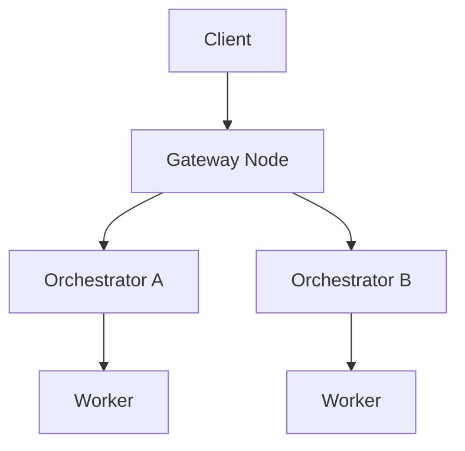

import { DynamicTable } from '/snippets/components/layout/table.jsx'
import { GotoCard, GotoLink } from '/snippets/components/primitives/links.jsx'

The Livepeer Network supports a dynamic decentralized marketplace for real-time media compute: transcoding and AI inference. Unlike static infrastructure platforms, Livepeer's open marketplace introduces real-time **bidding, routing, and pricing** of jobs across a global pool of Orchestrators. This page outlines the marketplace layer, actor behaviors, session economics, and how it relates to the protocol.

## Marketplace overview

<DynamicTable
  headerList={["Element", "Role"]}
  itemsList={[
    { "Element": "Gateway / Client", "Role": "Submit job requests (stream, image, session intent)" },
    { "Element": "Gateway", "Role": "Matches requests to suitable Orchestrators" },
    { "Element": "Orchestrator", "Role": "Advertises availability, pricing, and capabilities" },
    { "Element": "Worker", "Role": "Executes compute task (Transcoder or AI worker)" },
    { "Element": "TicketBroker", "Role": "Receives tickets for ETH reward upon verified work (on-chain)" }
  ]}
/>

This market is **continuous** - Orchestrators are always available for sessions; Gateways route work off-chain without per-job on-chain gas.

## Demand: client workloads

Clients submit various media compute jobs through Gateways:

<DynamicTable
  headerList={["Job type", "Example use case", "Payment style"]}
  itemsList={[
    { "Job type": "Live stream", "Example use case": "RTMP ingest for video platforms", "Payment style": "Per-minute ETH / credits" },
    { "Job type": "AI inference", "Example use case": "Frame-by-frame image-to-image generation", "Payment style": "Per-job (frame, token)" },
    { "Job type": "File transcode", "Example use case": "Static MP4 → web formats", "Payment style": "Batch credits" }
  ]}
/>

**API examples:** Livepeer Studio REST, Gateway POST job, ComfyStream interface (AI).

## Supply: Orchestrator nodes

Orchestrators advertise:

- Hardware specs (GPU/CPU, memory)
- Region and latency
- Supported workloads (video, AI, or both)
- Price per segment / frame / token

They update availability via gateway-side gRPC or REST heartbeat endpoints. Gateways use this information to route jobs to the best match.

## Routing logic

The Gateway scores Orchestrators by:

- Latency to input source
- Workload match (video vs AI)
- Cost per job
- Availability and retry buffer

Sessions are **routed** off-chain to the best match; no on-chain gas is spent per job.

## Price discovery

The current Livepeer implementation uses **posted pricing** (Orchestrator-set), not auction-based. A few notes:

- Clients can be matched to the lowest available compatible provider.
- Prices may vary by:
  - Region (e.g. US-East vs EU-Central)
  - GPU load (AI-heavy Orchestrators may charge more)
  - Quality profile (e.g. 1080p60 vs 720p30)

<Note>
In development: LIPs may introduce dynamic auction mechanisms for AI sessions (e.g. spot job auctions). See the [Forum LIPs](https://forum.livepeer.org/c/lips/) for proposals.
</Note>

## Payments and settlement

**Clients** pay via:

- ETH tickets (settled on-chain via the protocol’s `TicketBroker`)
- Credit balance (tracked off-chain by some Gateways)

**Orchestrators:**

- Claim winning tickets to the `TicketBroker` on Arbitrum
- Accumulate ETH earnings from transcoding/AI work
- Claim inflation (LPT) rewards from the `BondingManager` each round

## Credit system extensions

Some Gateways provide user-friendly pricing in addition to direct ETH:

<DynamicTable
  headerList={["Currency", "Top-up methods", "Denomination example"]}
  itemsList={[
    { "Currency": "USD", "Top-up methods": "Credit card, USDC", "Denomination example": "Per minute or per job" },
    { "Currency": "ETH", "Top-up methods": "MetaMask, smart wallet", "Denomination example": "Per job or per segment" }
  ]}
/>

Orchestrators can price in USD-equivalent via oracle-based quoting where supported.

## Observability

Each session can be logged with:

- Latency to first response
- Retry count
- Orchestrator ID and region
- Price paid (ETH or credit)

Future marketplace indexers may surface real-time job flow stats for the network.

## Protocol–market boundaries

<DynamicTable
  headerList={["Layer", "Description", "Example"]}
  itemsList={[
    { "Layer": "Protocol", "Description": "Verifies work and pays ETH & LPT rewards", "Example": "TicketBroker, BondingManager" },
    { "Layer": "Marketplace", "Description": "Matches jobs to compute providers", "Example": "Gateway load balancer, routing" },
    { "Layer": "Interface layer", "Description": "Abstracts API, SDK, session negotiation", "Example": "Livepeer Studio SDK, Daydream API" }
  ]}
/>

## Future upgrades (LIPs proposed)

- **LIP-78:** Spot job auctions
- **LIP-81:** Credit-to-protocol sync bridge
- **LIP-85:** Orchestrator staking influence on job routing

For current status, see the [Forum LIPs](https://forum.livepeer.org/c/lips/) and [Technical roadmap](../resources/technical-roadmap).

## See also

- [Job lifecycle](./job-lifecycle) - End-to-end flow from ingest to settlement
- [Actors](./actors) - Gateway, Orchestrator, and Delegator roles
- [Livepeer Protocol overview](../livepeer-protocol/overview) - On-chain contracts and incentives
- [Blockchain contracts](../resources/blockchain-contracts) - TicketBroker and other contract addresses

## References

- [Livepeer Studio / Gateway docs](https://livepeer.studio/docs)
- [TicketBroker (protocol)](https://github.com/livepeer/protocol/tree/master/contracts/job)
- [Orchestrator node setup](/v2/orchestrators/orchestrators-portal)
- [Forum: LIP proposals](https://forum.livepeer.org/c/lips/)
- [Livepeer AI (ComfyStream, blog)](https://blog.livepeer.org/real-time-ai-comfyui)
